# STL源码剖析

## 第一章 概论与版本介绍

**STL六大组件：**

1. 容器（containers）:各种数据结构，如vector,list,deque,set,map，用来存放数据。从实现角度来看STL容器是一种class template。
2. 算法（algorithms）:各种常用的算法如sort,search,copy,erase… 从实现角度来看STL算法是一种function template。
3. 迭代器（iterators）:扮演容器与算法之间的胶合剂，是所谓的”泛型指针“。共有物种类型，以及其他衍生变化。从实现角度来看，迭代器是一种将operator*, operator->, operator++, operator--等指针相关操作予以重载的class template。
4. 仿函数（functors）:行为类似函数，可作位算法的某种策略（policy）。从实现角度来看，仿函数是一种重载了operator()的class或class template。一般函数指针可视为侠义的仿函数。
5. 配接器（adapters）:一种用来修饰容器或仿函数或迭代器接口的东西。例如STL提供的queue和stack虽然看似容器，其实只能算是一种容器适配器，因为他们的底层全部借助deque，所有的操作都由底层的deque供应。
6. 配置器（allocators）:负责空间配置与管理。从实现的角度来看，配置器是一个实现了动态空间配置、空间管理、空间释放的class template。

**STL六大组件交互关系**

Container通过Allocator取得数据储存空间，Algorithm通过Iterator存取Container内容，Functor可以协助Algorithm完成不同的策略变化，Adapter可以修饰或套接Functor。 


## 第二章 空间配置器（allocator）

### 具备次配置力（sub-allocation）的SGI空间配置器

#### SGI标准的空间配置器

​	SGI定义了一个符合部分标准，名为allocator的配置器，效率不高，只把c++的::operator new和::operator delete做了一层薄薄的包装，SGI没有用过 。

#### SGI特殊的空间配置器，std::alloc

​	allocator只是基层内存配置/释放行为（也就是::operator new和::operator delete）的一层薄薄包装，并没有考虑到任何效率上的强化。

一般而言，我们所习惯的C++内存配置操作和释放操作是这样的：

```c++
class Foo{...};
Foo pf=new Foo;       //配置内存，然后构造对象
delete pf;			 //将对象析构，然后释放内存
```

​	这里new构造一个对象时，包含两阶段操作：（1）调用::operator new配置内存；（2）调用该对象的构造函数构造对象内容。delete销毁一个对象时，也包含两阶段操作：（1）调用该对象的析构函数将对象析构；（2）调用::operator delete释放内存。 

**STL allocator将上述两阶段操作区分开来。内存配置由alloc::allocator()负责，内存释放操作由alloc::deallocator()负责；对象构造由::constructor()负责，对象析构由::destroy()负责。** 

STL标准告诉我们，配置器定义于<memory>之中，SGI<memory>中包含以下两个文件：

`#include<stl_alloc.h>`          //负责内存空间的配置和释放

`#include<stl_construct.h>`   //负责对象内容的构造与析构


#### 析构和构造的基本工具,construct()和destroy()

下面是`#include<stl_construct.h>`的部分内容：

```C++
#include <new.h>                //placement new头文件
template <class T1, class T2>  
inline void construct(T1* p, const T2& value) {  
  new (p) T1(value);            //placement new；调用T1::T1(value)
}  

//以下是destroy()第一个版本，接受一个指针  
template <class T>  
inline void destroy(T* pointer) {  
    pointer->~T();  
}  

//destory()第二版本，接受两个迭代器。此函数没法找出元素数值型别
template <class ForwardIterator>  
inline void destroy(ForwardIterator first, ForwardIterator last) {  
  __destroy(first, last, value_type(first));  
}  

```

​	上述destroy()的第一版本接受一个指针，将该指针所指的对象析构掉。第二版本接受first和last两个迭代器，将这两个迭代器范围内的对象析构掉。在第二版本中运用了traits编程技法，traits会得到当前对象的一些特性，再根据特性的不同分别对不同特性的对象调用相应的方法。在第二版本中，STL会分析迭代器所指对象的has_trivial_destructor特性的类型（只有两种：true_type和false_type），如果是true_type，STL就什么都不做；如果是false_type，就会调用每个对象的析构函数来销毁这组对象。 

#### 空间配置与释放，std::alloc

​	C++内存配置基本操作是::operator new()，内存释放基本操作是::operator delete()。这两个全局函数相当于C的malloc()和free()函数。正是如此，SGI以malloc和free完成内存的分配和释放。

​	考虑到小型区块可能造成的内存破碎问题，SGI设计了双层配置器，**第一级配置器直接使用malloc()和free()，第二级配置器采取以下策略：当配置区块超过128bytes时，调用第一级配置器；当配置区块小于128bytes时，采用内存池方式。 ** 


#### 第一级配置器

**第一级空间配置器**使用malloc()、free()、realloc()等c函数执行实际内存配置、释放、重配等操作，当分配的空间大小**超过128 bytes**的时候使用第一级空间配置器；

```c++
static void * allocate(size_t n)  
{  
    void *result = malloc(n);   //直接使用malloc()  
    if (0 == result) result = oom_malloc(n);  
    return result;  
}  
  
static void deallocate(void *p, size_t /* n */)  
{  
    free(p);    //直接使用free()  
}  
  
static void * reallocate(void *p, size_t /* old_sz */, size_t new_sz)  
{  
    void * result = realloc(p, new_sz);     //直接使用realloc()  
    if (0 == result) result = oom_realloc(p, new_sz);  
    return result;  
}  
```

​	当alloc()和realloc()申请不到内存时，会调用oom_malloc()和oom_realloc()，这两个函数不断调用“内存不足处理函数”，直到获得足够内存为止。如果用户没有传递“内存不足处理函数”，会抛出__THROW_BAD_ALLOC异常。

####  第二级配置器

​	**第二级空间配置器**多了一些机制，避免太多小额区块造成内存的碎片。小额区块带来的不仅是内存碎片，配置时的额外负担也是一个问题。SGI第二级配置器的做法是，如果区块够大，超过128bytes时，就移交第一级配置器。当区块**小于128bytes**时，则以内存池（memory pool）管理，此法又称为层次配置（sub-allocation）:每次配置一大块内存，并维护对应自由链表（free-list）。下次如若再有相同大小的内存需求，就直接从free-lists中拨出。如果客户端释还了小额区块，就由配置器回收到free-lists中，配置器除了负责配置也方便回收。

​	SGI STL的第二级内存配置器主动将任何小额区块的内存需求量上调至8的倍数（例如客户端需求30bytes。就自动调整为32bytes），并维护了一个free-list数组，分别用于管理8, 16, 24, 32,40，56，64，72，80，88，96，104，112，120，128 bytes的小额区块，free-list的节点结构如下：

```c++
union obj
{
    union obj* free_list_link;
    char client_data[1];
};
```

​	这里使用union结构，是为了节省空间，也就是说，当节点位于free-list时，通过free_list_link指向下一块内存，而当节点取出来分配给用户使用的时候，整个节点的内存空间对于用户而言都是可用的，这样在用户看来，就完全意识不到free_list_link的存在，可以使用整块的内存了。

​	在分配内存时，会将大小向上调整为8的倍数，因为free-list中的节点大小全是8的倍数。

#### 空间配置函数allocate()

1. 如果申请内存大于128 bytes，就调用第一级配置器，否则说明申请内存小于128 bytes，转到2
2. 根据申请内存的大小n在16个free lists中找出其对应的my_free_list
3. 如果对应的my_free_list中没有空闲区块，分配器首先将申请内存的大小上调至8的倍数n，调用refill()，准备重新填充my_free_list
4. 否则说明有可用的空闲区块，更新my_free_list并将第一块空闲区块返回


#### 空间释放函数deallocate()

​	该函数首先判断区块大小，大于128bytes就调用第一级配置器，小于128bytes就找出对应的free list，将区块回收。


#### 重新填充free lists

​	先前讨论allocate()。当发现free list中没有可用区块了时，就调用refill()，准备为free list重新填充空间。新的空间取自内存池（经由chunk_allock()完成）。缺省取得20个新节点（新区块），但万一内存池空间不足，获得的节点数（区块数）可能小于20。

#### 内存池

从内存池中取空间给free list使用，是chunk_alloc()函数工作：

1. 如果内存池剩余空间大于或等于`20*n`的内存空间，则从这个空间中取出`n*20`大小的内存空间，更新start_free并返回申请到的内存空间的起始地址，否则转到2)
2. 如果内存池剩余空间足够分配一个及以上的区块，则分配整数倍于n的内存空间，更新start_free，由nobjs返回实际分配到的区块个数，并返回申请到的内存空间的起始地址，否则转到3)
3. 内存池中无法提供一个大小为n的区块，此时如果内存池中还有一些残余内存（这些内存大小小于n），则将这些内存插入到其对应大小的空闲分区链中
4.  调用malloc向运行时库申请大小为（`2*20*n` + 附加量）的内存空间， 如果申请成功，更新start_free，end_free和heap_size，并递归调用chunk_alloc()，修正nobjs，否则转到5)
5. 4)中调用malloc失败，这时分配器依次遍历区块足够大的freelists，只要有一个未用区块，就释放该区块，递归调用chunk_alloc()，修正nobjs
6. 如果出现意外，到处都没有内存可用了，则调用第一级配置器，看out-of-memory机制能否尽点力


### 内存处理基本工具

​	STL定义了五个全局函数，作用于未初始化空间上。这样的功能对于容器的实现很由帮助。前两个函数是用于构造的construct()和用于析构的destroy()。另外三个函数uninitialized_copy(),uninitialized_fill()和uninitialized_fill_n()函数，分别对应copy()，fill()和fill_n()函数——这些都是STL算法。

## 第三章 迭代器(iterators)概念与traits编程技法

### 迭代器设计思维——STL关键所在

STL的中心思想在于：将数据容器（containters）和算法（algorithms）分开，彼此独立设计，最后再以一帖胶着剂撮合在一起。

### 迭代器是一种smart pointer

迭代器是一种行为类似指针的对象，而指针的各种行为中最常见也最方便的便是内容提领（dereference）和成员访问（member access），因此，迭代器最重要的编程工作就是对operator* 和operator-> 进行重载工作。

### [Traits编程技法——STL源代码门钥](https://www.cnblogs.com/mangoyuan/p/6446046.html)

traits，又被叫做特性萃取技术，说得简单点就是提取“被传进的对象”对应的返回类型，让同一个接口实现对应的功能。因为STL的算法和容器是分离的，两者通过迭代器链接。算法的实现并不知道自己被传进来什么。萃取器相当于在接口和实现之间加一层封装，来隐藏一些细节并协助调用合适的方法，这需要一些技巧（例如，偏特化）。 

首先，在算法中运用迭代器时，很可能会用到其相应型别（迭代器所指之物的型别）。假设算法中有必要声明一个变量，以“迭代器所指对象的型别”为型别，该怎么办呢？

解决方法是：利用function template的参数推导机制。

```c++
template <class I, class T>
void func_impl(I iter, T t) {
        T tmp; // 这里就是迭代器所指物的类型新建的对象
        // ... 功能实现
}

template <class I>
inline
void func(I iter) {
        func_impl(iter, *iter); // 传入iter和iter所指的值，class自动推导
}

int main() {
    int i;
    func(&i);
}
```

我们以func()对外接口，却把实际操作全部置于func_imp1()之中。由于func_imp1()是一个function template，一旦被调用，编译器会自动进行template参数推到。于是导出型别T，顺利解决问题。

迭代器相应型别不只是“迭代器所指对象的型别”一种而已。根据经验，最常用的相应型别有五种，然而并非任何情况下任何一种都可以利用上述的template参数推导机制来取得。

函数的“template参数推导机制”推导的只是参数，无法推导函数的返回值类型。万一需要推导函数的传回值，就无能为力了。

声明内嵌型别似乎是个好主意，这样我们就可以直接获取。  

```c++
template <class T>
struct MyIter {
    typedef T value_type; // 内嵌型别声明
    // ...
};

template <class I>
typename I::value_type //这一行是func的回返值型别
func(I ite) {
    return *ite;
}

// ...
MyIter<int> ite(new int(8));
cout << func(ite);
```

 并不是所有迭代器都是class type，原生指针就不是。如果不是class type，就无法定义它内嵌型别。但STL绝对必须接受原生指针作为一种迭代器。template partial specialization 可以做到。

Partial Specialization (偏特化)意义：如果class template拥有一个以上的template参数，我们可以针对其中某个（或数个，但非全部）template参数进行特化工作。换句话说，我们可以在泛化设计中提供一个特化版本（也就是将泛化版本中的某些template参数赋予明确的指定）。

《泛型思维》对Partial Specialization 定义：针对（任何）template参数更进一步的条件限制所设计出来的一个特化版本。由此，面对以下这么一个class template：

```c++
template<typename T>
class C {……};  //这个泛化版本允许（接受）T为任何型别

//我们更容易接受它有一个形如下的Partial Specialization 
template<typename T>
class C<T*> {……};  //这个泛化版本仅适用于"T为原生指针"的情况，便是"T为任何型别"的一个更进一步的条件限制
```

关键地带！下面这个class template专门用来萃取迭代器的特性，而value type正是迭代器的特性之一：

```c++
template <class I>
struct iterator_traits {
     typedef typename I::value_type value_type;
};

template <class I>
struct iterator_traits<T*> {
    typedef T value_type;
};

template <class I> typename iterator_traits<I>::value_type
  func(I ite) {
     return *ite;
}
```

func在调用 I 的时候，首先把 I 传到萃取器中，然后萃取器就匹配最适合的 value_type。（萃取器会先匹配最特别的版本）这样当你传进一个原生指针的时候，首先匹配的是带<T*>的偏特化版本，这样 value_type 就是 T，而不是没有事先声明的 I::value_type。这样返回值就可以使用 `typename iterator_traits<I>::value_type ` 来知道返回类型。


## 第四章 序列式容器（sequence containers）

### vector

#### vector概述

vector的数据安排以及操作方式，与array非常相似。两者的唯一差别在于空间的运用的灵活性。array是静态空间，一旦配置了就不能改变；vector的**动态空间** ，随着元素的加入，它的内部机制会自行扩充空间以容纳新元素。vector的实现技术，关键在于对其大小的控制以及重新配置时的数据移动效率。

#### vector迭代器

vector维护的是一个连续线性空间，所以不论其元素型别为何，普通指针都可以作为vector的迭代器而满足所有必要条件，因为vector迭代器所需要的操作，如operator*、operator->、operater++、operater--、operator-、operator+、operator+=、operator-=，普通指针天生就具备。vecotr支持随机存取，而普通指针正有这样的能力，所以，vecotr提供的是Random Access Iterators。

```c++
template<class T, class Alloc = alloc>  
class vector{  
public:  
    typedef T   value_type;  
    typedef value_type* iterator;//vector的迭代器是普通指针  
    ...  
};
```

根据定义，如果客户端写出这样的代码：

```c++
vector<int>::iterator ivite;
vector<Shap>::iterator svite;
```

ivite的型别其实就是`int*`，svite的型别其实就是` Shape *`。

#### vector数据结构

vector采用**线性连续空间**的数据结构。它以两个迭代器start和finish分别指向配置的来的连续空间中目前已被使用的范围，并以迭代器end_of_storage指向整块连续空间（含备用空间）的尾端:

```c++
template<class T,class Alloc = alloc>  
class vector{  
...  
protected :  
    iterator start ; //表示目前使用空间的头  
    iterator finish ; // 表示目前使用空间的尾  
    iterator end_of_storage ; //表示目前可用空间的尾  
};
```

为了降低空间配置时的速度成本，vector实际配置的大小可能比客户需求量大一些，以备将来可能的扩展。这便是容量（capacity）的观念。

```c++
template<class T, class Alloc = alloc>  
class vector{
...
public:
	iterator begin() {return start;}
	iterator end() {return finish;}
	size_type size() const {return size_type(end()-begin());}
    size_type capacity const{
    	return size_type(end_of_storage-begin());
    }
    bool empty const{return begin()==end();}
    reference operator[](size_type n){return *(begin()+n);}
    
    reference front(){return *begin();}
    reference back(){return *(end()-1);}
...
}
```


#### vector构造与内存管理

vector缺省使用alloc作为空间配置器，并据此另外定义了一个data_allocator，为的是更方便以元素大小为配置单位：

```c++
template<class T, class Alloc = alloc>  
class vector{
protected:
	typedef simple_alloc<value_type,Alloc> data_allocator;
...
}
```

于是，data_allocator::allocate(n)表示配置n个元素空间。

当我们以push_back()将新元素插入vector尾端时，该函数先检查是否还有备用空间，如果有就直接在备用空间上构造元素，并调整迭代器finish，使vector变大。不过没有备用空间，就扩充空间（重新配置、移动数据、释放原空间）：

```c++
template<class T, class Alloc>  
void vector<T, Alloc>::insert_aux(iterator position, const T&x){  
    if (finish != end_of_storage){//还有备用空间  
        construct(finish, *(finish - 1)); //在备用空间起始处构造一个元素，以vector最后一个元素值为其初值  
        ++finish; //调整finish迭代器  
        T x_copy = x;  
        copy_backward(position, finish - 2, finish - 1);  
        *position = x_copy;  
    }  
    else{//没有备用空间  
        const size_type old_size = size();  
        const size_type new_size = old_size != 0 ? 2 * old_size : 1;  
        iterator new_start = data_allocator::allocate(new_size);  
        iterator new_finish = new_start;  
        try{  
            new_finish = uninitialized_copy(start, position, new_start);//将原vector的内容拷贝到新vector  
            construct(new_finish, x);  
            ++new_finish;  
            new_finish = uninitialzed_copy(position, finish, new_finish);//将安插点的原内容也拷贝过来  
        }  
        catch (excetion e){  
            destroy(new_start, new_finish);//如果发生异常，析构移动的元素，释放新空间  
            data_allocator::deallocate(new_start, new_size);  
        }//析构并释放原空间  
        destroy(begin(), end());  
        deallocator();  
        start = new_start; //调整迭代器  
        finish = new_finish;  
        end_of_storage = new_start + new_size;//调整迭代器  
    }  
}  
```

所谓动态增加大小，并不是在原空间之后接续空间（因为无法包装原空间之后尚有可配置的空间），而是以**原大小的两倍另外配置一块较大的空间**，然后将原来内容拷贝过来，然后才开始在原内容之后构造新元素，并释放原空间。因此对vector的任何操作，一旦引起空间重新配置，指向原vector的所有**迭代器就都失效**了。

#### vector元素操作

**pop_back()实现**

```c++
void pop_back(){
    --finish;            //将尾端标记往前移一格，表示放弃尾端元素
    destory(finish);
}
```

**erase()实现**

```c++
//清除[first,last]中的所有元素
iterator erase(iterator first,iterator last){
    iterator i=copy(last,finish,first);
    destroy(i,finish);
    finish=finish-(last-first);
}
//清除某个位置上的元素
iterator erase(iterator position){
    if(position+1!=end())
        copoy(position+1,finish,position);
    --finish;
    destory(finish);
    return position;
}
//清除所有元素
void claar() {erase(begin(),end());}
```


**insert()实现**


### list

#### list概述

list是双向链表 ，相比于vector的连续线性空间，list就显得复杂许多，她的好处是每次插入或删除一个元素，就配置或释放一个元素空间 。list对空间的运用绝对的精准，一点儿也不浪费。而且，对任何位置的元素插入或元素移除，list永远是常数时间。

#### list的节点

list本身和list节点是不同的结构，需要分开设计。以下是STL list的节点结构：

```c++
template <class T>  
struct __list_node {  
  typedef void* void_pointer;  
  void_pointer next;  
  void_pointer prev;  
  T data;  
};  
```

显然是一个双向链表。

#### list的迭代器

list不能够像vector一样以普通指针作为迭代器，因为其节点不能保证在存储空间中连续存在。list迭代器必须有能力指向list的节点，并有能力进行递增、递减、取值、成员存取等操作。

由于STL list是一个双向链表，迭代器必须具备前移、后移的能力，所以list提供的是Bidirectional Iterators 。

list有一个重要性质：插入操作（insert）和接合操作（splice）都不会造成list迭代器失效。这在vector是不成立的，因为vector的插入操作可能造成记忆体重新配置，导致原有迭代器全部失效。甚至list的元素删除操作，也只有”指向被删除元素“的那个迭代器失效，其他迭代器不受任何影响。


以下是list迭代器的设计：

```c++
template<class T,class Ref，class Ptr>
struct _list_iterator{
	typedef _list_iterator<T,T&,T*> iterator;
	typedef _list_iterator<T,T&,T*> iterator;

	typedef bidirectional_iterator_tag iterator_category;
	typedef T value_type;
	typedef Ptr pointer;
	typedef Ref reference;
	typedef _list_node<T>* link_type;
	typedef size_t size_type;
	typedef ptrdiff_t difference_type;
	
	link_type node;//迭代器内部需要一个普通指针，指向list节点
	
	//constructor
	_list_iterator(link_type x):node(x){}
	_list_iterator(){}
	_list_iterator(const iterator& x):node(x.node){}
	
	bool operator==(const self& x) const {return node==x.node;}
	bool operator!=(const self& x) const {return node!=x.node;}
	//以下对迭代器取值，取的是节点的数据值
	reference operator*() const {return (*node).data;}
	//以下是迭代器的成员存取运算子的标准做法
	reference operator->() const {return &(operator*());}
	
	//对迭代器累加1
    self& operator++(){
    	node=(link_type)((*node).next);
    	return *this;
    }
    self operator++(int){
    	self tmp=*this;
    	++*this;
    	return tmp;
    }
    //对迭代器累减1
    self& operator--(){
    	node=(link_type)((*node).prev);
    	return *this;
    }
    self operator--(int){
    	self tmp=*this;
    	--*this;
    	return tmp;
    }
}
```

#### list的数据结构

SGI list不仅是一个双向链表，而且还是一个环状双向链表。所以它只需要一个指针，便可以完整表现整个表。

```c++
template<class T,class Alloc = alloc> //缺省使用alloc为配置器:w  
class list{  
protected :  
    typedef __list_node<T> list_node ;  
public  :  
    typedef list_node* link_type ;  
protected :  
    link_type node ; //只要一个指针，便可以表示整个环状双向链表  
    ...
};
```

如果让指针node指向可以置于尾端的一个空白节点，node便符合STL对于“前闭后开”区间的要求，成为last迭代

器。

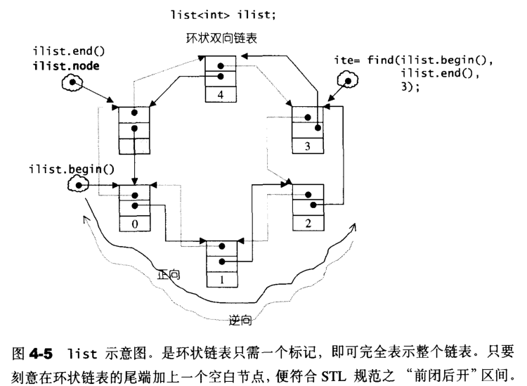

#### list的元素操作

**push_back**

当使用push_back将新元素插入list尾端时，此函数内部调用insert():

```c++
void push_back(const T& x) {insert(end(),x);}
```

**insert**

insert()是一个重载函数，有多种形式，其中最简单的一种如下：

```c++
iterator insert(iterator position, const T& x){//在迭代器position所指位置插入一个节点，内容为x  
    link_type tmp = create_node(x);  
    tmp->next = position.node;  
    tmp->prev = position.node->node;  
    (link_type(position.node->prev))->next = tmp;  
    return tmp;  
}
```

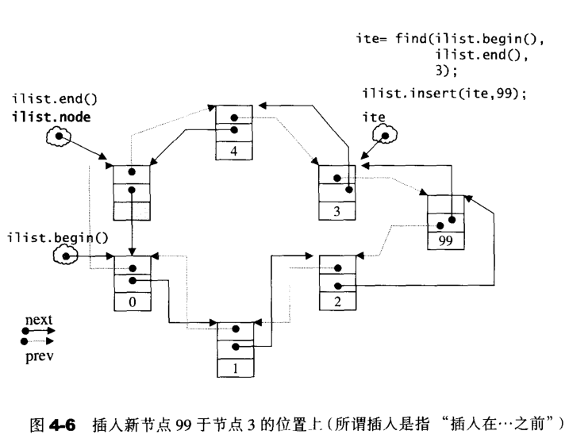

**push_front()**

将新元素插入于list头端，内部调用insert()函数   

```c++
void push_front(const T&x){  
insert(begin(),x);  
}
```

**eraser()**

```c++
iterator erase(iterator position){  
    link_type next_node=link_type(position.node->next);  
    link_type prev_node=link_type(position.node->prev_nodext);  
    prev_node->next=next_node;  
    next_node->prev=prev_node;  
    destroy_node(position.node);  
    return iterator(next_node);  
} 
```

**pop_front()** 

移除头结点，内部调用erase()函数  

```c++
void pop_front(){  
	erase(begin());  
} 
```

**pop_back()**

移除尾结点，内部调用erase()函数  

```c++
void pop_back(){  
    iterator i=end();  
    erase(--i);  
} 
```

**transfer()**

将某连续范围的元素迁移到某个特定位置之前。技术上讲很简单，节点直接的指针移动而已。这个操作为其他复杂操作如splice，sort，merge等奠定了良好的基础。

```c++
void transfer(iterator position, iterator first, iterator last) {  
    if (position != last) {  
      (*(link_type((*last.node).prev))).next = position.node; //(1)  
      (*(link_type((*first.node).prev))).next = last.node;    //(2)  
      (*(link_type((*position.node).prev))).next = first.node;//(3)  
      link_type tmp = link_type((*position.node).prev);       //(4)  
      (*position.node).prev = (*last.node).prev;              //(5)  
      (*last.node).prev = (*first.node).prev;                 //(6)  
      (*first.node).prev = tmp;                               //(7)  
    }  
  }  
```

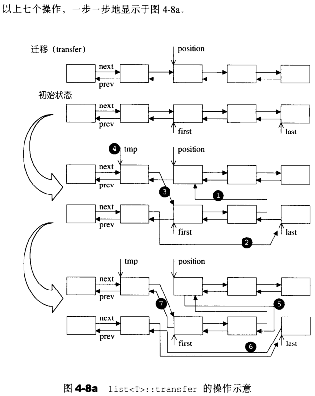

### deque

#### deque概述

vector是单向开口的连续线性空间，deque则是一种双向开口的连续线性空间。所谓双向开口，意思是可以在头尾两端分别做元素的插入和删除操所。vector当然也可以在头尾端进行操作（从技术观点），但是其从头部操作效率奇差，无法被接受。

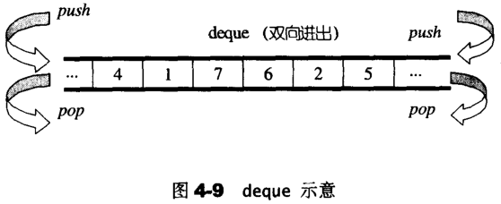

deque和vector的最大差异，一在于deque允许常数时间内对起头端进行元素的插入或移除操作，二在于deque没有所谓的容量概念，因为它是动态地以分段连续空间组合而成，随时可以增加一段新的空间并链接起来。

虽然deque也提供了Ramdon Access Iterator，但它的迭代器并不是普通指针，其复杂度和vector不可以道里计，这影响了各个运算层面。因此，除非必要，应尽可能选用vector而非deque。对deque进行的排序操作，为了最高效率，可讲deque先完整复制到一个vector上，然后vector排序后，再复制到deque。

#### deque的中控器

deque系由一段一段的定量连续空间构成。一旦有必要在deque的前端或尾端增加新空间，便配置一段定量连续空间，串接在整个deque的头端或尾端。deque的最大任务，便是在这些分段的定量连续空间上，维护其整体连续的假象，并提供随机存取的接口。避开了“重新配置、复制、释放”的轮回，代价则是复杂的迭代器结构。

deque采用一块所谓的map（不是STL的map容器）作为主控。这里所谓map是一小块连续空间，其中每个元素(此处称为一个节点，node)都是指针，指向另一段(较大的)连续线性空间，称为缓冲区。缓冲区才是deque的储存空间主体。 

```c++
template<class T, class Alloc = alloc, size_t BufSiz = 0>  
class deque{  
public :  
    typedef T value_type ;  
    typedef value_type* pointer ;  
    ...  
protected :  
    //元素的指针的指针(pointer of pointer of T)  
    typedef pointer* map_pointer ; //其实就是T**  
  
protected :  
    map_pointer map ; //指向map,map是块连续空间，其内的每个元素  
                      //都是一个指针(称为节点)，指向一块缓冲区  
    size_type map_size ;//map内可容纳多少指针  
    ...  
};  
```

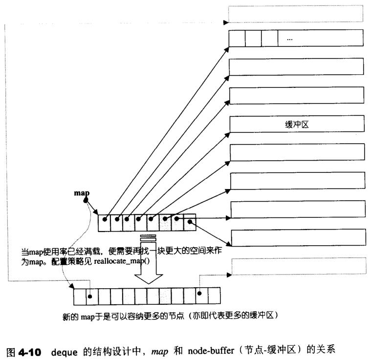

#### deque的迭代器

deque是分段连续空间。维持”整体连续“假象的任务，落在迭代器的operator++和operator—两个运算子上。deque的迭代器首先必须能指出分段连续空间在哪里，其次它必须能够判断自己是否以及处于其所在缓冲区的边缘，如果是，一旦前进或后退时就必须跳跃至下一个或上一个缓冲区。为了能够正确跳跃，deque必须随时掌控管控中心（map）。下面这个实现符合需求：

```c++
template<class T, class Ref, class Ptr, size_t BufSiz>  
struct __deque_iterator{ //未继承std::iterator  
    typedef __deque_iterator<T,T&,T*,BufSize> iterator ;  
    typedef __deque_iterator<T,const T&,const T*,BufSize> const_iterator ;  
    static  size_t  buffer_size() {return __deque_buf_size(BufSize,sizeof(T)) ;}   
  
    //未继承std::iterator，所以必须自行撰写五个必要的迭代器相应型别  
    typedef random_access_iterator_tag  iterator_category ;  
    typedef T   value_type ;  
    typedef Ptr pointer ;  
    typedef Ref reference ;  
    typedef size_t  size_type ;  
    typedef ptrdiff_t   difference_type ;  
    typedef T** map_pointer ;  
  
    typedef __deque_iterator    self ;  
  
    //保持与容器的联结  
    T *cut ; //此迭代器所指之缓冲区中的现行(current)元素  
    T *first ; //此迭代器所指之缓冲区的头  
    T *last ;   //此迭代器所指之缓冲区的尾(含备用空间)  
    map_pointer node ; //指向管控中心  
    ...  
};  
```

  

#### deque的数据结构

deque除了维护一个先前说过的指向map的指针外，也维护start，finish两个迭代器，分别指向第一缓冲区的第一个元素和最后缓冲区的最后一个元素（的下一个位置）。此外，它当然也必须记住目前的map大小，因为一旦map所提供的节点不足，就必须重新配置更大的一块map。

```c++
  template<class T, class Alloc = alloc, size_t BufSiz = 0>  
  class deque{  
  public :  
      typedef T   value_type ;  
      typedef value_type* pointer ;  
      typedef size_t  size_type ;  
  public :  
      typedef __deque_iterator<T,T&,T*,BufSiz>  iterator ;  
  protected :  
      //元素的指针的指针(pointer of pointer of T)  
      typedef pointer*    map_pointer ;  
  protected:  
      iterator    start ; //表现第一节点  
      iterator    finish ; //表现最后一个节点  
      map_pointer map ; //指向map,map是块连续空间，其每个元素都是个指针，指向一个节点(缓冲区)  
      size_type   map_size ; //map内有多少指针  
      ...  
  } ; 
```

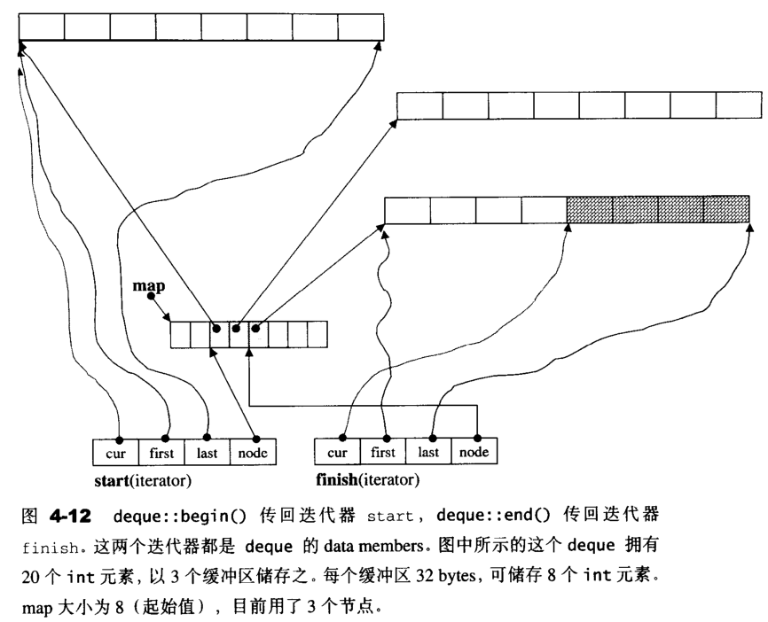

#### deque的构造与内存管理

```c++
#include<iostream>
#include<deque>
#include<algorithm>
using namespace std;

int main(){
	deque<int,alloc,8> ideq(20, 9);
	cout << "size=" << ideq.size() << endl;

	for (int i = 0; i < ideq.size(); ++i)
		ideq[i] = i;

	for (int i = 0; i < ideq.size(); ++i)
		cout << ideq[i] << ' ';
	cout << endl;

	for (int i = 0; i < 3; i++)
		ideq.push_back(i);

	for (int i = 0; i < ideq.size(); ++i)
		cout << ideq[i] << ' ';
	cout << endl;
	cout << "size=" << ideq.size() << endl;

	ideq.push_back(3);
	for (int i = 0; i < ideq.size(); ++i)
		cout << ideq[i] << ' ';
	cout << endl;
	cout << "size=" << ideq.size() << endl;

	ideq.push_front(99);
	for (int i = 0; i < ideq.size(); ++i)
		cout << ideq[i] << ' ';
	cout << endl;
	cout << "size=" << ideq.size() << endl;

	ideq.push_front(98);
	ideq.push_front(97);
	for (int i = 0; i < ideq.size(); ++i)
		cout << ideq[i] << ' ';
	cout << endl;
	cout << "size=" << ideq.size() << endl;

	deque<int>::iterator it = find(ideq.begin(), ideq.end(), 99);
	cout << *it << endl;
	
	system("pause");
	return 0;
}

```

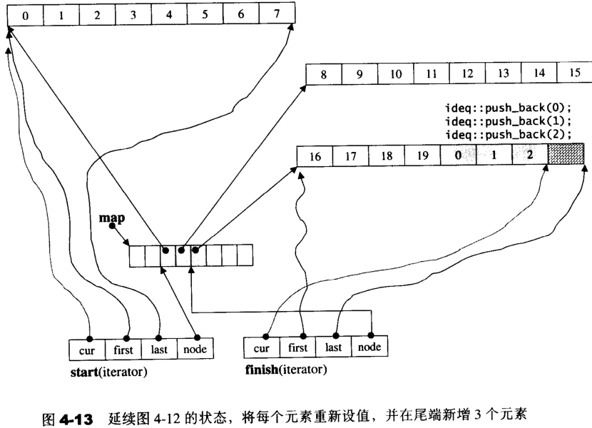

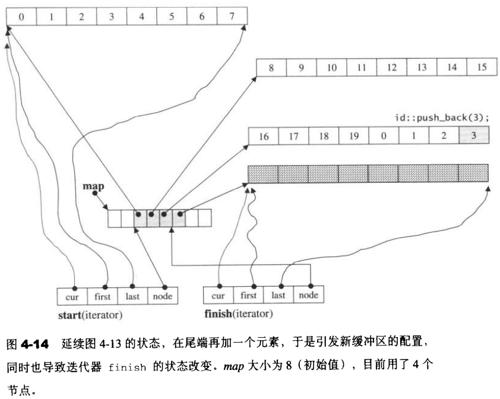

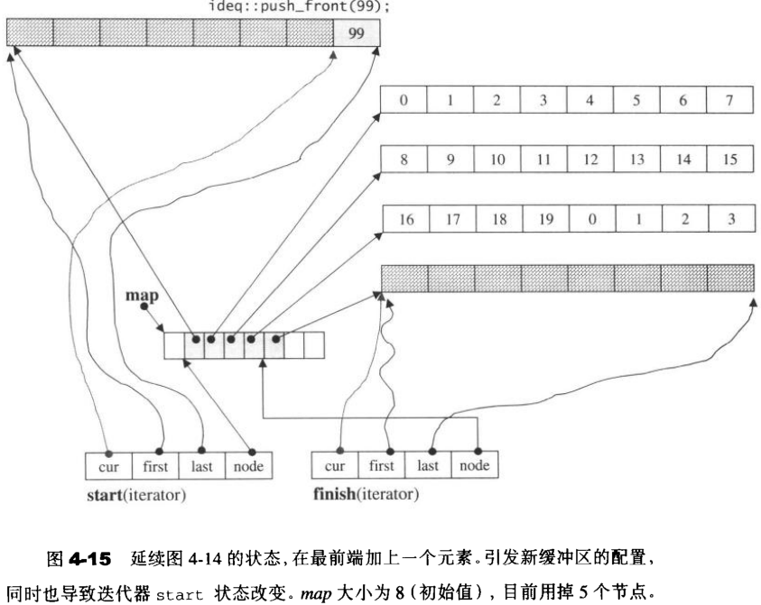

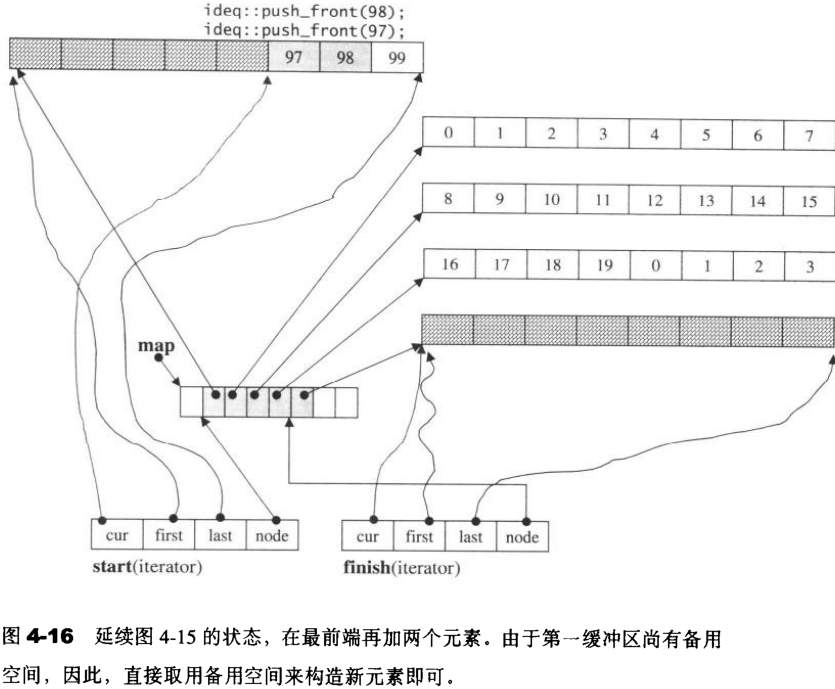

### stack

#### stack概述

stack是一种先进先出的数据结构。它只能有一个出口。stack允许新增元素、移除元素、取得最顶端元素。但除了最顶端元素外，没有任何其他方法可以存取stack的其他元素。换言之，stack不允许有遍历行为。

将新元素推入stack的操作称为push，将元素推出stack的操作称为pop。

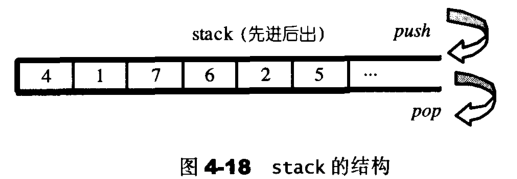

#### stack定义完整列表

以某种既有容器作为底部结构，将其接口改变，使之符合“先进先出”的特性，形成一个stack，是很容易做到的。deque是双向开口的数据结构，若以deque为底部结构并封闭其头端开口，便轻而易举地形成一个stack。因此，**SGI STL便以deque作为缺省情况下的stack底部结构 **，stack的实现因而非常简单，源代码十分简短。

```C++
template<class T, class Sequence = deque<T> >  
class stack{  
    friend bool operator== __STL_NULL_TMPL_ARGS(const stack& , const stack&) ;  
    friend bool operator< __STL_NULL_TMPL_ARGS(const stack& , const stack&) ;  
public :  
    typedef typename Sequence::value_type value_type ;  
    typedef typename Sequence::size_type size_type ;      
    typedef typename Sequence::reference reference ;  
    typedef typename Sequence::const_reference  const_reference ;  
protected:  
    Sequence c ; //底层容器  
public :  
    //以下完全利用Sequence c 的操作，完成stack的操作  
    bool empty() const {return c.empty() ;}   
    size_type size() {return c.size();}  
    reference top() {return c.back();}  
    const_reference top() const {return c.back();}  
    //deque是两头可进出，stack是末端进，末端出。  
    void push(const value_type& x) {c.push_back(x) ;}  
    void pop() {c.pop_back() ;}  
} ;  
```

#### stack没有迭代器

stack所有元素的进出都符合“先进先出”的条件，只有stack顶端的元素，才有机会被外界取用。stack不能提供走访功能，也不提供迭代器。

#### 以list作为stack的底层容器

除了deque之外，list也是双向开口的数据结构。上述stack源代码中使用的底层容器的函数有empt，size，back，push_back，pop_back，凡此种种，list都具备。因此，list为底部结构并封闭其头端开口，一样能够轻而易举形成一个stack。

```c++
#include<stack>  
#include<list>  
#include<algorithm>  
#include <iostream>  
using namespace std;  
  
int main(){  
    stack<int, list<int>> istack;  
    istack.push(1);  
    istack.push(3);  
    istack.push(5);  
      
    cout << istack.size() << endl; //3  
    cout << istack.top() << endl;//5  
    istack.pop();  
    cout << istack.top() << endl;//3  
    cout << istack.size() << endl;//2  
  
    system("pause");  
    return 0;  
}  
```

### queue

#### queue概述

queue是一种先进先出(First In FirstOut,FIFO)的数据结构，它有两个出口。queue允许新增元素、移除元素、从最底端加入元素、取得最顶端元素，但不允许遍历行为。 

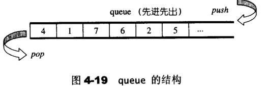

#### queue定义完整列表

SGI STL以deque作为缺省情况下的queue底部结构。 

```c++
template<class T, class Sequence = deque<T> >  
class queue{  
      
public :      
    typedef typename Sequence::value_type value_type ;  
    typedef typename Sequence::size_type size_type ;  
    typedef typename Sequence::reference reference ;  
    typedef typename Sequence::const_reference const_reference ;  
protected :  
    Sequence c ; //底层容器  
public :  
    //以下完全利用Sequence c的操作，完成queue的操作  
    bool empty() const {return c.empty();}  
    size_type size() const {return c.size();}  
    reference front() const {return c.front();}  
    const_reference front() const {return c.front();}  
    //deque是两头可进出，queue是末端进，前端出。  
    void push(const value_type &x) {c.push_back(x) ;}   
    void pop() {c.pop_front();}  
} ;  
```

#### queue没有迭代器

queue所有元素的进出都必须符合“先进先出”的条件，只有queue顶端的元素，才有机会被外界去用。queue不提供遍历功能，也不提供迭代器。

#### 以list作为queue的底层迭代器

```c++
#include<queue>  
#include<list>  
#include<algorithm>  
#include <iostream>  
using namespace std;  
  
int main(){  
    queue<int, list<int>> iqueue;  
    iqueue.push(1);  
    iqueue.push(3);  
    iqueue.push(5);  
      
    cout << iqueue.size() << endl; //3  
    cout << iqueue.front() << endl;//1  
    iqueue.pop();  
    cout << iqueue.front() << endl;//3  
    cout << iqueue.size() << endl;//2  
  
    system("pause");  
    return 0;  
}  
```

### heap

#### heap概述

heap并不归属于STL容器组件，它扮演priority queue的助手。binary max heap是priority queue的底层机制。

binary heap是一种complete binary tree（完全二叉树），也就是说，整棵binary tree除了最底层的叶节点(s)之外，是填满的，而最底层的叶节点(s)由左至右不得由空隙。

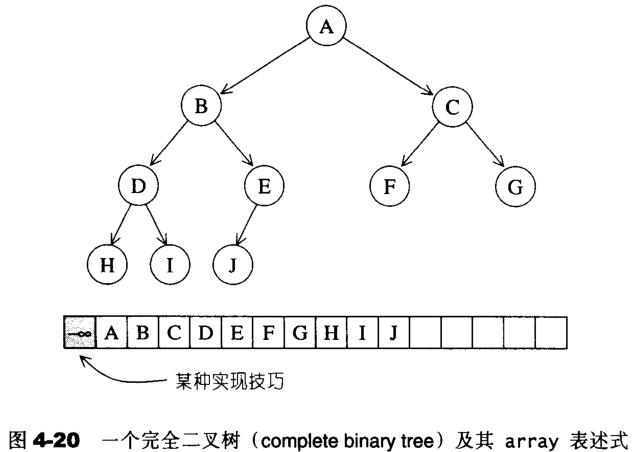

complete binary tree整棵树内没有任何节点漏洞。利用array来存储completebinary tree的所有节点，将array的#0元素保留，那么当complete binary tree的某个节点位于array的i处时，其左子节点必位于array的2i处，右子节点必位于array的2i+1处，父节点必位于i/2处。

 根据元素排列方式，heap分为max-heap和min-heap两种，前者每个节点的键值都大于或等于其子节点的值，后者每个节点的键值都小于或等于其子节点的值。max-heap中最大值在根节点，min-heap最小值在根节点。底层存储结构为vector或者array。 

#### heap算法

##### push_heap算法

为了满足complete binary tree的条件，新加入的元素一定要放在最下一层作为叶节点，并填补在由左至右的第一个空格，也就是吧新元素插入在底层vector的end()处。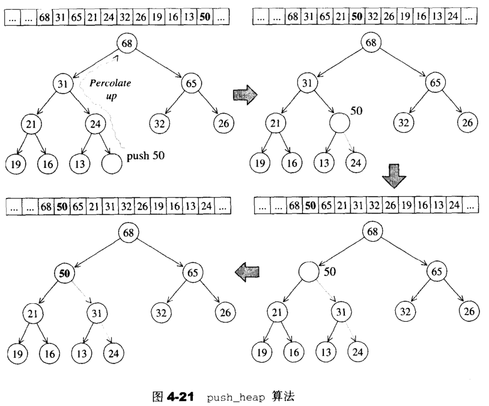

新元素是否适合于其现有位置呢？为满足max-heap的条件（每个节点的键值都大于或等于其子节点键值），我们执行一个所谓的percolate up（上溯）程序：将新节点拿来与其父节点比较，如果其键值（key）比父节点大，就父子对换位置，如此一直上溯，直到不需对换或直到根节点为止。

```C++
template<class RandomAccessIterator>
inline void push_heap(RandomAccessIterator first,RandomAccessIterator last)
{
    //注意，此函数被调用时，新元素应已置于底部容器的最尾端
    _push_heap_aux(first,last,distance_type(first),value_type(first))；
}

template<class RandomAccessIterator，class Distance,class T>
inline void _push_heap_aux(RandomAccessIterator first,Distance*,T*)
{
    _push_heap(first,Distance(last-first)-1),Distance(0),T(*(last-1)));
    //以上系根据implicit representation heap的结构特性：新值必须置于底部容器的最尾端，此即第一个洞号：（last-first）-1
}

template<class RandomAccessIterator，class Distance,class T>
void _push_heap(RandomAccessIterator first,Distance holeIndex,Distance topIndex,T value){
    Distance parent(holeIndex-1)/2;//找出父节点
    while(holeIndex>topIndex&&*(first+parent)<value)
    {
        //当尚未达到顶端，且父节点小于新值（于是不符合heap的次序特性）
        //由于以上使用operator<,可知STL heap是一种max-heap
        *(first+holeIndex)=*(first+parent);//令洞值为父值
        holeIndex=parent;//调整洞号，向上提升至父节点
        parent=(holeIndex-1)/2;//新洞的父节点
    } //持续至顶端，或满足heap的次序特性为止
    *(first+holeIndex)=value;//令洞值为新值，完成插入操作
}
```

##### pop_heap算法

图示为pop_heap算法的实际操作情况。既然自身为max-heap，最大值必然在根节点。pop操作取走根节点（其实是移至底部容器vector的最后一个元素）之后，为了满足complete binary tree的条件，必须将最下一层右边的叶节点拿掉，现在我们的任务是为这个被拿掉的节点找一个适当的位置。

为满足max-heap的条件（每个节点的键值都大于或等于其子节点键值），我们执行一个所谓的percolate down（下溯）程序：将根节点（最大值被取走后，形成一个”洞“）填入上述那个失去生存空间的叶节点值，再将它拿来和其两个子节点比较键值（key），并于较大子节点对调位置。如此一直下放，直到这个”洞“的键值大于左右两个子节点，或直到下放至叶节点为止。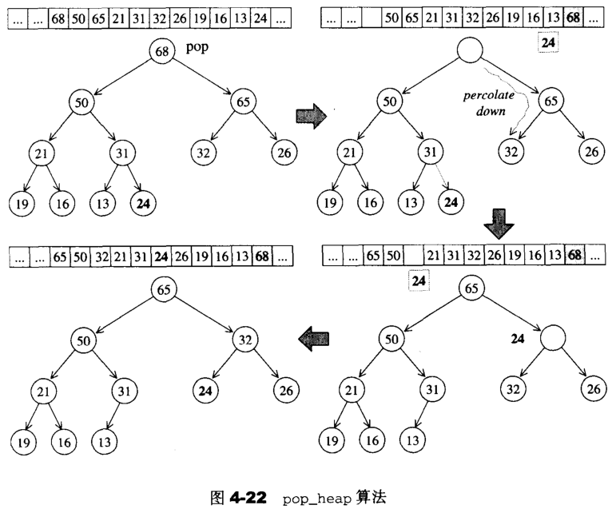

```C++
template <class _RandomAccessIterator, class _Distance, class _Tp>  
void   
_adjust_heap(_RandomAccessIterator _first, _Distance _holeIndex, _Distance _len, _Tp _value) 
{  
  _Distance _topIndex = _holeIndex;//根节点标号  
  _Distance _secondChild = 2 * _holeIndex + 2;//获取子节点  
  while (_secondChild < _len) {//若子节点标号比总的标号数小  
    if (*(_first + _secondChild) < *(_first + (_secondChild - 1)))  
      _secondChild--;//找出堆中最大关键字值的节点  
    //若堆中存在比新根节点元素（即原始堆最后节点关键字值）大的节点,则交换位置   
    *(_first + _holeIndex) = *(_first + _secondChild);  
    _holeIndex = _secondChild;//更新父节点  
    _secondChild = 2 * (_secondChild + 1);//更新子节点  
  }  
  if (_secondChild == _len) {  
    *(_first + __holeIndex) = *(_first + (_secondChild - 1));  
    _holeIndex = _secondChild - 1;  
  }  
  _push_heap(_first, _holeIndex, _topIndex, _value);  
}  
  
template <class _RandomAccessIterator, class _Tp, class _Distance>  
inline void   
__pop_heap(_RandomAccessIterator _first, _RandomAccessIterator _last,  
           _RandomAccessIterator _result, _Tp _value, _Distance*)  
{  
  *_result = *_first;//把原始堆的根节点元素放在容器的末尾  
  //调整剩下的节点元素，使其成为新的heap  
  _adjust_heap(_first, _Distance(0), _Distance(_last - _first), _value);  
}  
  
template <class _RandomAccessIterator, class _Tp>  
inline void   
__pop_heap_aux(_RandomAccessIterator _first, _RandomAccessIterator _last,  
               _Tp*)  
{  
  _pop_heap(_first, _last-1, _last-1, _Tp(*(_last-1)), _DISTANCE_TYPE(_first));  
}  
  
template <class _RandomAccessIterator>  
inline void pop_heap(_RandomAccessIterator __first, _RandomAccessIterator _last)  
{  
  _STL_REQUIRES(_RandomAccessIterator, _Mutable_RandomAccessIterator);  
  _STL_REQUIRES(typename iterator_traits<_RandomAccessIterator>::value_type,  
                 _LessThanComparable);  
  _pop_heap_aux(_first, _last, _VALUE_TYPE(_first));  
}
```

##### sort_heap算法

既然每次pop_heap可获得heap中键值最大的元素，如果持续对整个heap做pop_heap操作，每次将操作范围从后向前缩减一个元素（因为pop_heap会把键值最大的元素放在底部容器的最尾端），当整个程序执行完毕时，我们便有了一个递增序列。

```C++
//以下这个sort_heap()不允许指定“大小比较标准”
template <class RandomAccessIterator>
void sort_heap(RandomAccessIterator first,RandomAccessIterator last){
	//以下，每没执行一次pop_heap(),极值（在STL heap中为极大值）即被放在尾端
	//扣除尾端再执行一次pop_heap()，次极值又被放在新尾端。一直下去，最后即得排序结果
	while(last-first>1)
		pop_heap(first,last--);
}
```

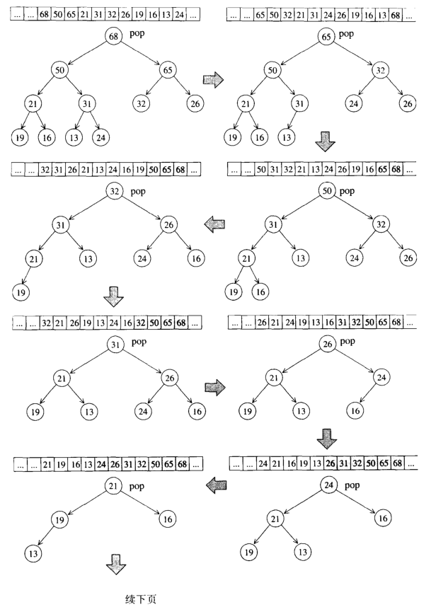


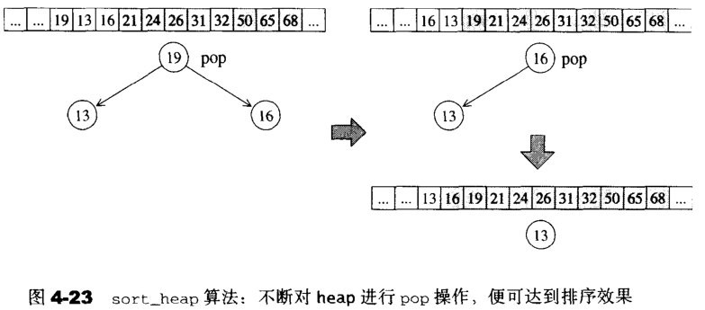

##### make_heap算法

这个算法用来将一段现有数据转化成一个heap。

```c++
//将[first,last)排列成一个heap
template<class RandomAccessIterator>
inline void make_heap(RandomAccessIterator first,RandomAccessIterator last){
	_make_heap(first,last,value_type(first),distance_type(first));
}
//以下这组make_heap()不允许指定“大小比较标准”
template<class RandomAccessIterator,class T,class Distance>
void _make_heap(RandomAccessIterator first,RandomAccessIterator last,T*,Distance*){
	if(last-first<2) return;//如果长度为0或1，不必重新排列
	Distance len=last-first;
	//找出第一个需要重排的子树头部，以parent标示出。由于任何叶节点都不需执行parlocate down，所以有以下计算。
	Distance parent=(len-1)/2;
	
    while(true){
    	//重排以parent为首的子树。len是为了让_adjust_heap()判断操作范围
    	_adjust_heap(first,parent,len,T(*(first+parent)));
    	if(parent==0) return;  //走完根节点，就结束
    	parent--；             //（即将重排子树的）头部向前一个节点
    }
}
```

##### heap没有迭代器

heap的所有元素都必须遵循特别的（complete binary tree）排列规则，所以heap不提供遍历功能，也不提供迭代器。

### priority_queue

#### priority_queue概述

priority_queue是一个拥有权值观念的queue，它允许加入新元素、移除就元素、审视元素值等功能。由于它是一个queue，所以只允许在低端加入元素，并从顶端取出元素，除此之外别无其他存取元素的途径。

priority_queue带有权值观念，其内的元素并非依照被推入的顺序排列，而是自动依照元素的权值排列（通常权值以实值标识）。权值最高者，排在最前面。

缺省情况下priority_queue系利用一个max-heap完成，后者是一个以vector表现的complete binary tree。max-heap可以满足priority_queue所需要的“依权值高低自动递增排序”的特性。

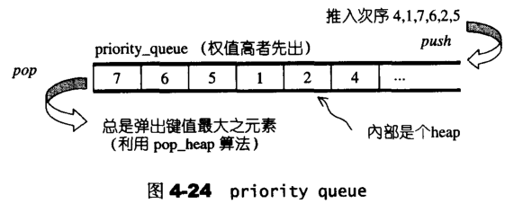


priority_queue缺省情况下是以vector为底层容器，再加上heap处理规则，STL priority_queue往往不被归类为container(容器)，而被归类为containeradapter。 

#### priority_queue测试实例

```c++
#include<queue>  
#include<iostream>  
#include<algorithm>  
using namespace std;  
  
int main(void){  
    //test priority queue...  
    int ia[9] = { 0, 1, 2, 3, 4, 8, 9, 3, 5 };  
    priority_queue<int> ipq(ia, ia + 9);  
    cout << "size= " << ipq.size() << endl;    //size=9
  
    for (int i = 0; i < ipq.size(); ++i)  
        cout << ipq.top() << ' ';              //9 9 9 9 9 9 9 9 9
    cout << endl;  
  
    while (!ipq.empty()){  
        cout << ipq.top() << ' ';             //9 8 5 4 3 3 2 1 0
        ipq.pop();  
    }  
    cout << endl;  
  
    system("pause");  
    return 0;  
} 
```

## 第五章 关联式容器

标准的STL关联式容器分为set（集合）和map（映射表）两大类，以及这两大类的衍生体multiset（多建集合）和multimap（多键映射表）。这些容器的底层实现极值均以RB-tree（红黑树）完成。RB-tree也是一个独立容器，但并不开放给外界使用。

此外，SGI STL还提供了一个不在标准规格之列的关联式容器：hash table（散列表），以及以此hash table为底层实现机制而完成的hash_set（散列集合）、hash_map（散列映射表）、hash_multiset（散列多键集合）、hash_multimap（散列多键映射表）。

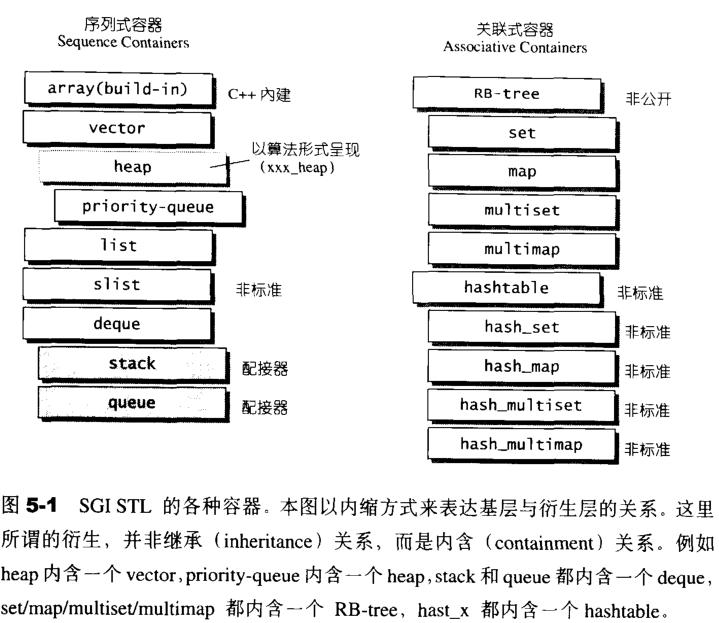

**关联式容器（associative containers）**

所谓关联式容器，观念上类似关联式数据库（实际上则简单许多）：每笔数据（每个元素）都有一个键值（key）和一个实值（value）。当元素被插入关联式容器中时，容器内部结构（可能是RB-tree，也可能是hash-table）便依照其键值大小，以某种特定规则将这个元素置于适当位置。关联式容器没有所谓的头尾（只有最大元素和最小元素），所以不会有所谓的push_back()、push_front()、pop_back()、pop_front()、begin()、end()这样的操作行为。

### 树的导览

树由节点（nodes）和边（edges）构成。整棵树有一个最上端节点，称为根节点（root）。每个节点可以拥有具有方向性的边（directed edges），用来和其他节点相连。相连节点之中，在上者称为父节点（parent），在下者称为子节点（child）。无子节点者称为叶节点（leaf）。子节点可以存在多个，如果最多只允许两个子节点，即所谓二叉树（binary tree）。不同的节点如果拥有相同的父节点，则彼此互为兄弟节点（siblings）。根节点至任何节点直接有唯一路径（path），路径所经过的边数，称为路径长度（length）。根节点至任一节点的路径长度，即所谓该节点的深度（depth）。根节点的深度永远是0。某节点至其最深子节点（叶节点）的路径长度，称为该节点的高度（height）。整棵树的高度，便以根节点的高度来代表。任何节点的大小（size）是指其所有子代（包括自己）的节点总数。

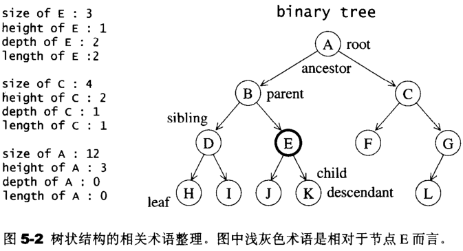

#### 二叉搜索树

所谓二叉树，其意义是："任何节点最多只允许两个子节点"，即左右子节点。递归方式定义：”一个二叉树如果不为空，便是一个根节点和左右两子树构成；左右子树都可能为空“。二叉树应用广泛，例子：编译器表达式树、哈夫曼编码树。

所谓二叉搜索树，**可提供对数实际的元素插入和访问** 。二叉搜索树的节点放置规则是：任何节点的键值一定大于其左子树中的每一个节点的键值，并小于其右子树中的每一个节点的键值。因此，从根节点一直往左走，直至无路可走，即得最小元素；从根节点一直往右走，直至无右路可走，即得最大元素。

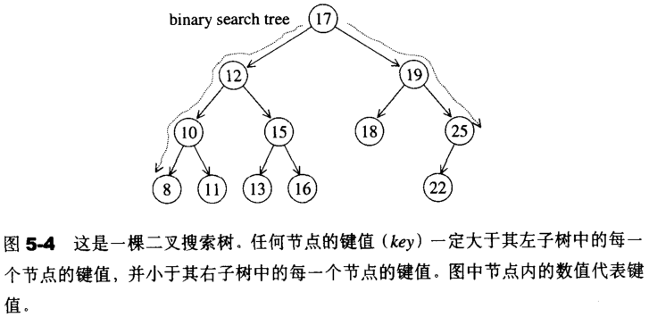

二叉搜索树插入新元素时，可以从根节点开始，遇键值较大者就向左，遇键值较小者就向右，一直到尾端，即为插入点。

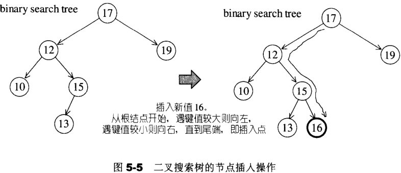


二叉搜索树移除操作。欲删除就节点A，情况可分两种。如果A只有一个子节点，我们就直接将A的子节点连至A的父节点，并将A删除。如果A有两个子节点，我们就以右子树内的最小节点取代A。注意，右子书的最小节点极易获得。

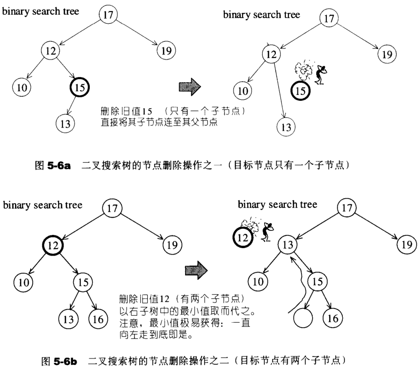

#### 平衡二叉搜索树

所谓树形平衡与否，并没有一个绝对的测量标准。“平衡”的大致意义是：没有任何一个节点过深。不同的平衡条件，造就不同的效率表现，以及不同的实现复杂度。有数种特殊结构如AVL-tree、RB-tree、AA-tree，均可实现平衡二叉搜索树，它们比一般二叉搜索树复杂，因此，插入节点和删除节点的平均时间也比较长，但是它们可以避免极难应付的最坏情况，况且由于它们总数保持某种程度的平衡，所以元素的访问时间平均而言也就比较少，一般而言其搜素时间可节省25%左右。

#### AVL tree

AVL tree是一个“加上了额外平衡条件”的二叉搜索树。其平衡条件的建立是为了确保整棵树的深度为O(logN)。AVL tree要求任何节点的左右子树高度相差最多为1。

如图AVL tree，插入了节点11之后，灰色节点违反了AVL tree的平衡条件。由于只有“插入点至根节点”路径上的各节点可能改变平衡状态，因此，只要调整其中最深的那个节点，便可使整棵树重新获得平衡。

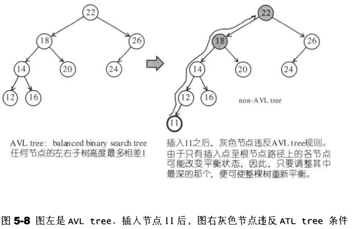

前面说过，只要调整“插入节点至根节点”路径上，平衡状态被破坏之各节点种最深的那一个，便可使得整棵树重新获得平衡。假设该最深节点X，由于节点最多拥有两个子节点，二所谓“平衡被破坏”意味着X的左右两棵子树的高度相差2，因此可以分为一些四种情况：

1. 插入点位于X的左子节点的左子树——左左。
2. 插入点位于X的左子节点的右子树——左右。
3. 插入点位于X的右子节点的左子树——右左。
4. 插入点位于X的右子节点的右子树——右右。

情况1，4彼此对称，称为外侧插入，可以采用单选转操作调整解决。情况2，3彼此对此对此，称为内存插入，可采用双旋转调整解决。

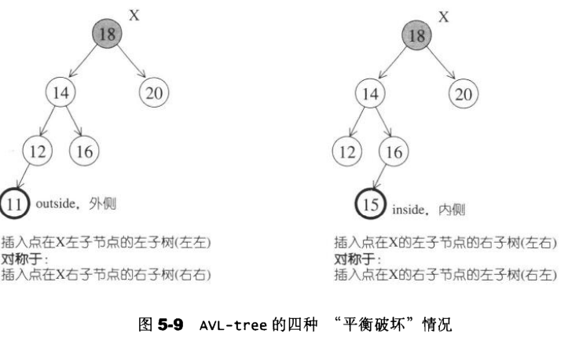

#### 单旋转

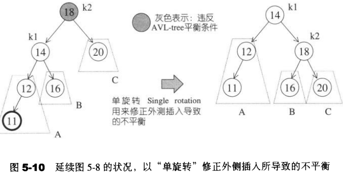

#### 双旋转

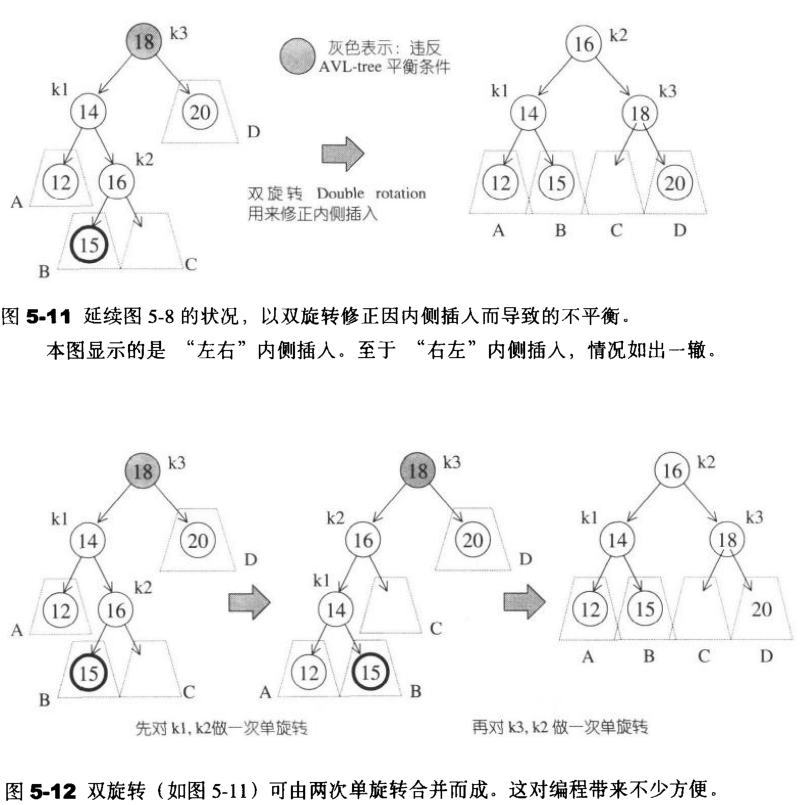

### RB-tree

[红黑树比AVL树的优势](https://blog.csdn.net/mmshixing/article/details/51692892)

RB-tree不仅是一个二叉搜索树，而且必须满足一些规则：

1. 每个节点不是红色就是黑色（图中深色代表黑，浅色代表红）
2. 根节点为黑色
3. 如果节点为红，其子节点必须为黑
4. 任一节点至NULL(树尾端)的任何路径，所含之黑节点数必须相同

根据规则4，新增节点不许为红；根据规则3，新增节点之父节点必须为黑。当新节点根据二叉搜索树的规则到达其插入点，却未能符合上述条件时，就必须调整颜色并旋转树形。

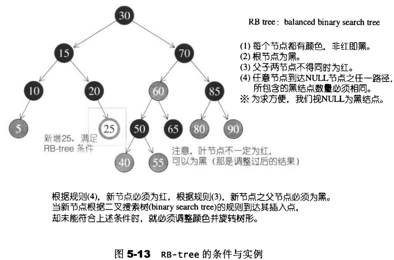

#### 插入节点

在图5-13的RB-tree分别插入3，8，35，75，根据二叉搜索树的规则，这四个新节点落脚处应如图5-14所示，它们破坏了RB-tree的规则，因此必须调整树形，也就是旋转树形并改变节点颜色。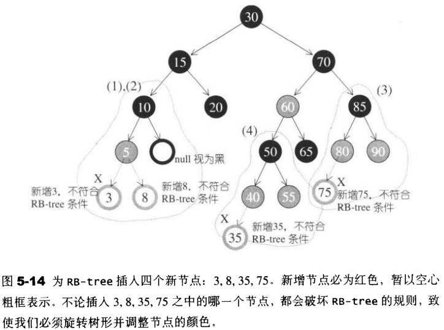

> 假设新节点为X，其父节点为P，祖父节点为G，伯父节点（父节点的兄弟节点）为S，曾祖父节点为GG

- 状况1：S为黑且X为外侧插入。对此情况，先对P,G做一次单选转，再更改P,G颜色，即可重新满足红黑树的规则3。

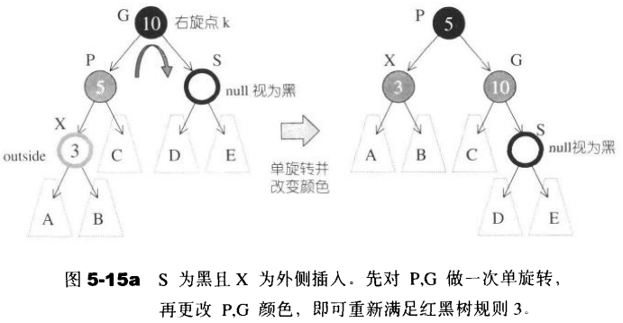

- 状况2：S为黑且X为内测插入。对此情况，必须现对P,X做一次单选转并更改G,X颜色，再将结果对G做一次单选转，即可再次满足红黑树规则3。

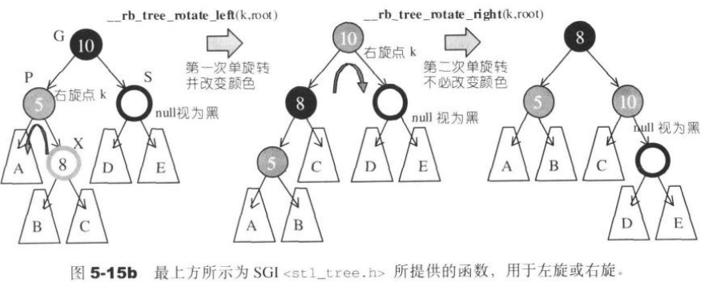

- 状况3：S为红且X为外侧插入。对此情况，现对P和G做一次单选转，并改变X的颜色。此时如果GG为黑，一切搞定，但如果GG为红，则问题比较大，见状况4。

  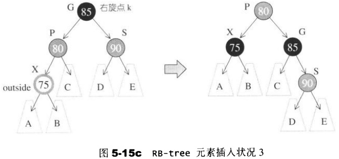

- 状况4：S为红且X为外侧插入。对此情况，先对P和G做一次单选转，并改便X的颜色。此时如果GG也为红。害的持续网上做，直到不再有父子连续为红的情况。

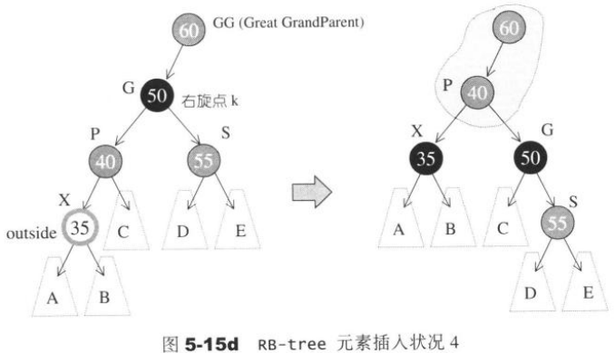

#### 一个自上而下的程序

为避免插入节点的情况4，可以用自顶向下的方法：假设新增节点为A，就顺着A的路径，当遇到一个节点X的两个儿子都为红，就将X改为红，两个儿子改为黑。当X的父节点也为红使用情况1或情况2中的方法做调整。 

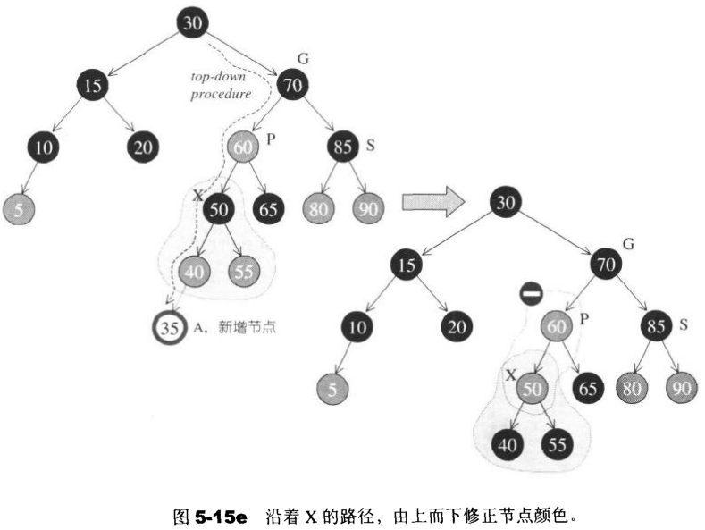

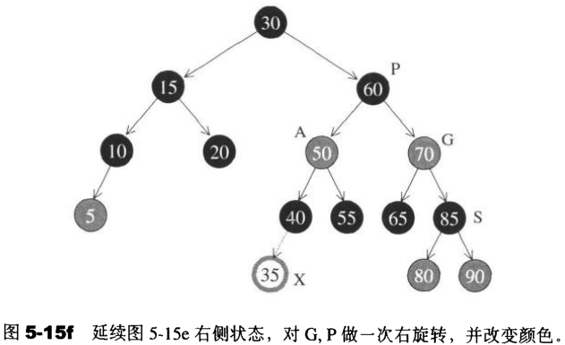

#### RB-tree的节点设计

RB-tree有红黑二色，并且拥有左右子节点，很容易勾勒出其结构风貌。下面是SGI STL的实现源码。为了有更大的弹性，节点分为两层。

由于RB-tree的各种操作时常需要上溯其父节点，所以特别在数据结构中安排了一个parent指针。

```c++
typedef bool __rb_tree_color_type;  
const __rb_tree_color_type __rb_tree_red = false;     // 红色为0  
const __rb_tree_color_type __rb_tree_black = true; // 黑色为1  
  
struct __rb_tree_node_base  
{  
  typedef __rb_tree_color_type color_type;  
  typedef __rb_tree_node_base* base_ptr;  
  
  color_type color;     // 节点颜色，红色或黑色  
  base_ptr parent;      // 该指针指向其父节点  
  base_ptr left;        // 指向左节点  
  base_ptr right;       // 指向右节点  
  
  static base_ptr minimum(base_ptr x)  
  {  
     while (x->left != 0) x = x->left; //一直向左走，找到最小值  
     return x;                              
  }  
  
  static base_ptr maximum(base_ptr x)  
  {  
    while (x->right != 0) x = x->right; //一直向右走，找到最大值  
    return x;                             
  }  
};  
  
template <class Value>  
struct __rb_tree_node : public __rb_tree_node_base  
{  
  typedef __rb_tree_node<Value>* link_type;  
  Value value_field;   //节点值  
}; 
```

#### RB-tree的迭代器

SGI将RB-tree迭代器实现分为两层。图5-16是两层节点结构和双层迭代器结构间的关系，其中主要意义是：            _ rb_tree_node 继承自  _rb_tree_node_base ，_rb_tree_iterator继承自_rb_tree_base_iterator。

 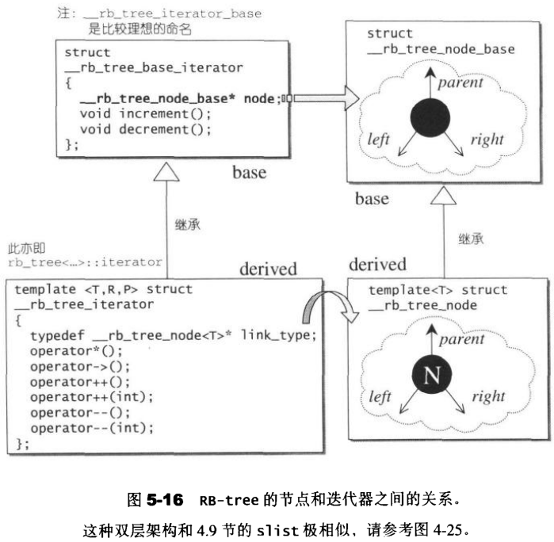

#### RB-tree的元素操作

RB-tree提供两种插入操作：insert_unique()和insert_equal()，前者标识被插入节点的键值（key）在整棵树中必须独一无二（因此，如果整棵树中已存在相同的键值，插入操作就不会真正进行），后者标识被插入节点的键值在整棵树中可以重复，因此，无论如何插入都会成功（除非空间不足导致配置失败）。

### set

1. 所有的元素都会根据元素的键值自动被排序。set的元素不像map那样可以同时拥有实值（value）和键值（key），set元素的键值就是实值。set不允许两个元素有相同的键值。
2. 不可以通过set的迭代器改变set的元素值。因为set元素值就是其键值，关系到set元素的排列规则。如果任意改变set元素值，会严重破坏set组织。set源码中，`set<T>::iterator`被定义为底层RB-tree的const_iterator，杜绝写入操作。换句话，set iterators是一种constant iterators。
3. set拥有与list相同的某些性质：当客户端对它进行元素新增操作（insert）或删除操作（erase）时，操作之前的所有迭代器，在操作完成之后依然有效。当然，被删除的那个元素的迭代器必然是个例外。
4. STL set以RB-tree为底层机制，set的操作几乎都是转调用RB-tree的函数而已。

set测试代码: 

```c++
#include<set>
#include<iostream>
using namespace std;

int main(){
	int ia[] = { 5, 3, 4, 1, 6, 2 };
	set<int> iset(begin(ia), end(ia));

	cout << "size=" << iset.size() << endl; //size=6
	cout << "3 count=" << iset.count(3) << endl;//3 count=1

	iset.insert(3);
	cout << "size=" << iset.size() << endl;//size=6
	cout << "3 count=" << iset.count(3) << endl;//3 count=1

	iset.insert(7);
	cout << "size=" << iset.size() << endl;//size=7
	cout << "3 count=" << iset.count(3) << endl;//3 count=1

	iset.erase(1);
	cout << "size=" << iset.size() << endl;//size=6
	cout << "1 count=" << iset.count(1) << endl;//1 count=0

	set<int>::iterator it;
	for (it = iset.begin(); it != iset.end(); ++it)
		cout << *it << " "; //2 3 4 5 6 7
	cout << endl;

	it = find(iset.begin(), iset.end(), 3);
	if (it != iset.end())
		cout << "3 found" << endl;//3 found

	it = find(iset.begin(), iset.end(), 1);
	if (it == iset.end())
		cout << "1 not found" << endl;//1 not found

	system("pause");
	return 0;
}
```

### map

1. map的特性是，所有元素都会根据元素的键值自动被排序。map的所有元素都是pair，同时拥有实值（value）和键值（key）。pair的第一元素被视为键值，第二元素被视为实值。map不允许两个元素拥有相同的键值。下面是`<stl_pair.h>`中pair定义：

   ```c++
   template<class T1,class T2>
   struct pair{
   	typedef T1 first_type;
   	typedef T2 second_type;
   	T1 first;
   	T2 second;
   	pair():first(T1()),second(T2()) {}
   	pair(const T1& a,const T2& b):first(a),second(b) {}
   }
   ```

    

2. 不能通过map的迭代器改变map的键值，但通过map的迭代器能改变map的实值。因此map的iterators既不是一种const iterators，也不是一种mutable iterators。 

3. map拥有和list相同的某些性质：当客户端对它进行元素新增操作（insert）或删除操作（erase）时，操作之前的所有迭代器，在操作完成之后都依然有效。当然，被删除的那个元素的迭代器必然是个例外。

4. 由于RB-tree是一种平衡二叉搜索树，自动排序的效果很不错，所以标准的STL map即以RB-tree为底层机制。又由于map所开放的各种操作接口，RB-tree也都提供了，所以几乎所有的map操作行为，都只是转调用RB-tree的操作行为而已。

```c++
#include<map>
#include<iostream>
#include<string>
using namespace std;

int main()
{
	map<string, int> simap;            //以string为键值，以int为实值
	simap[string("jjhou")] = 1;        //第一对内容是（"jjhou",1）
	simap[string("jerry")] = 2;        //第一对内容是（"jerry",2）
	simap[string("jason")] = 3;        //第一对内容是（"jason",3）
	simap[string("jimmy")] = 4;        //第一对内容是（"jimmy",4）

	pair<string, int> value(string("david"), 5);
	simap.insert(value);

	map<string, int>::iterator simap_iter = simap.begin();
	for (; simap_iter != simap.end(); ++simap_iter)
		cout << simap_iter->first << ' ' << simap_iter->second << endl;
																//david 5   //按键值排序
																//jason 3
																//jerry 2
																//jimmy 4
																//jjhou 1

	int number = simap[string("jjhou")];
	cout << number << endl;                                     //1

	map<string, int>::iterator ite1;

	//面对关联式容器，应使用其所提供的find函数来搜寻元素，会比STL算法find(）更有效率。因为STL find()只是循序搜索
	ite1 = simap.find(string("mchen"));
	if (ite1 == simap.end())
		cout << "mchen not found" << endl;                      //mchen not found

	ite1 = simap.find(string("jerry"));
	if (ite1 != simap.end())
		cout << "jerry found" << endl;                         //jerry found

	ite1->second = 9;
	int number2 = simap[string("jerry")];
	cout << number2 << endl;                                   //9
}
```

### multiset

multiset的特性以及用法和set完全相同，唯一的差别在于它允许键值重复，因此它的插入操作采用的是底层机制RB-tree的insert_equal()而非insert_unique()。

```c++
#include<set>
#include<iostream>
#include<vector>
using namespace std;
int main() {
      vector<int> a = { 5, 3, 4, 1, 6, 2 };
      multiset<int> iset(a.begin(),a.end());
  
      cout << "size=" << iset.size() << endl; //size=6
      cout << "3 count=" << iset.count(3) << endl;//3 count=1
  
      iset.insert(3); //和set区别的地方
      cout << "size=" << iset.size() << endl;//size=7
      cout << "3 count=" << iset.count(3) << endl;//3 count=2
  
      iset.insert(7);
      cout << "size=" << iset.size() << endl;//size=8
      cout << "3 count=" << iset.count(3) << endl;//3 count=2
  
      iset.erase(1);
      cout << "size=" << iset.size() << endl;//size=7
      cout << "1 count=" << iset.count(1) << endl;//1 count=0
  
      set<int>::iterator it;
      for (it = iset.begin(); it != iset.end(); ++it)
          cout << *it << " "; //2 3 3 4 5 6 7
      cout << endl;
  
      it = find(iset.begin(), iset.end(), 3);
      if (it != iset.end())
          cout << "3 found" << endl;//3 found
  
      it = find(iset.begin(), iset.end(), 1);
      if (it == iset.end())
          cout << "1 not found" << endl;//1 not found
  
      system("pause");
      return 0;
 }
```

### multimap

multimap的特性以及用法与map完全相同，唯一的差别在于它允许键值重复，因此它的插入操作采用的是底层机制RB-tree的insert_equal()而非insert_unique()。

```c++
#include<map>
#include<string>
#include<iostream>
using namespace std;

int main(){
	multimap<string, int> mp;//multimap没有下标操作
	mp.insert(pair<string, int>("Jack", 1));
	mp.insert(pair<string, int>("John", 2));
	mp.insert(pair<string, int>("Lily", 3));
	mp.insert(pair<string, int>("Kate", 4));//按键值字典序排序
	mp.insert(pair<string, int>("Tom", 5));              //Jack 1
	mp.insert(pair<string, int>("John", 8));            //John 2   
	                                                    //John 8   
	map<string, int>::iterator it;                      //Kate 4
	for (it = mp.begin(); it != mp.end(); ++it)         //Lily 3
		cout << it->first << " " << it->second << endl; //Tom 5

	it = mp.find("John");
	if (it != mp.end())
		cout << "John found" << endl; //John found
	it->second = 8;

	it = mp.find("John");
	cout << it->second << endl;//8

	system("pause");
	return 0;
}
```

### hashtable

二叉搜索树具有对数平均时间的表现，但这种的表现构造在一个假设上：输入数据有足够的随机性。这一节介绍一种名为hastable（散列表）的数据结构，这种结构在插入、删除、搜寻等操作上也具有“常数平均时间”的表现，而这种表现是以统计为基础的，不需仰赖输入元素的随机性。

#### hashtable概述

hashtable通过hash function将元素映射到不同的位置，但当不同的元素通过hash function映射到相同的位置时，便产生了“碰撞”问题。解决碰撞问题的方法主要有**线性探测、二次探测、开链法**等。 

##### 线性试探

负载系数：意指元素个数除以表格大小。负载系数永远在0~1之间，除非采用开链策略。

当hash function计算处某个元素的插入位置，而该位置上的空间不再可用时，最简单的办法就是循序往下一一寻找（如果到达尾端，就绕过头部继续寻找），直到找到一个可用的空间为止。只要表格足够大，总是能够找到一个i安身立命的空间，需要花费的时间就很难说了。进行元素搜索操作时，道理也相同，如果hash function计算出来的位置上的元素与我们搜寻目标不符，就循序往下一一寻找，直到找到吻合者，或直到遇上空格元素。至于元素的删除，必须采用惰性删除，也就是只标记删除记号，实际删除操作则待表格中心整理时再进行——这是因为hash table中的每一个元素不仅表述自己，也关系到其它元素的排列。

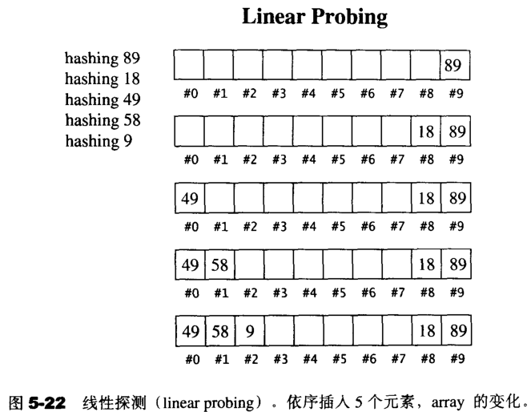

欲分析线性探测的表现，需要两个假设：（1）表格足够大；（2）每个元素都独立。在此假设下，最坏的情况是线性巡防整个表格，平均情况则是寻访一半表格，和常数实际时间差已经很大了。会造成主集团（primary clustering）问题。

##### 二次试探

二次试探发主要用来解决primary clusterign问题。其命名由来是因为解决碰撞问题的方程式F(i)=i^2是个二次方程式。明确地说，如果hash function计算出来新元素的位置为H，而该位置实际上已被使用，那么就依序尝试H+1^2,H+2^2,H+3^2,……，H+i^2，而不是像线性探测那样依序尝试H+1,H+2,H+3，……，H+i。

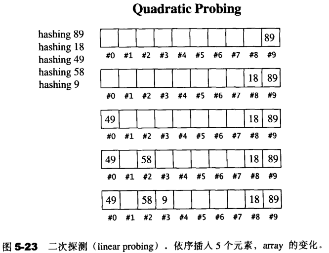

二次试探可以消除主集团（primary clustering），却可能造成次集团（secondary clustering）。

##### 开链

另外一种与二次探测法分庭抗礼的，是所谓的开链法。这种做法是在每一个表格中维护一个list；hash function为我们分配某一个list，然后我们在那个list身上执行元素的插入、搜寻、删除等操作。虽然针对list而进行的搜索只是一种线性操作，但如果list够短，速度还是够快。

使用开链法表格的负载系数将大于1。SGI STL的hash table便是采用这种做法。

#### hashtable的桶子（buckets）与节点（nodes）

SGI STL称hash table表格内的元素为桶子（bucket），此名大约的意思是，表格的每个单元，覆盖的不只是节点（元素），甚至可能是一个“桶”节点。

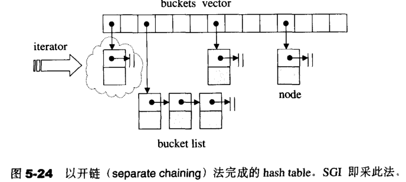

下面是hash table的节点定义：

```c++
  template<class Value>
  struct _hashtable_node
  {
      _hashtable_node* next;
      Value val;
  };
```

bucket所维护的linked list并不采用STL的list或slist，而是自身维护上述的hash table node。

#### hashtable的迭代器

hastable迭代器必须永远维系着整个“buckets vector”的关系，并记录目前所指的节点。其前进操作是首先尝试从目前所指的节点出发，前进一个位置（节点），由于节点被安置于list内，所以利用节点的next指针可轻易达成前进操作。如果目前节点正巧是list的尾端，就跳至下一个bucket身上，那正是指向下一个list头部节点。

注意，hashtable的迭代器没有后退操作（operator--()）,hastable也没有定为逆向迭代器。

#### hashtable的数据结构

```c++
  template <class Value, class Key, class HashFcn,  
            class ExtractKey, class EqualKey,  
            class Alloc>  
```

value：节点的实值类别  key：节点的键值类别  HashFcn：hash function函数类别  ExtractKey：从节点中取出键值的方法  EqualKey：判断键值相同与否的方法 Alloc：空间配置器，默认使用std::alloc 

#### hashtable的构造与内存管理 

节点配置函数与节点释放函数 

```c++
  node* new_node(const value_type& obj)  
    {  
      node* n = node_allocator::allocate();  
      n->next = 0;  
      __STL_TRY {  
        construct(&n->val, obj);  
        return n;  
      }  
      __STL_UNWIND(node_allocator::deallocate(n));  
    }  
      
    void delete_node(node* n)  
    {  
      destroy(&n->val);  
      node_allocator::deallocate(n);  
    }  
```

##### 插入操作（insert）与表格重整（resize）

表格重整：

```
  resize()  
  {  
  表格是否需要重建判断原则：拿元素个数和bucket vector的大小来比，如果前者比后者大就重建表格。因此，每个bucket(list)的最大容量和bucket vector的大小相同。  
      如果要重建，找出下一个质数作为vector的大小，建立新的buckets  
      处理每一个旧的bucket{  
          建立一个新节点指向节点所指的串行的起始节点  
          处理每一个旧bucket所含串行的每一个节点{  
              找出节点落在哪一个新的bucket内  
              令旧bucket指向其所指的串行的下一个节点  
              将当前节点插入到新的bucket内，成为其串行的第一个节点  
              回到旧bucket所指的待处理串行，准备处理下一个节点  
      }  
  }  
      新旧两个buckets对调，如果双方大小不同，大的会变小，小的会变大  
  离开时释放temp的内存  
  }  
```

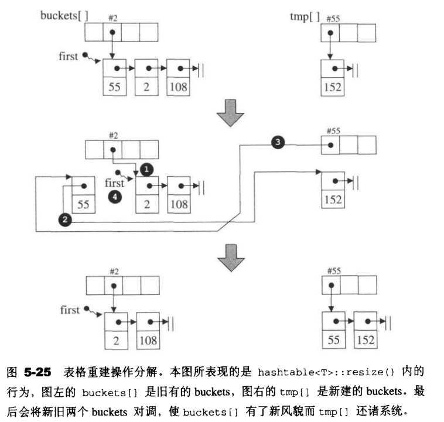

#### hash functions

<stl_hash_fun.h>定义有数个现成的hash functions，全都是仿函数。hash function是计算元素位置的函数，SGI将这项任务赋予bkt_num()，再由它来调用这里提供的hash function，取得一个可以对hashtable进行模运算的值。针对char，int，long等整数型别，这里大部分hash function什么也不做，只是返回原值。但对于字符字符串（const char*），就设计了一个转换函数如下：

```c++
  inline size_t __stl_hash_string(const char* s)  
  {  
    unsigned long h = 0;   
    for ( ; *s; ++s)  
      h = 5*h + *s;  
      
    return size_t(h);  
  } 
```
