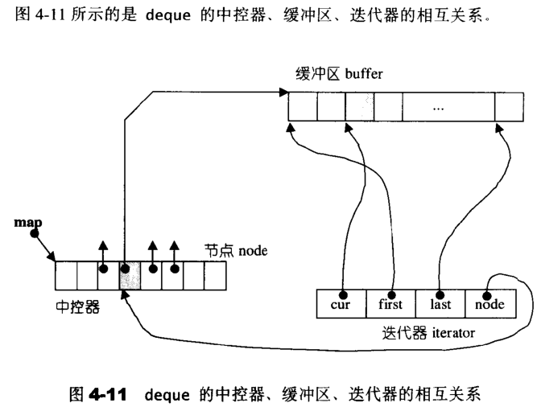

# STL源码剖析

## 第一章 概论与版本介绍

**STL六大组件：**

1. 容器（containers）:各种数据结构，如vector,list,deque,set,map，用来存放数据。从实现角度来看STL容器是一种class template。
2. 算法（algorithms）:各种常用的算法如sort,search,copy,erase… 从实现角度来看STL算法是一种function template。
3. 迭代器（iterators）:扮演容器与算法之间的胶合剂，是所谓的”泛型指针“。共有物种类型，以及其他衍生变化。从实现角度来看，迭代器是一种将operator*, operator->, operator++, operator--等指针相关操作予以重载的class template。
4. 仿函数（functors）:行为类似函数，可作位算法的某种策略（policy）。从实现角度来看，仿函数是一种重载了operator()的class或class template。一般函数指针可视为侠义的仿函数。
5. 配接器（adapters）:一种用来修饰容器或仿函数或迭代器接口的东西。例如STL提供的queue和stack虽然看似容器，其实只能算是一种容器适配器，因为他们的底层全部借助deque，所有的操作都由底层的deque供应。
6. 配置器（allocators）:负责空间配置与管理。从实现的角度来看，配置器是一个实现了动态空间配置、空间管理、空间释放的class template。

**STL六大组件交互关系**

Container通过Allocator取得数据储存空间，Algorithm通过Iterator存取Container内容，Functor可以协助Algorithm完成不同的策略变化，Adapter可以修饰或套接Functor。 


## 第二章 空间配置器（allocator）

### 具备次配置力（sub-allocation）的SGI空间配置器

#### SGI标准的空间配置器

​	SGI定义了一个符合部分标准，名为allocator的配置器，效率不高，只把c++的::operator new和::operator delete做了一层薄薄的包装，SGI没有用过 。

#### SGI特殊的空间配置器，std::alloc

​	allocator只是基层内存配置/释放行为（也就是::operator new和::operator delete）的一层薄薄包装，并没有考虑到任何效率上的强化。

一般而言，我们所习惯的C++内存配置操作和释放操作是这样的：

```c++
class Foo{...};
Foo pf=new Foo;       //配置内存，然后构造对象
delete pf;			 //将对象析构，然后释放内存
```

​	这里new构造一个对象时，包含两阶段操作：（1）调用::operator new配置内存；（2）调用该对象的构造函数构造对象内容。delete销毁一个对象时，也包含两阶段操作：（1）调用该对象的析构函数将对象析构；（2）调用::operator delete释放内存。 

**STL allocator将上述两阶段操作区分开来。内存配置由alloc::allocator()负责，内存释放操作由alloc::deallocator()负责；对象构造由::constructor()负责，对象析构由::destroy()负责。** 

STL标准告诉我们，配置器定义于<memory>之中，SGI<memory>中包含以下两个文件：

`#include<stl_alloc.h>`          //负责内存空间的配置和释放

`#include<stl_construct.h>`   //负责对象内容的构造与析构


#### 析构和构造的基本工具,construct()和destroy()

下面是`#include<stl_construct.h>`的部分内容：

```C++
#include <new.h>                //placement new头文件
template <class T1, class T2>  
inline void construct(T1* p, const T2& value) {  
  new (p) T1(value);            //placement new；调用T1::T1(value)
}  

//以下是destroy()第一个版本，接受一个指针  
template <class T>  
inline void destroy(T* pointer) {  
    pointer->~T();  
}  

//destory()第二版本，接受两个迭代器。此函数没法找出元素数值型别
template <class ForwardIterator>  
inline void destroy(ForwardIterator first, ForwardIterator last) {  
  __destroy(first, last, value_type(first));  
}  

```

​	上述destroy()的第一版本接受一个指针，将该指针所指的对象析构掉。第二版本接受first和last两个迭代器，将这两个迭代器范围内的对象析构掉。在第二版本中运用了traits编程技法，traits会得到当前对象的一些特性，再根据特性的不同分别对不同特性的对象调用相应的方法。在第二版本中，STL会分析迭代器所指对象的has_trivial_destructor特性的类型（只有两种：true_type和false_type），如果是true_type，STL就什么都不做；如果是false_type，就会调用每个对象的析构函数来销毁这组对象。 

#### 空间配置与释放，std::alloc

​	C++内存配置基本操作是::operator new()，内存释放基本操作是::operator delete()。这两个全局函数相当于C的malloc()和free()函数。正是如此，SGI以malloc和free完成内存的分配和释放。

​	考虑到小型区块可能造成的内存破碎问题，SGI设计了双层配置器，**第一级配置器直接使用malloc()和free()，第二级配置器采取以下策略：当配置区块超过128bytes时，调用第一级配置器；当配置区块小于128bytes时，采用内存池方式。 ** 


#### 第一级配置器

**第一级空间配置器**使用malloc()、free()、realloc()等c函数执行实际内存配置、释放、重配等操作，当分配的空间大小**超过128 bytes**的时候使用第一级空间配置器；

```c++
static void * allocate(size_t n)  
{  
    void *result = malloc(n);   //直接使用malloc()  
    if (0 == result) result = oom_malloc(n);  
    return result;  
}  
  
static void deallocate(void *p, size_t /* n */)  
{  
    free(p);    //直接使用free()  
}  
  
static void * reallocate(void *p, size_t /* old_sz */, size_t new_sz)  
{  
    void * result = realloc(p, new_sz);     //直接使用realloc()  
    if (0 == result) result = oom_realloc(p, new_sz);  
    return result;  
}  
```

​	当alloc()和realloc()申请不到内存时，会调用oom_malloc()和oom_realloc()，这两个函数不断调用“内存不足处理函数”，直到获得足够内存为止。如果用户没有传递“内存不足处理函数”，会抛出__THROW_BAD_ALLOC异常。

####  第二级配置器

​	**第二级空间配置器**多了一些机制，避免太多小额区块造成内存的碎片。小额区块带来的不仅是内存碎片，配置时的额外负担也是一个问题。SGI第二级配置器的做法是，如果区块够大，超过128bytes时，就移交第一级配置器。当区块**小于128bytes**时，则以内存池（memory pool）管理，此法又称为层次配置（sub-allocation）:每次配置一大块内存，并维护对应自由链表（free-list）。下次如若再有相同大小的内存需求，就直接从free-lists中拨出。如果客户端释还了小额区块，就由配置器回收到free-lists中，配置器除了负责配置也方便回收。

​	SGI STL的第二级内存配置器主动将任何小额区块的内存需求量上调至8的倍数（例如客户端需求30bytes。就自动调整为32bytes），并维护了一个free-list数组，分别用于管理8, 16, 24, 32,40，56，64，72，80，88，96，104，112，120，128 bytes的小额区块，free-list的节点结构如下：

```c++
union obj
{
    union obj* free_list_link;
    char client_data[1];
};
```

​	这里使用union结构，是为了节省空间，也就是说，当节点位于free-list时，通过free_list_link指向下一块内存，而当节点取出来分配给用户使用的时候，整个节点的内存空间对于用户而言都是可用的，这样在用户看来，就完全意识不到free_list_link的存在，可以使用整块的内存了。

​	在分配内存时，会将大小向上调整为8的倍数，因为free-list中的节点大小全是8的倍数。

#### 空间配置函数allocate()

1. 如果申请内存大于128 bytes，就调用第一级配置器，否则说明申请内存小于128 bytes，转到2
2. 根据申请内存的大小n在16个free lists中找出其对应的my_free_list
3. 如果对应的my_free_list中没有空闲区块，分配器首先将申请内存的大小上调至8的倍数n，调用refill()，准备重新填充my_free_list
4. 否则说明有可用的空闲区块，更新my_free_list并将第一块空闲区块返回


#### 空间释放函数deallocate()

​	该函数首先判断区块大小，大于128bytes就调用第一级配置器，小于128bytes就找出对应的free list，将区块回收。


#### 重新填充free lists

​	先前讨论allocate()。当发现free list中没有可用区块了时，就调用refill()，准备为free list重新填充空间。新的空间取自内存池（经由chunk_allock()完成）。缺省取得20个新节点（新区块），但万一内存池空间不足，获得的节点数（区块数）可能小于20。

#### 内存池

从内存池中取空间给free list使用，是chunk_alloc()函数工作：

1. 如果内存池剩余空间大于或等于`20*n`的内存空间，则从这个空间中取出`n*20`大小的内存空间，更新start_free并返回申请到的内存空间的起始地址，否则转到2)
2. 如果内存池剩余空间足够分配一个及以上的区块，则分配整数倍于n的内存空间，更新start_free，由nobjs返回实际分配到的区块个数，并返回申请到的内存空间的起始地址，否则转到3)
3. 内存池中无法提供一个大小为n的区块，此时如果内存池中还有一些残余内存（这些内存大小小于n），则将这些内存插入到其对应大小的空闲分区链中
4.  调用malloc向运行时库申请大小为（`2*20*n` + 附加量）的内存空间， 如果申请成功，更新start_free，end_free和heap_size，并递归调用chunk_alloc()，修正nobjs，否则转到5)
5. 4)中调用malloc失败，这时分配器依次遍历区块足够大的freelists，只要有一个未用区块，就释放该区块，递归调用chunk_alloc()，修正nobjs
6. 如果出现意外，到处都没有内存可用了，则调用第一级配置器，看out-of-memory机制能否尽点力


### 内存处理基本工具

​	STL定义了五个全局函数，作用于未初始化空间上。这样的功能对于容器的实现很由帮助。前两个函数是用于构造的construct()和用于析构的destroy()。另外三个函数uninitialized_copy(),uninitialized_fill()和uninitialized_fill_n()函数，分别对应copy()，fill()和fill_n()函数——这些都是STL算法。

## 第三章 迭代器(iterators)概念与traits编程技法

### 迭代器设计思维——STL关键所在

STL的中心思想在于：将数据容器（containters）和算法（algorithms）分开，彼此独立设计，最后再以一帖胶着剂撮合在一起。

### 迭代器是一种smart pointer

迭代器是一种行为类似指针的对象，而指针的各种行为中最常见也最方便的便是内容提领（dereference）和成员访问（member access），因此，迭代器最重要的编程工作就是对operator* 和operator-> 进行重载工作。

### [Traits编程技法——STL源代码门钥](https://www.cnblogs.com/mangoyuan/p/6446046.html)

traits，又被叫做特性萃取技术，说得简单点就是提取“被传进的对象”对应的返回类型，让同一个接口实现对应的功能。因为STL的算法和容器是分离的，两者通过迭代器链接。算法的实现并不知道自己被传进来什么。萃取器相当于在接口和实现之间加一层封装，来隐藏一些细节并协助调用合适的方法，这需要一些技巧（例如，偏特化）。 

首先，在算法中运用迭代器时，很可能会用到其相应型别（迭代器所指之物的型别）。假设算法中有必要声明一个变量，以“迭代器所指对象的型别”为型别，该怎么办呢？

解决方法是：利用function template的参数推导机制。

```c++
template <class I, class T>
void func_impl(I iter, T t) {
        T tmp; // 这里就是迭代器所指物的类型新建的对象
        // ... 功能实现
}

template <class I>
inline
void func(I iter) {
        func_impl(iter, *iter); // 传入iter和iter所指的值，class自动推导
}

int main() {
    int i;
    func(&i);
}
```

我们以func()对外接口，却把实际操作全部置于func_imp1()之中。由于func_imp1()是一个function template，一旦被调用，编译器会自动进行template参数推到。于是导出型别T，顺利解决问题。

迭代器相应型别不只是“迭代器所指对象的型别”一种而已。根据经验，最常用的相应型别有五种，然而并非任何情况下任何一种都可以利用上述的template参数推导机制来取得。

函数的“template参数推导机制”推导的只是参数，无法推导函数的返回值类型。万一需要推导函数的传回值，就无能为力了。

声明内嵌型别似乎是个好主意，这样我们就可以直接获取。  

```c++
template <class T>
struct MyIter {
    typedef T value_type; // 内嵌型别声明
    // ...
};

template <class I>
typename I::value_type //这一行是func的回返值型别
func(I ite) {
    return *ite;
}

// ...
MyIter<int> ite(new int(8));
cout << func(ite);
```

 并不是所有迭代器都是class type，原生指针就不是。如果不是class type，就无法定义它内嵌型别。但STL绝对必须接受原生指针作为一种迭代器。template partial specialization 可以做到。

Partial Specialization (偏特化)意义：如果class template拥有一个以上的template参数，我们可以针对其中某个（或数个，但非全部）template参数进行特化工作。换句话说，我们可以在泛化设计中提供一个特化版本（也就是将泛化版本中的某些template参数赋予明确的指定）。

《泛型思维》对Partial Specialization 定义：针对（任何）template参数更进一步的条件限制所设计出来的一个特化版本。由此，面对以下这么一个class template：

```c++
template<typename T>
class C {……};  //这个泛化版本允许（接受）T为任何型别

//我们更容易接受它有一个形如下的Partial Specialization 
template<typename T>
class C<T*> {……};  //这个泛化版本仅适用于"T为原生指针"的情况，便是"T为任何型别"的一个更进一步的条件限制
```

关键地带！下面这个class template专门用来萃取迭代器的特性，而value type正是迭代器的特性之一：

```c++
template <class I>
struct iterator_traits {
     typedef typename I::value_type value_type;
};

template <class I>
struct iterator_traits<T*> {
    typedef T value_type;
};

template <class I> typename iterator_traits<I>::value_type
  func(I ite) {
     return *ite;
}
```

func在调用 I 的时候，首先把 I 传到萃取器中，然后萃取器就匹配最适合的 value_type。（萃取器会先匹配最特别的版本）这样当你传进一个原生指针的时候，首先匹配的是带<T*>的偏特化版本，这样 value_type 就是 T，而不是没有事先声明的 I::value_type。这样返回值就可以使用 `typename iterator_traits<I>::value_type ` 来知道返回类型。


## 第四章 序列式容器（sequence containers）

### vector

#### vector概述

vector的数据安排以及操作方式，与array非常相似。两者的唯一差别在于空间的运用的灵活性。array是静态空间，一旦配置了就不能改变；vector的**动态空间** ，随着元素的加入，它的内部机制会自行扩充空间以容纳新元素。vector的实现技术，关键在于对其大小的控制以及重新配置时的数据移动效率。

#### vector迭代器

vector维护的是一个连续线性空间，所以不论其元素型别为何，普通指针都可以作为vector的迭代器而满足所有必要条件，因为vector迭代器所需要的操作，如operator*、operator->、operater++、operater--、operator-、operator+、operator+=、operator-=，普通指针天生就具备。vecotr支持随机存取，而普通指针正有这样的能力，所以，vecotr提供的是Random Access Iterators。

```c++
template<class T, class Alloc = alloc>  
class vector{  
public:  
    typedef T   value_type;  
    typedef value_type* iterator;//vector的迭代器是普通指针  
    ...  
};
```

根据定义，如果客户端写出这样的代码：

```c++
vector<int>::iterator ivite;
vector<Shap>::iterator svite;
```

ivite的型别其实就是`int*`，svite的型别其实就是` Shape *`。

#### vector数据结构

vector采用**线性连续空间**的数据结构。它以两个迭代器start和finish分别指向配置的来的连续空间中目前已被使用的范围，并以迭代器end_of_storage指向整块连续空间（含备用空间）的尾端:

```c++
template<class T,class Alloc = alloc>  
class vector{  
...  
protected :  
    iterator start ; //表示目前使用空间的头  
    iterator finish ; // 表示目前使用空间的尾  
    iterator end_of_storage ; //表示目前可用空间的尾  
};
```

为了降低空间配置时的速度成本，vector实际配置的大小可能比客户需求量大一些，以备将来可能的扩展。这便是容量（capacity）的观念。

```c++
template<class T, class Alloc = alloc>  
class vector{
...
public:
	iterator begin() {return start;}
	iterator end() {return finish;}
	size_type size() const {return size_type(end()-begin());}
    size_type capacity const{
    	return size_type(end_of_storage-begin());
    }
    bool empty const{return begin()==end();}
    reference operator[](size_type n){return *(begin()+n);}
    
    reference front(){return *begin();}
    reference back(){return *(end()-1);}
...
}
```


#### vector构造与内存管理

vector缺省使用alloc作为空间配置器，并据此另外定义了一个data_allocator，为的是更方便以元素大小为配置单位：

```c++
template<class T, class Alloc = alloc>  
class vector{
protected:
	typedef simple_alloc<value_type,Alloc> data_allocator;
...
}
```

于是，data_allocator::allocate(n)表示配置n个元素空间。

当我们以push_back()将新元素插入vector尾端时，该函数先检查是否还有备用空间，如果有就直接在备用空间上构造元素，并调整迭代器finish，使vector变大。不过没有备用空间，就扩充空间（重新配置、移动数据、释放原空间）：

```c++
template<class T, class Alloc>  
void vector<T, Alloc>::insert_aux(iterator position, const T&x){  
    if (finish != end_of_storage){//还有备用空间  
        construct(finish, *(finish - 1)); //在备用空间起始处构造一个元素，以vector最后一个元素值为其初值  
        ++finish; //调整finish迭代器  
        T x_copy = x;  
        copy_backward(position, finish - 2, finish - 1);  
        *position = x_copy;  
    }  
    else{//没有备用空间  
        const size_type old_size = size();  
        const size_type new_size = old_size != 0 ? 2 * old_size : 1;  
        iterator new_start = data_allocator::allocate(new_size);  
        iterator new_finish = new_start;  
        try{  
            new_finish = uninitialized_copy(start, position, new_start);//将原vector的内容拷贝到新vector  
            construct(new_finish, x);  
            ++new_finish;  
            new_finish = uninitialzed_copy(position, finish, new_finish);//将安插点的原内容也拷贝过来  
        }  
        catch (excetion e){  
            destroy(new_start, new_finish);//如果发生异常，析构移动的元素，释放新空间  
            data_allocator::deallocate(new_start, new_size);  
        }//析构并释放原空间  
        destroy(begin(), end());  
        deallocator();  
        start = new_start; //调整迭代器  
        finish = new_finish;  
        end_of_storage = new_start + new_size;//调整迭代器  
    }  
}  
```

所谓动态增加大小，并不是在原空间之后接续空间（因为无法包装原空间之后尚有可配置的空间），而是以**原大小的两倍另外配置一块较大的空间**，然后将原来内容拷贝过来，然后才开始在原内容之后构造新元素，并释放原空间。因此对vector的任何操作，一旦引起空间重新配置，指向原vector的所有**迭代器就都失效**了。

#### vector元素操作

**pop_back()实现**

```c++
void pop_back(){
    --finish;            //将尾端标记往前移一格，表示放弃尾端元素
    destory(finish);
}
```

**erase()实现**

```c++
//清除[first,last]中的所有元素
iterator erase(iterator first,iterator last){
    iterator i=copy(last,finish,first);
    destroy(i,finish);
    finish=finish-(last-first);
}
//清除某个位置上的元素
iterator erase(iterator position){
    if(position+1!=end())
        copoy(position+1,finish,position);
    --finish;
    destory(finish);
    return position;
}
//清除所有元素
void claar() {erase(begin(),end());}
```


**insert()实现**


### list

#### list概述

list是双向链表 ，相比于vector的连续线性空间，list就显得复杂许多，她的好处是每次插入或删除一个元素，就配置或释放一个元素空间 。list对空间的运用绝对的精准，一点儿也不浪费。而且，对任何位置的元素插入或元素移除，list永远是常数时间。

#### list的节点

list本身和list节点是不同的结构，需要分开设计。以下是STL list的节点结构：

```c++
template <class T>  
struct __list_node {  
  typedef void* void_pointer;  
  void_pointer next;  
  void_pointer prev;  
  T data;  
};  
```

显然是一个双向链表。

#### list的迭代器

list不能够像vector一样以普通指针作为迭代器，因为其节点不能保证在存储空间中连续存在。list迭代器必须有能力指向list的节点，并有能力进行递增、递减、取值、成员存取等操作。

由于STL list是一个双向链表，迭代器必须具备前移、后移的能力，所以list提供的是Bidirectional Iterators 。

list有一个重要性质：插入操作（insert）和接合操作（splice）都不会造成list迭代器失效。这在vector是不成立的，因为vector的插入操作可能造成记忆体重新配置，导致原有迭代器全部失效。甚至list的元素删除操作，也只有”指向被删除元素“的那个迭代器失效，其他迭代器不受任何影响。


以下是list迭代器的设计：

```c++
template<class T,class Ref，class Ptr>
struct _list_iterator{
	typedef _list_iterator<T,T&,T*> iterator;
	typedef _list_iterator<T,T&,T*> iterator;

	typedef bidirectional_iterator_tag iterator_category;
	typedef T value_type;
	typedef Ptr pointer;
	typedef Ref reference;
	typedef _list_node<T>* link_type;
	typedef size_t size_type;
	typedef ptrdiff_t difference_type;
	
	link_type node;//迭代器内部需要一个普通指针，指向list节点
	
	//constructor
	_list_iterator(link_type x):node(x){}
	_list_iterator(){}
	_list_iterator(const iterator& x):node(x.node){}
	
	bool operator==(const self& x) const {return node==x.node;}
	bool operator!=(const self& x) const {return node!=x.node;}
	//以下对迭代器取值，取的是节点的数据值
	reference operator*() const {return (*node).data;}
	//以下是迭代器的成员存取运算子的标准做法
	reference operator->() const {return &(operator*());}
	
	//对迭代器累加1
    self& operator++(){
    	node=(link_type)((*node).next);
    	return *this;
    }
    self operator++(int){
    	self tmp=*this;
    	++*this;
    	return tmp;
    }
    //对迭代器累减1
    self& operator--(){
    	node=(link_type)((*node).prev);
    	return *this;
    }
    self operator--(int){
    	self tmp=*this;
    	--*this;
    	return tmp;
    }
}
```

#### list的数据结构

SGI list不仅是一个双向链表，而且还是一个环状双向链表。所以它只需要一个指针，便可以完整表现整个表。

```c++
template<class T,class Alloc = alloc> //缺省使用alloc为配置器:w  
class list{  
protected :  
    typedef __list_node<T> list_node ;  
public  :  
    typedef list_node* link_type ;  
protected :  
    link_type node ; //只要一个指针，便可以表示整个环状双向链表  
    ...
};
```

如果让指针node指向可以置于尾端的一个空白节点，node便符合STL对于“前闭后开”区间的要求，成为last迭代

器。


#### list的元素操作

**push_back**

当使用push_back将新元素插入list尾端时，此函数内部调用insert():

```c++
void push_back(const T& x) {insert(end(),x);}
```

**insert**

insert()是一个重载函数，有多种形式，其中最简单的一种如下：

```c++
iterator insert(iterator position, const T& x){//在迭代器position所指位置插入一个节点，内容为x  
    link_type tmp = create_node(x);  
    tmp->next = position.node;  
    tmp->prev = position.node->node;  
    (link_type(position.node->prev))->next = tmp;  
    return tmp;  
}
```


**push_front()**

将新元素插入于list头端，内部调用insert()函数   

```c++
void push_front(const T&x){  
insert(begin(),x);  
}
```

**eraser()**

```c++
iterator erase(iterator position){  
    link_type next_node=link_type(position.node->next);  
    link_type prev_node=link_type(position.node->prev_nodext);  
    prev_node->next=next_node;  
    next_node->prev=prev_node;  
    destroy_node(position.node);  
    return iterator(next_node);  
} 
```

**pop_front()** 

移除头结点，内部调用erase()函数  

```c++
void pop_front(){  
	erase(begin());  
} 
```

**pop_back()**

移除尾结点，内部调用erase()函数  

```c++
void pop_back(){  
    iterator i=end();  
    erase(--i);  
} 
```

**transfer()**

将某连续范围的元素迁移到某个特定位置之前。技术上讲很简单，节点直接的指针移动而已。这个操作为其他复杂操作如splice，sort，merge等奠定了良好的基础。

```c++
void transfer(iterator position, iterator first, iterator last) {  
    if (position != last) {  
      (*(link_type((*last.node).prev))).next = position.node; //(1)  
      (*(link_type((*first.node).prev))).next = last.node;    //(2)  
      (*(link_type((*position.node).prev))).next = first.node;//(3)  
      link_type tmp = link_type((*position.node).prev);       //(4)  
      (*position.node).prev = (*last.node).prev;              //(5)  
      (*last.node).prev = (*first.node).prev;                 //(6)  
      (*first.node).prev = tmp;                               //(7)  
    }  
  }  
```


### deque

#### deque概述

vector是单向开口的连续线性空间，deque则是一种双向开口的连续线性空间。所谓双向开口，意思是可以在头尾两端分别做元素的插入和删除操所。vector当然也可以在头尾端进行操作（从技术观点），但是其从头部操作效率奇差，无法被接受。


deque和vector的最大差异，一在于deque允许常数时间内对起头端进行元素的插入或移除操作，二在于deque没有所谓的容量概念，因为它是动态地以分段连续空间组合而成，随时可以增加一段新的空间并链接起来。

虽然deque也提供了Ramdon Access Iterator，但它的迭代器并不是普通指针，其复杂度和vector不可以道里计，这影响了各个运算层面。因此，除非必要，应尽可能选用vector而非deque。对deque进行的排序操作，为了最高效率，可讲deque先完整复制到一个vector上，然后vector排序后，再复制到deque。

#### deque的中控器

deque系由一段一段的定量连续空间构成。一旦有必要在deque的前端或尾端增加新空间，便配置一段定量连续空间，串接在整个deque的头端或尾端。deque的最大任务，便是在这些分段的定量连续空间上，维护其整体连续的假象，并提供随机存取的接口。避开了“重新配置、复制、释放”的轮回，代价则是复杂的迭代器结构。

deque采用一块所谓的map（不是STL的map容器）作为主控。这里所谓map是一小块连续空间，其中每个元素(此处称为一个节点，node)都是指针，指向另一段(较大的)连续线性空间，称为缓冲区。缓冲区才是deque的储存空间主体。 

```c++
template<class T, class Alloc = alloc, size_t BufSiz = 0>  
class deque{  
public :  
    typedef T value_type ;  
    typedef value_type* pointer ;  
    ...  
protected :  
    //元素的指针的指针(pointer of pointer of T)  
    typedef pointer* map_pointer ; //其实就是T**  
  
protected :  
    map_pointer map ; //指向map,map是块连续空间，其内的每个元素  
                      //都是一个指针(称为节点)，指向一块缓冲区  
    size_type map_size ;//map内可容纳多少指针  
    ...  
};  
```


#### deque的迭代器

deque是分段连续空间。维持”整体连续“假象的任务，落在迭代器的operator++和operator—两个运算子上。deque的迭代器首先必须能指出分段连续空间在哪里，其次它必须能够判断自己是否以及处于其所在缓冲区的边缘，如果是，一旦前进或后退时就必须跳跃至下一个或上一个缓冲区。为了能够正确跳跃，deque必须随时掌控管控中心（map）。下面这个实现符合需求：

```c++
template<class T, class Ref, class Ptr, size_t BufSiz>  
struct __deque_iterator{ //未继承std::iterator  
    typedef __deque_iterator<T,T&,T*,BufSize> iterator ;  
    typedef __deque_iterator<T,const T&,const T*,BufSize> const_iterator ;  
    static  size_t  buffer_size() {return __deque_buf_size(BufSize,sizeof(T)) ;}   
  
    //未继承std::iterator，所以必须自行撰写五个必要的迭代器相应型别  
    typedef random_access_iterator_tag  iterator_category ;  
    typedef T   value_type ;  
    typedef Ptr pointer ;  
    typedef Ref reference ;  
    typedef size_t  size_type ;  
    typedef ptrdiff_t   difference_type ;  
    typedef T** map_pointer ;  
  
    typedef __deque_iterator    self ;  
  
    //保持与容器的联结  
    T *cut ; //此迭代器所指之缓冲区中的现行(current)元素  
    T *first ; //此迭代器所指之缓冲区的头  
    T *last ;   //此迭代器所指之缓冲区的尾(含备用空间)  
    map_pointer node ; //指向管控中心  
    ...  
};  
```

  

#### deque的数据结构

deque除了维护一个先前说过的指向map的指针外，也维护start，finish两个迭代器，分别指向第一缓冲区的第一个元素和最后缓冲区的最后一个元素（的下一个位置）。此外，它当然也必须记住目前的map大小，因为一旦map所提供的节点不足，就必须重新配置更大的一块map。

```c++
  template<class T, class Alloc = alloc, size_t BufSiz = 0>  
  class deque{  
  public :  
      typedef T   value_type ;  
      typedef value_type* pointer ;  
      typedef size_t  size_type ;  
  public :  
      typedef __deque_iterator<T,T&,T*,BufSiz>  iterator ;  
  protected :  
      //元素的指针的指针(pointer of pointer of T)  
      typedef pointer*    map_pointer ;  
  protected:  
      iterator    start ; //表现第一节点  
      iterator    finish ; //表现最后一个节点  
      map_pointer map ; //指向map,map是块连续空间，其每个元素都是个指针，指向一个节点(缓冲区)  
      size_type   map_size ; //map内有多少指针  
      ...  
  } ; 
```


#### deque的构造与内存管理

```c++
#include<iostream>
#include<deque>
#include<algorithm>
using namespace std;

int main(){
	deque<int,alloc,8> ideq(20, 9);
	cout << "size=" << ideq.size() << endl;

	for (int i = 0; i < ideq.size(); ++i)
		ideq[i] = i;

	for (int i = 0; i < ideq.size(); ++i)
		cout << ideq[i] << ' ';
	cout << endl;

	for (int i = 0; i < 3; i++)
		ideq.push_back(i);

	for (int i = 0; i < ideq.size(); ++i)
		cout << ideq[i] << ' ';
	cout << endl;
	cout << "size=" << ideq.size() << endl;

	ideq.push_back(3);
	for (int i = 0; i < ideq.size(); ++i)
		cout << ideq[i] << ' ';
	cout << endl;
	cout << "size=" << ideq.size() << endl;

	ideq.push_front(99);
	for (int i = 0; i < ideq.size(); ++i)
		cout << ideq[i] << ' ';
	cout << endl;
	cout << "size=" << ideq.size() << endl;

	ideq.push_front(98);
	ideq.push_front(97);
	for (int i = 0; i < ideq.size(); ++i)
		cout << ideq[i] << ' ';
	cout << endl;
	cout << "size=" << ideq.size() << endl;

	deque<int>::iterator it = find(ideq.begin(), ideq.end(), 99);
	cout << *it << endl;
	
	system("pause");
	return 0;
}

```


### stack

#### stack概述

stack是一种先进先出的数据结构。它只能有一个出口。stack允许新增元素、移除元素、取得最顶端元素。但除了最顶端元素外，没有任何其他方法可以存取stack的其他元素。换言之，stack不允许有遍历行为。

将新元素推入stack的操作称为push，将元素推出stack的操作称为pop。


#### stack定义完整列表

以某种既有容器作为底部结构，将其接口改变，使之符合“先进先出”的特性，形成一个stack，是很容易做到的。deque是双向开口的数据结构，若以deque为底部结构并封闭其头端开口，便轻而易举地形成一个stack。因此，**SGI STL便以deque作为缺省情况下的stack底部结构 **，stack的实现因而非常简单，源代码十分简短。

```C++
template<class T, class Sequence = deque<T> >  
class stack{  
    friend bool operator== __STL_NULL_TMPL_ARGS(const stack& , const stack&) ;  
    friend bool operator< __STL_NULL_TMPL_ARGS(const stack& , const stack&) ;  
public :  
    typedef typename Sequence::value_type value_type ;  
    typedef typename Sequence::size_type size_type ;      
    typedef typename Sequence::reference reference ;  
    typedef typename Sequence::const_reference  const_reference ;  
protected:  
    Sequence c ; //底层容器  
public :  
    //以下完全利用Sequence c 的操作，完成stack的操作  
    bool empty() const {return c.empty() ;}   
    size_type size() {return c.size();}  
    reference top() {return c.back();}  
    const_reference top() const {return c.back();}  
    //deque是两头可进出，stack是末端进，末端出。  
    void push(const value_type& x) {c.push_back(x) ;}  
    void pop() {c.pop_back() ;}  
} ;  
```

#### stack没有迭代器

stack所有元素的进出都符合“先进先出”的条件，只有stack顶端的元素，才有机会被外界取用。stack不能提供走访功能，也不提供迭代器。

#### 以list作为stack的底层容器

除了deque之外，list也是双向开口的数据结构。上述stack源代码中使用的底层容器的函数有empt，size，back，push_back，pop_back，凡此种种，list都具备。因此，list为底部结构并封闭其头端开口，一样能够轻而易举形成一个stack。

```c++
#include<stack>  
#include<list>  
#include<algorithm>  
#include <iostream>  
using namespace std;  
  
int main(){  
    stack<int, list<int>> istack;  
    istack.push(1);  
    istack.push(3);  
    istack.push(5);  
      
    cout << istack.size() << endl; //3  
    cout << istack.top() << endl;//5  
    istack.pop();  
    cout << istack.top() << endl;//3  
    cout << istack.size() << endl;//2  
  
    system("pause");  
    return 0;  
}  
```

### queue

#### queue概述

queue是一种先进先出(First In FirstOut,FIFO)的数据结构，它有两个出口。queue允许新增元素、移除元素、从最底端加入元素、取得最顶端元素，但不允许遍历行为。 


#### queue定义完整列表

SGI STL以deque作为缺省情况下的queue底部结构。 

```c++
template<class T, class Sequence = deque<T> >  
class queue{  
      
public :      
    typedef typename Sequence::value_type value_type ;  
    typedef typename Sequence::size_type size_type ;  
    typedef typename Sequence::reference reference ;  
    typedef typename Sequence::const_reference const_reference ;  
protected :  
    Sequence c ; //底层容器  
public :  
    //以下完全利用Sequence c的操作，完成queue的操作  
    bool empty() const {return c.empty();}  
    size_type size() const {return c.size();}  
    reference front() const {return c.front();}  
    const_reference front() const {return c.front();}  
    //deque是两头可进出，queue是末端进，前端出。  
    void push(const value_type &x) {c.push_back(x) ;}   
    void pop() {c.pop_front();}  
} ;  
```

#### queue没有迭代器

queue所有元素的进出都必须符合“先进先出”的条件，只有queue顶端的元素，才有机会被外界去用。queue不提供遍历功能，也不提供迭代器。

#### 以list作为queue的底层迭代器

```c++
#include<queue>  
#include<list>  
#include<algorithm>  
#include <iostream>  
using namespace std;  
  
int main(){  
    queue<int, list<int>> iqueue;  
    iqueue.push(1);  
    iqueue.push(3);  
    iqueue.push(5);  
      
    cout << iqueue.size() << endl; //3  
    cout << iqueue.front() << endl;//1  
    iqueue.pop();  
    cout << iqueue.front() << endl;//3  
    cout << iqueue.size() << endl;//2  
  
    system("pause");  
    return 0;  
}  
```


