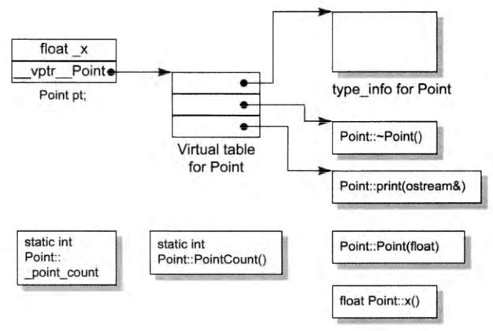
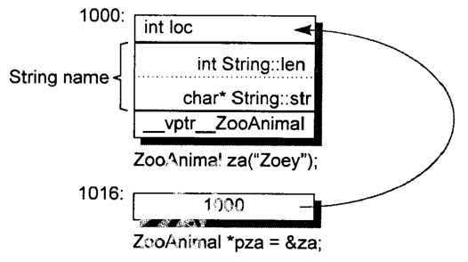
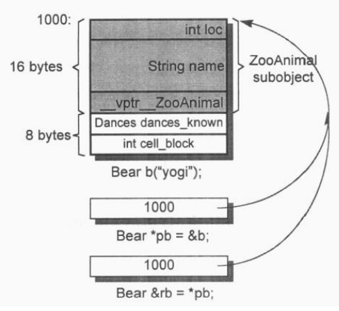
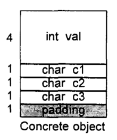
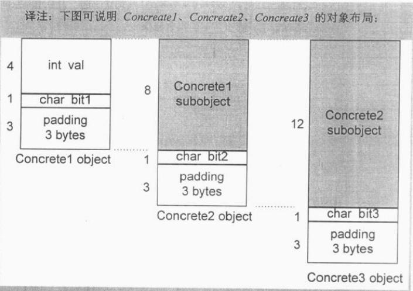
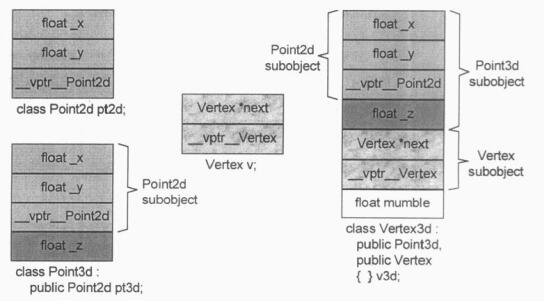

# 深度探索C++对象模型

## [第一章 关于对象模型](https://www.cnblogs.com/tgycoder/p/5426628.html)

### C++对象模型

​	此模型中，Nonstatic data members被配置于一个class object之内，static data members则被存放在个别的class object之外。Static和nonstatic function members也被存放在个别的class object之外。Virtual functions则分两个步骤支持之：

1. 每一个class产生出一堆指向Virtual functions的指针，放在表格之中。这个表格被成为虚函数表（virtual table,vtbl)；
2. 每一个class object被安插一个指针，指向相关的virtual table。通常这个指针被称为vptr。vptr的设定和重置都由每一个class的构造函数、析构函数和拷贝赋值运算符自动完成。每一个class所关联的type_info object（用以支持runtime type identification,RTTI,运行时类型识别），也经由virtual table被指出来，通常放在表格的第一个slot。



​	上图为C++对象模型示例。主要**优点**在于它的空间和存取时间的效率；主要**缺点**则是，如果应用程序代码本身未曾改变，但所用到的class objects和nonstatic data members有所改变，那么应用程序代码同样需要重新编译。

### 关键词带来的差异

​	struct和class从语法本质上差别并不大，无非是二者的默认继承和默认成员访问级别不同。但从一般来说，我们习惯用struct来代表一些简单数据的集合，用class来代表更为复杂的封装、继承的数据。

### 对象的差异

​	C++程序设计模型直接支持三种程序设计范式

1. 程序模型；

2. 抽象数据类型模型；

3. 面向对象模型。

   需要多少内存能表现一个class object？（类的大小）一般而言：

- 其nonstatic data members的总和大小；（非静态成员变量）
- 加上任何由于数据对齐而填补上去的空间；
- 加上支持virtual而由内部产生的任何额外负担。（虚函数表指针，4字节）

#### 指针的类型

​	指向不同类型的指针有什么不同？

```c++
ZooAnimal *px；
int *pi;
Array<string> *px;
```

​	从内存的观点来说没有什么不同！它们三个都需要足够的内存来放置一个机器地址。"指向不同类型之各指针"间的差异，既不在其指针表示方法不同，也不在其内容（代表一个地址）不同，**而是在其所寻址出来的object类型不同**。也就是说，“指针类型”会教导编译器如何解释某个特定地址的内存内容及其大小。

```c++
class ZooAnimal{
public:
    ZooAnimal();
    virtual ~ZooAnimal();
    //……
    virtual void rotate();
protected:
    int loc;
    string name;
};

ZooAnimal za("Zoey");
ZooAnimal *pza=&za;
```

- 一个指向地址1000的整数指针，在32位机器上，其涵盖地址空间1000~1003

- 如果string是传统的8-bytes（包含一个4-bytes的字符指针和一个用来表示字符串长度的整数），那么一个ZooAnimal指针将横跨地址空间1000~1015（注：非静态成员变量（int4+string8）+虚函数指针（4）=16）

  

#### 加上多态后

​	定义一个Bear继承ZooAnimal：

```c++
class Bear:public ZooAnimal{
public:
    Bear();
    ~Bear();
    //……
    void rotate();
    virtual void dance();
    //……
protected:
	enum Dances{……};
    Dances dances_known;
    int cell_block;
};

Bear b("Yogi");
Bear *pb=&b;
Bear &rb=pb;
```

​	Bear object需要24bytes，也就是ZooAnimal的16bytes加上Bear所带的8bytes。可能的内存布局如图所示：



​	假设我们的Bear object放在地址1000处，一个Bear指针和一个ZooAnimal指针有什么不同

```c++
Bear b;
ZooAnimal *pz=&b;
Bear *pb=&b;
```

​	它们每个指针指向Bear object的第一个byte。其间差别是，**pb所涵盖的地址包含整个Bear object，而pz所涵盖的地址只包含Bear object中的ZooAnimal subobject**。

​	除了ZooAnimal subobject中出现的members，不能使用pz来直接处理Bear中的任何members。**唯一例外是通过virtual机制**（注：具体参考书上内容，virtual实现运行时多态）。

## 第二章 构造函数语意学

### [Default Constructor的构造操作](https://blog.csdn.net/zyl_1102179268/article/details/60370626)

​	C++并不会为每一个没有声明构造函数的类生成一个default constructor。只有在以下四种情况下，会造成“编译器必须为未声明constructor的classes合成一个default constructor”:

1. "带有Default Constructor"的Member Class Object

   ​	如果一个class没有任何constructor，但它内含一个member object，而后者有default constructor，那么这个class的implicit default constructor就是“nontrivial”（有用的），编译器要为该class合成一个default constructor。不过这个合成操作只在constructor真正需要被调用时才会发生。

2. “带有Default Constructor”的Bases Class

   ​	如果一个没有任何constructors的class派生自一个”带有default constructor“的base class，那么这个derived class的default constructor会被视为nontrivial（有用的），并因此需要被合成出来。它将调用上一层base classes的default constructor（根据声明顺序）。对一个后继派生的class而言，这个合成的constructor和一个”被显示提供的default constructor“没有什么差异。

   ​	如果设计这提供了多个constructors,但没有default constructor，编译器会空中现有的第一个constructor，将”用以调用所有必要之default constructor“的程序代码加进去。它不会合成新的default constructor。

3. ”带有Virtual Function“的Class

   ​	另有两种情况也需要合成default constructor：

   - class声明（或继承）一个virtual function；

   - class派生自一个继承串链，其中一个或多个的virtual bases classes；

     注：有virtual function存在是需要default constructor在编译期间产生virtual funtion table，以及一个指向虚函数表的指针（vptr）

4. ”带有一个Virtual Bases Class“的Class

   ​	 虚继承也会在子类对象中被合成一个指向虚基类的指针，因此也要被初始化，所以必须要构造函数，虚基类或者虚继承保证子类对象中只有一份虚基类的对象。

**总结：**

​	以上4中情况下，”编译器必须为未声明constructor的classes合成一个default constructor“。c++标准把这些合成物称为implicit nontrivial default constructors。被合成的constructor只能满足编译器（非程序）的需要。它之所以能完成任务，是借着”**调用member object或base class的default constructor**“或是”**为每一个object初始化其virtual function机制或virtual base class机制**“而完成的。没有存在那4种情况而又没有声明任何constructor的classes，我们说它们拥有implicit trivial（无用的）default constructors，它们并不会被合成出来。 

**C++新手一般两个常见的误解：**

- 任何class没有定义default constructor，就会被合成出来一个；wrong！
- 编译器合成出来的default constructor会显式设定”class内每一个data member的默认值“；wrong！

### Copy Constructor的构造操作

​	有三种情况会以一个对象的内容作为另一个对象的初值：

1. 一个object做显示初始化操作
2. 当object被当作参数交给某个函数的时候
3. 当函数传回一个class object时

- Default Memberwise(对每一各member施以……) Initialization

  ​	如果class没有提供一个explicit copy constructor又当如何？当class object以”相同class的另一个object“作为初值，其内部是所谓的default memberwise initialization手法完成的，也就是把一个内建的或派生的data member的值，从某个object拷贝一份到另一个object身上。不过它并不会拷贝其中的member class object，而是以递归的方式施行memberwise initialization。

> Dafault constructor和copy constructor在必要的时候才由编译器产生出来

​	像default constructor一样，C++ Standard上说，如果class没有声明一个copy constructor，就会有隐式的声明（implicitly declared）或隐式的定义（implicitly defined）出现。和以前一样，C++ Standard把copy constructor区分为trivial和nontrivial（没有用的/有用的）两种。只有nontrivial 的实例才会被合成于程序之中。决定一个copy constructor是否为trivial的标准在于class是否展现出所谓的”Bitwise Copy Semantics“。

- Bitwise Copy Semantics（逐次拷贝）

  **当class展现了Bitwise Copy Semantics则不需要合成一个Dafault copy constructor，反之则需要。**

- 不要Bitwise Copy Semantics！

  什么时候class不展现出”Bitwise Copy Semantics“呢？（即**需要合成Dafault copy constructor**）

  1. 当class内含一个member object而后者的class存在一个copy constructor时；
  2. 当class继承自一个base class而后者存在一个copy constructor时；
  3. 当class声明了一个或多个virtual functions时；
  4. 当class派生自一个继承串链，其中一个或多个virtual base classes时。

- 重新设定Virtual Table的指针

  ​	编译器期间的两个程序扩张操作（只要一个class声明了一个或多个virtual functions就会如此）：

  - 增加一个virtual function table（vtbl），内含每一个有作用的virtual function的地址；

  - 一个指向virtual function table的指针（vptr），安插在每一个class object内。

    当编译器导入一个vptr到class之中时，该class就不再展现Bitwise Semantics了，编译器需要合成一个copy constructor以求将vptr适当初始化。

- 处理Virtual Base Class Subobject（虚继承）

### 程序转化语意学

​	介绍编译器对程序执行过程的优化。

### 成员们的初始化队伍

​	当你写下一个constructor时，就有机会设定class members的初值。要不是经由member intialization list，就是在constructor函数本体之内。除了4种情况，两种选择差不多。

​	在下列情况下，为了让程序能够被顺利编译，**[必须使用member intialization list](http://www.cnblogs.com/codingmengmeng/p/6285580.html)**：

1. 当初始化一个reference member时；

2. 当初始化一个const member；

3. 当调用一个base class的constructor，而它拥有一组参数时；（如果类存在继承关系，派生类必须在其初始化列表中调用基类的构造函数）

4. 当调用一个member class的constructor，而它拥有一组参数时。（注：类成员为没有默认构造函数的类类型）

   注：**list中的初始化顺序是由class中member的声明顺序决定的，而不是由initialization list中的排列顺序决定的。**（不注意会导致以下问题）

   ```c++
   class X{
       int i;
       int j;
   public:
   	X(int val):j(val),i(j){}
   	//……
   }
   ```

   ​	上述程序看起来是要把j设初值为val，再把i设初值为j。问题在于，由于声明顺序的缘故，initialization list中的i(j)比j(val)更早执行。但因j一开始未有初值，所以i(j)的执行结果导致i无法预知	其值。

## 第三章 Data语意学

​	C++对象模型尽量以空间优化和存取速度优化的考虑来表现nonstatic data members，并且保持和C语言struct数据配置的兼容性，它把数据直接存放在每一个class object中。对于继承而来的nonstatic data members也是如此。不过并没有强制定义其间的排列顺序。至于static data members，则被放置在程序的一个global data segment中，不会影响个别class object的大小，static data members永远只存在一份实例。

​	每一个class object必须有足够的大小以容纳它所有的nonstatic data members。但有时候可能比预想的还大，原因是：

1. 有编译器自动加上额外的data members，用以支持某些语言特性（主要是各种virtual特性）；
2. 因为alignment（边界调整）的需要。

### Data member的绑定

### Data member的布局

已知下面一组data member：

```c++
class Point3d{
public:
    //……
private:
    float x;
    static List<Point3d*> freeList;
    float y;
    static const int chuckSize=250;
    float z;
};
```

​	**Nonstatic data member在class object中的排列顺序和其被声明的顺序一样**，任何中间介入的static data member如freeList、chuckSize都不会被放进对象布局中。在上例中Point3d对象是由3个float组成的，顺序是x,y,z。static data members存放在程序的data segment中，和个别的class object无关。

​	C++标准要求，在同一个access section（也就是private、public、protected等区段）中，members的排列顺序只需符合“较晚出现的members在class object中较高的地址”这一条即可。也就是说，各个members并不一定得连续排列。members的边界调整（alignment）可能需要补充一些bytes。

​	编译器还会合成一些内部使用的data members，以支持整个对象模型。vptr就是这样的东西。vptr传统上它被安放在所有显示声明memebers的最后，不过如今也有一些编译器把vptr放在一个class object的最前端。

​	C++允许编译器将多个access sections中的data members自由排列，不必在乎它们出现在class声明中的顺序，不过目前没有编译器这么做。

### Data member的存取

已知下面这段代码：

```c++
Point3d origin;
origin.x=0.0;
```

​	x的存取成本是什么？答案视x和Point3d如何声明而定。x可能是个static member，也可能是nonstatic member。Point可能是个独立（非派生）的class，也可能是从另一个单一的base class派生而来。

​	抛出问题。如果有两个定义，origin和pt：

```
Point3d origin,*pt=&origin;
```

​	用它们存取data members，例如：

```c++
origin.x=0.0;
pt->x=0.0;
```

​	两种存取方式是否有重大差异？

#### Static Data Members

​	类的每个static成员都只有一个实例，存放在程序的data segment之中，和对象无关；因此对于这种情况，对x的存取并不会招致任何空间和时间上的额外负担。从指令执行的观点来看，这是C++语言中”通过一个指针和通过一个对象来存取member，结论完全相同“的唯一一种情况。

#### Nonstatic Data Members

​	欲对一个nonstatic data members进行存取操作，编译器需要把class object的起始地址加上data member的**偏移地址**。例如：

```c++
//源代码
origin._y=0.0;
//编译后的代码
*(&origin+(&Point3d::_y-1))=0.0;
```

### "继承"与Data member

#### 只要继承不要多态

​	在有继承的情况下，可能会导致空间上的浪费。我们来看这样一个例子：

```c++
class Concrete{
public:
	//……
private:
	int val;
	char c1;
	char c2;
	char c3;
};
```



​	这个类中存有一个int和三个char，如果我们把这些变量都放到一个类中声明，那么算上alignment，它的对象大小为8字节。

​	现假设Concrete分裂为三层结构：

```c++
class Concrete1{
public:
	//……
private:
    int val;
    char bit1;
};

class Concrete2:public Concrete1{
public:
    //……
private:
    char bit2;
};

class Concrete3:public Concrete2{
public:
    //……
private:
    char bit3;
};
```

​	那么Concrete3的对象的大小将达到16字节，比原先的设计多了100%！

​	这是因为alignment(边界调整)导致的，因为C++的对象模型中，在一个继承而来的类的内存分布里，各个基类需要分别遵循alignment，从而导致了空间的浪费。具体地对象布局可见下图：



#### 加上多态

​	在这种情况下，无论是时间还是空间上，访问类的成员都会带来一定额外的负担，主要体现在以下几个方面：

1. virtual table，用来存放它所声明的每一个virtual functions的地址。
2. 每一个对象中会有一个vptr，提供执行期的链接。
3. 编译器会重写constructor和destructor，使其能够创建和删除vptr

#### 多重继承

​	多重继承既不像单一继承，也不容易模塑出其模型。多重继承的复杂度在于derived class和其上一个base class乃至上上一个base class……之间的“非自然”关系。例如，考虑下面这个多重继承所获得的class vertex3d:

```c++
class Point2d{
public:
    //……
protected:
   float _x,_y;
};

class Point3d:public Point2d{
public:
    //……
protected:
   float _z;
};

class Vertex{
public:
    //……
protected：
    Vertex *next；
};

class Vertex3d:public Point3d,public Vertex{
public:
    //……
protected:
    float mumble;
};
```

继承关系如下：


​	对一个多重派生对象，将其地址指定给”最左端（也就是第一个）base class的指针“，情况将和单一继承时相同，因为二者都指向相同的起始地址。需付出的成本只有地址的指定操作而已。至于第二个或后继的base class的地址指定操作，则需要将地址修改过：加上介于中间的base class subobject大小，例如：

```c++
Vertex3d v3d;
Vertex *pv;
Point2d *p2d;
Point3d *p3d;
```

对于操作：

```c++
pv=&v3d;
```

需要这样的内部转化：

```c++
//虚拟C++代码
pv=(Vertex*)(((char*)&v3d)+sizeof(Point3d));
```

而对于下面操作：

```c++
p2d=&v3d;
p3d-&v3d;
```

只需要简单地拷贝其地址就好。



#### 虚拟继承

### 成员对象的效率

### 指向Data Members的指针

## 第四章 Function语意学


