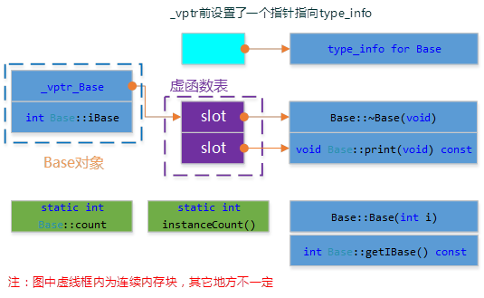
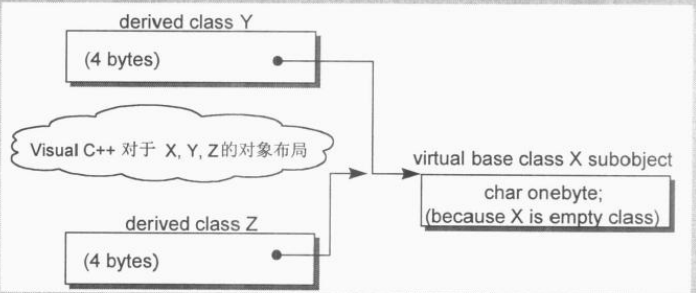

# C++基础

## 程序设计基础

### 内存分配与管理

#### 内存分配方式

  由C/C++编译的程序占用的内存分为以下几个部分

1. 栈区(stack)：由编译器自动分配释放，存放函数的参数值，局部变量等。其操作方式类似于数据结构中的栈。
2. 堆区(heap)：一般由程序员分配释放（malloc/free、new/delete），若程序员不释放，程序结束时可能由操作系统回收。注意它与数据结构中的堆是两回事，分配方式倒是类似于链表。
3. 全局区(static)：全局变量和静态变量的存储是放在一块的，初始化的全局变量和静态变量在一块区域，未初始化的全局变量和未初始化的静态变量在相邻的另一块区域，程序结束后由系统释放。
4. 文字常量区：常量字符串就是放在这里的，程序结束后由系统释放。
5. 程序代码区：存放函数体的二进制代码

#### 堆和栈区别

- 申请方式不同。
  - 栈由系统自动分配。
  - 堆由程序员手动分配。
- 申请大小限制不同。
  - 栈向低地址方向增长，栈顶和栈底是之前预设好的，大小固定。
  - 堆向高地址方向增长，是不连续的内存区域，大小可以灵活调整。
- 申请效率不同。
  - 栈，速度快，是一个先进后出的队列，进出一一对应，不会产生碎片。
  - 堆，速度慢，频繁的new/delete会造成大量碎片，使程序效率降低。

#### 动态内存

**malloc、calloc、realloc、alloca**

1. malloc：申请指定字节数的内存。申请到的内存中的初始值不确定。
2. calloc：为指定长度的对象，分配能容纳其指定个数的内存。申请到的内存的每一位(bit)都初始化为0
3. realloc：更改以前分配的内存长度(增加或减少)。当增加长度时，可能需将以前分配区的内容移到另一个足够大的区域，而新增区域内的初始值则不确定
4. alloca：在栈上申请内存。程序在出栈的时候，会自动释放内存。但是需要注意的是，alloca不具可移植性, 而且在没有传统堆栈的机器上很难实现。alloca不宜使用在必须广泛移植的程序中,。C99中支持变长数组(VLA), 可以用来替代alloca()。

**malloc、free**

申请内存，确认是否申请成功

```c++
char *str = (char*) malloc(100);
assert(str != nullptr);
```

释放内存后指针置空

```c++
free(p); 
p = nullptr;
```

**new、delete**

1. new/new[]：完成两件事，先底层调用malloc分了配内存，然后创建一个对象（调用构造函数）。
2. delete/delete[]：也完成两件事，先调用析构函数（清理资源），然后底层调用free释放空间。
3. new在申请内存时会自动计算所需字节数，而malloc则需我们自己输入申请内存空间的字节数。

```c++
int main()
{
    T* t = new T();     // 先内存分配 ，再构造函数
    delete t;           // 先析构函数，再内存释放
    return 0;
}
```

#### 内存泄露

​	堆是动态分配内存的，并且可以分配很大的内存，使用不好会产生内存泄露。频繁使用malloc和free会产生内存碎片。

​	所谓内存泄漏是指由于疏忽或错误造成程序未能释放已经不再使用的内存的情况。一般常说的内存泄漏是指堆内存的泄露。内存泄露其实并非指内存在物理上的消失，而是应用程序分配某段内存后，由于设计错误，失去了对该段内存的控制，因而造成了内存的浪费。内存泄漏与许多其他问题有着相似的症状，并且通常情况下只能由哪些可以获得程序源码的程序员才可以分析出来。

​	应用程序一般使用malloc、calloc、realloc、new等函数从堆中分配到一块内存，使用完后，程序必须负责响应地调用free、delete释放内存块，否则这块内存就不能再次使用，造成内存泄露。	

#### new/delete和malloc/free区别

 [new/delete实现]( http://blog.csdn.net/passion_wu128/article/details/38966581)

1. new/delete是c++关键字，需要编译器支持；malloc/free是库函数，需要头文件支持；

2. new能够自动计算需要分配的内存空间，而malloc需要手工计算字节数。例如，`int* p1=new int[2],int * p2=malloc(2*sizeof(int))`;

3. new与delete直接返回具体类型的指针，而malloc与free返回void类型指针。

4. new是类型安全的，而malloc不是，例如，int * p=new float[2], 编译时就会报错；而`int * p=malloc(2*sizeof(int))`, 编译时编译器就无法指出错误来。

5. new会先调用operator new函数，申请足够的内存（通常底层使用malloc实现）。然后调用类型的构造函数，初始化成员变量，最后返回自定义类型指针。delete先调用析构函数，然后调用operator delete函数释放内存（通常底层使用free实现）。

   malloc/free是库函数，只能动态的申请和释放内存，无法强制要求其做自定义类型对象构造和析构工作。

6. C++允许重载new/delete操作符，特别的，布局new的就不需要为对象分配内存，而是指定了一个地址作为内存起始区域，new在这段内存上为对象调用构造函数完成初始化工作，并返回此地址。而malloc不允许重载。

### 指针相关

#### 引用和指针

- 引用只是别名，不占用具体存储空间，只有声明没有定义；指针是具体变量，需要占用存储空间。
- 引用在声明时必须初始化为另一变量，一旦出现必须为typename refname &varname形式；指针声明和定义可以分开，可以先只声明指针变量而不初始化，等用到时再指向具体变量。
- 引用一旦初始化之后就不可以再改变（变量可以被引用为多次，但引用只能作为一个变量引用）；指针变量可以重新指向别的变量。
- 不存在指向空值的引用，必须有具体实体；但是存在指向空值的指针。

#### 指针数组和数组指针

​	指针数组，是指一个数组里面装着指针，也即指针数组是一个数组。一个有10个指针的数组，其中每个指针指向一个整型数，那么次数组定义位：

```c
int *a[10];
```

​	数组指针，是指一个指向数组的指针，它其实还是指针，只不过它指向整个数组。一个指向有10个元素整形数组的指针定义为：

```c
int （*a）[10];
```

### 字符串相关函数

#### strcmp

```c
int Strcmy(const char* str1,const char* str2)
{
	assert(str1!=NULL&&str2!=NULL);
	int ret = 0;
	while (!(ret = *(unsigned char*)str1 - *(unsigned char*)str2) && *str1)
	{
		str1++;
		str2++;
	}
	if (ret < 0) return -1;
	else if (ret > 0) return 1;
	else return 0;
}
```

#### strcat,strcpy,strncpy

`strcat(dest,scr)`把src所指字符串添加到dest尾处（覆盖dest结尾的'\'）并添加'\0'

```c++
char * my_strcat(char *dest, const char *ptr)
{
	char *temp = dest;
	while (*temp != '\0')
	{
		temp++;
	}
	while (*ptr != '\0')
	{
		*temp = *ptr;
		temp++;
		ptr++;
	}
	*temp = '\0';
	return dest;
}
```

strcpy(dest,src)把从scr地址开始且还有null结束符的字符串复制到以dest开始的地址空间

```c++
char *my_strcpy( char *dst, const char *scr )  
{  
    char *ret = dst;//保存返回地址  
    assert(dst);  
    assert(scr);  
    while( *dst++ = *scr++ );//实现拷贝  
    return ret;  
}  
```

#### memcpy,memset

```c++
void *memcpy(void *dest,const void *src,size_t n);
```

功能：从源src所指的内存地址的起始位置开始拷贝n个字节到目标dest所指的内存地址的起始位置中。函数返回指向*dest的指针。

memcpy与strcpy区别

1. 复制的内容不同。strcpy只能复制字符串，而memcpy可以复制任意内容，例如字符数组、整形、结构体、类等。strcpy只能用于字符串复制，并且它不仅复制字符串内容之外还会复制字符串的结束符。memcpy对于需要复制的内容没有限制，因此用途更广。
2. 复制的方法不同。strcpy不需要指定长度，它遇到被复制字符的串结束符'\0'时才结束，所以容易溢出。memcpy则根据其第三个参数决定复制的长度。
3. 用途不同。通常在复制字符串时使用strcpy，而需要复制其他数据时一般用memcpy。

```c++
void *memset(void *s,int ch,sizet n);
```

功能：将s中前n个字节用ch替换并返回s，作用是一段内存中填充某个给定的值，它是对较大的结构体或数组进行清零操作的一种最快方法，

### 关键字

####[const关键字](https://www.cnblogs.com/chogen/p/4574118.html)

常量：

const限定符把一个对象转换成一个常量，因为常量定义后就不能修改，所以定义时必须初始化。

修饰类成员变量：

```c++
//用const修饰的类成员变量，只能在类的构造函数初始化列表中赋值，不能在类构造函数体内赋值。
class A
{
public：
    A(int x) : a(x)  // 正确
    {
         //a = x;    // 错误
    }
private：
    const int a;
};
```

修饰类成员函数：

```c++
//用const修饰的类成员函数，在该函数体内不能改变该类对象的任何成员变量, 也不能调用类中任何非const成员函数。
class A
{
public:
    int& getValue() const
    {
        // a = 10;    // 错误
        return a;
    }
private:
    int a;            // 非const成员变量
};
```

修饰类对象：

```c++
/*用const修饰的类对象，该对象内的任何成员变量都不能被修改。
因此不能调用该对象的任何非const成员函数，因为对非const成员函数的调用会有修改成员变量的企图。*/
class A
{
 public:
    void funcA() {}
    void funcB() const {}
};
int main
{
    const A a;
    a.funcB();    // 可以
    a.funcA();    // 错误

    const A* b = new A();
    b->funcB();    // 可以
    b->funcA();    // 错误
}
```

#### [static关键字](https://www.cnblogs.com/BeyondAnyTime/archive/2012/06/08/2542315.html)

**c语言中static的用法：**

1、全局静态变量：

- 用法：在全局变量前加上关键字static，全局变量就定义成一个全局静态变量。 static int temp；
- 内存中的位置：静态存储区，在整个程序运行期间一直存在。
- 初始化：未经初始化的全局静态变量会被自动初始化为0（自动对象的值是任意的，除非他被显式初始化）；
- 作用域：全局静态变量在声明他的文件之外是不可见的，准确地说是从定义之处开始，到文件结尾。

2、局部静态变量：

- 在局部变量之前加上关键字static，局部变量就成为一个局部静态变量。
- 内存中的位置：静态存储区;
- 初始化：未经初始化的全局静态变量会被自动初始化为0（自动对象的值是任意的，除非他被显式初始化）；且<u>只在第一次被调用时定义</u>;
- 作用域：作用域仍为局部作用域，当定义它的函数或者语句块结束的时候，作用域结束。但是当局部静态变量离开作用域后，并没有销毁，而是仍然驻留在内存当中，只不过我们不能再对它进行访问，直到该函数再次被调用，并且值不变；

3、静态函数：

　　在函数返回类型前加关键字static，函数就定义成静态函数。函数的定义和生命在默认情况下都是extern的，但静态函数只是在声明他的文件当中可见，不能被其他文件所用；

**c++中static的用法：**

1、类的静态成员：

```c++
class A{
	private:
	static int val;
};
int A::val=0；
```

　　在cpp中必须对他进行初始化，初始化时使用作用域运算符来标明他所属类，其**属于该类的所有成员共有**，只有一个拷贝；

​	静态数据成员存储在全局数据区。静态数据成员定义时要分配空间，所以不能在类声明中定义。在Example中，语句int A::val=0;是定义静态数据成员；（类内声明，类外定义）

2、类的静态成员函数：

```c++
class A{
	private:
	static int func(int x);
};
```

　　 实现的时候也不需要static的修饰，因为static是声明性关键字；类的静态函数是该类的范畴内的全局函数，**不能访问类的私有成员，只能访问类的静态成员，不需要类的实例即可调用**、（非静态成员函数可以任意地访问静态成员函数和静态数据成员）；实际上，他就是增加了类的访问权限的全局函数；

　　void  A::func(int);

　　静态成员函数可以继承和覆盖，但**无法是虚函数**；

3、只在cpp内有效的全局变量：

　　在cpp文件的全局范围内声明：

　　static int val = 0；

　　这个变量的含义是该cpp内有效，但是其他的cpp文件不能访问这个变量；如果有两个cpp文件声明了同名的全局静态变量，那么他们实际上是独立的两个变量；

4、只在cpp内有效的全局函数：

　　函数的实现使用static修饰，那么这个函数只可在本cpp内使用，不会同其他cpp中的同名函数引起冲突；

　　warning：不要再头文件中声明static的全局函数，不要在cpp内声明非static的全局函数，如果你要在多个cpp中复用该函数，就把它的声明提到头文件里去，否则cpp内部声明需加上static修饰；

#### volatile关键字

```c++
  volatile int i = 10; 
```

  - volatile关键字是一种类型修饰符，用它声明的类型变量表示可以被某些编译器未知的因素（操作系统、硬件、其它线程等）更改。
  - volatile关键字声明的变量，每次访问时都必须从内存中取出值（没有被 volatile 修饰的变量，可能由于编译器的优化，从 CPU 寄存器中取值）
  - const 可以是 volatile （如只读的状态寄存器）
  - 指针可以是 volatile

#### define和const定义常量

- 用`#define MAX 255`定义的常量是**没有类型**的，所给出的是一个立即数，编译器只是把所定义的常量值与所定义的常量的名字联系起来，define所定义的宏变量在预处理的时候进行替换，在程序中使用到该常量的地方都要进行拷贝替换；

  用`const float MAX = 255;` 定义的常量有类型名字，存放在内存的静态区域中，在程序运行过程中const变量只有一个拷贝，而#define 所定义的宏变量却有多个拷贝，所以宏定义在程序运行过程中所消耗的内存要比const变量的大得多；

- 用define定义的常量是不可以用指针变量去指向的，用const定义的常量是可以用指针去指向该常量的地址的；

- 用define可以定义一些简单的函数，const是不可以定义函数的.

  - 具体来说，有以下几方面的区别：

    - 编译器处理方式 

      define – 在预处理阶段进行替换 
      const – 在编译时确定其值

    - 类型检查 

      define – 无类型，不进行类型安全检查，可能会产生意想不到的错误 
      const – 有数据类型，编译时会进行类型检查

    - 内存空间 

      define – 不分配内存，给出的是立即数，有多少次使用就进行多少次替换，在内存中会有多个拷贝，消耗内存大 
      const – 在静态存储区中分配空间，在程序运行过程中内存中只有一个拷贝

#### strlen和sizeof

自定义函数实现strlen功能：

```c
int strlen(const char *str){
    assert(str!=NULL);
    int len=0;
    while((*str++)!='\0')
        len++;
    return len;
}
int strlen(const char *str){
    assert(str!=NULL);
    return *str=='\0'? 0 : (1+strlen(++str));
}
```

- sizeof是运算符，并不是函数，结果在编译时得到而非运行中获得；strlen是字符处理的库函数。
- sizeof参数可以是任何数据的类型或者数据（sizeof参数不退化）；strlen的参数只能是字符指针且结尾是'\0'的字符串。
- **因为sizeof值在编译时确定，所以不能用来得到动态分配（运行时分配）存储空间的大小。**
- `strlen("\0")=0;sizeof("\0")=2;`

### 结构体共用体枚举

#### 概念

##### 共用体

​	结构体和共用体（联合）都是由不同的数据类型成员组成，但在任何同一时刻，共用体中只存放了一个被选中的成员，而结构体的所有成员都存在。对于共用体的不同成员赋值，将会对其他成员重写，原来的成员的值就不存在了，而对于结构体的不同成员赋值是互不影响的。

##### 枚举

​	枚举（enum）是一种用户自定义的类型，定义的基本格式为：

`enum 枚举类型名 {枚举常量1[=整形常数]，枚举常量1[=整形常数]，…}  [变量名列表]`

​	花括号中内容称为枚举表，其中的每一项称为枚举常量，换言之，枚举表是枚举常量的集合。枚举表中每项后的“=整形常数”是给枚举常量赋初值，用方括号代表可以省略，如果不给枚举常量赋值，编译器会给每一个枚举常量赋一个不同的整形值，第一个为0，第二个为1等。当枚举表中某个常量赋值后，其后的成员则按一次加1的规则确定其值。

#### 空间计算

##### struct

遵循两个原则：

- 整体空间是占用空间最大的成员（的类型）所占字节数的整数倍，但在32位Linux+gcc（vs下不满足）环境下，若最大成员类型所占字节超过4，如double是8，则整体空间是4的倍数即可。
- 数据对齐原则——内存按结构体成员的先后顺序排列，当排到该成员变量时，其前面已摆放的空间大小必须是该成员类型大小的整数倍，如果不够则补齐，依次向后类推，但在Linux+gcc（vs下不满足）下，若某成员类型占字节数超过4，如double是8，则前面已摆放的空间大小是4的倍数即可，不够则补齐。

```c++
//struct空间计算例子，windows32环境
struct s1{
    char a;
    double b;
    int c;
    char d;
};                         //sizeof(s1)=24;
struct s2{
    char a;
    char b;
    int c;
    double d;
};						//sizeof(s2)=16;
```

##### 位域

​	在结构体和类中，可以使用位域来规定某个成员所能占用的空间，所以使用位域能在一定程度上节省结构体占用的空间。

​	使用位域的主要目的是**压缩存储**，其大致规则为：

1. 如果相邻位域字段的类型相同，且其位宽之和小于类型的sizeof大小，则其后面的字段将紧邻前一个字段存储，直到不能容纳为止；
2. 如果相邻位域字段的类型相同，但其位宽之和大于类型的sizeof大小，则后面的字段将从新的存储单元开始，其偏移量为其类型大小的整数倍；
3. 如果相邻的位域字段类型不同，则各编译器的具体实现有差异，VC6采取不压缩方式，Dev-C++与gcc采取压缩方式；
4. 如果位与字段之间穿插着非位域字段，则不能进行压缩；
5. 整个结构体的总大小为最宽基本类型成员大小的整数倍。

```c++
//Linux+gcc
struct a{
    int f1:3;       //8位只占用前三位
    char b;
    char c;
};                  //sizeof（a)=4;     VS下参见规则3不压缩，8

struct b1{
    char f1:3;
    char f2:4;     //第一个字节可容纳f1和f2
    char f3:5;
}                  //sizeof(b1)=2;
```

##### “#pragma pack”

​	基本用法：#pragma pack（n）,n为字节对齐数，其取值为1、2、4、8、16等，默认为8，如果这个值比结构体成员的sizeof值小，那么该成员的偏移量应该以此值为准，即结构体成员的偏移量应该取二者的最小值，公式如下：`offsetof(item)=min(n,sizeof(item));`

```c++
#pragma pack(4)
struct node{
  char f;          //0~3
  int e;		  //4~7
  short int a;     //8~9
  char b;          //10
};                 //sizeof(node)=12; 4的倍数

#pragma pack(2)
struct node{
  char f;          //0~1
  int e;           //2~5    #2位对齐，即是2的倍数地址，不能为4的倍数
  short int a;     //6~7
  char b;          //8
};                 //sizeof（node）=10; 2的倍数

#pragma pack(1)
struct node{
  char f;
  int e;
  short int a;
  char b;
};			 //sizeof（node）=8; 
```

##### union

​	结构体在内存组织上是顺序式的，联合体是重叠式，各成员共享一段内存，所以整个联合体的sizeof也就是每个成员sizeof的最大值。但uninon也需要跟struct一样考虑对齐问题，原则同struct规则1.

```c++
union s1{
	double b;
};
union U{
    int i;
    char c;
    s1 s;
}              //sizeof(U)=8


//考虑对齐问题
union{
    char b[9];
    int bh[2];
}c;                //数组b占用9个字节，考虑对齐，须是4（int 占用空间数）的整数倍，故补齐为12
```

## C++相关语法

### struct和class

- C的struct与C++的class的区别：struct只是作为一种复杂数据类型定义，不能用于面向对象编程。 
- C++中的struct和class的区别：对于成员访问权限以及继承方式，class中默认的是private的，而struct中则是public的。class还可以用于表示模板类型，struct则不行。

### 关键字

#### [auto和decltype](https://www.cnblogs.com/XiangfeiAi/p/4451904.html)

#### [explicit](https://www.cnblogs.com/ymy124/p/3632634.html)

​	explicit关键字只能用于**修饰只有一个参数的类构造函数**，它的作用是表明该构造函数是显示的，而非隐式的，跟它相对应的另一个关键字是implicit，意思是隐藏的，类构造函数默认情况下即声明为implicit。

作用：**禁止隐式调用类内的单参构造函数**，主要包括以下三层意思：

- 该关键字只能用来修饰类内部的构造函数；
- 禁止隐式调用拷贝构造函数；
- 禁止类对象之间的隐式转换；

```c++
class CTest1 {
public:
    CTest1(int n)
    {
        cout<<"Constructor of CTest1"<<endl;
    }
    CTest1(const CTest1&)
    {
        cout<<"Copy constructor of CTest1"<<endl;
    }
};
class CTest2 {
public:
    explicit CTest2(int n)
    {
        cout<<"Constructor of CTest2"<<endl;
    }
    explicit CTest2(const CTest2&)
    {
        cout<<"Copy constructor of CTest2"<<endl;
    }
};
int main()
{
    CTest1 a1(1);            //显示调用构造函数
    CTest1 b1 = 1;           //隐式调用构造函数
    CTest1 c1 = a1;          //隐式调用拷贝构造函数
    CTest1 d1(b1);           //显示调用拷贝构造函数
    CTest2 a2(2);            //显示调用构造函数
    CTest2 b2 = 2;           //隐式调用构造函数，编译错误
    CTest2 c2 = a2;          //隐式调用拷贝构造函数，编译错误
    CTest2 d2(b2);           //显示调用拷贝构造函数
    return 0;
}
```

###[显式类型转换](http://blog.csdn.net/u010275850/article/details/49452373)

c++primer（144）

C++的四种显式类型转换为：`static_cast、const_cast、reinterpret_cast和dynamic_cast`

类型转换的一般形式：`cast-name<type>(expression);`

**static_cast**

任何具有明确定义的类型转换，只要不包含底层const，都可以使用static_cast；

```c++
//强制类型转换以便执行浮点数除法
double slope=static_cast<double>(j)/i;
```

```c++
注：

顶层const：表示指针本身是个常量。如：int *const p；

底层const：表示指针所指的对象是一个常量。如：int const *p；
```

**const_cast**

该运算符只能改变运算对象的底层const。

```c++
const char *pc;
char *p=const_cast<char*>(pc);
```

**reinterpret_cast**

通常为运算对象的位模式提供较低层次上的重新解释。

```c++
int *ip;
char *pc=reinterpret_cast(ip);
```

注：

1、在指针之间转换，将一个类型的指针转换为另一个类型的指针，无关类型；

2、将指针值转换为一个整型数,但不能用于非指针类型的转换。

**dynamic_cast**

运行时类型识别（以区别以上三个均在编译时识别），用于将基类的指针或引用安全地转换成派生类的指针或引用。

**总 结**

- 去const属性用const_cast。
- 基本类型转换用static_cast。
- 多态类之间的类型转换用daynamic_cast。
- 不同类型的指针类型转换用reinterpreter_cast

### 动态内存

#### [智能指针](https://www.cnblogs.com/wxquare/p/4759020.html)

​	C++程序设计中使用堆内存是非常频繁的操作，堆内存的申请和释放都由程序员自己管理。程序员自己管理堆内存可以提高了程序的效率，但是整体来说堆内存的管理是麻烦的，C++11中引入了智能指针的概念，方便管理堆内存。使用普通指针，容易造成堆内存泄露（忘记释放），二次释放，程序发生异常时内存泄露等问题等，使用智能指针能更好的管理堆内存。

##### shared_ptr

​	shared_ptr多个指针指向相同的对象。shared_ptr使用**引用计数**，每一个shared_ptr的拷贝都指向相同的内存。每使用他一次，内部的引用计数加1，每析构一次，内部的引用计数减1，减为0时，自动删除所指向的堆内存。shared_ptr内部的引用计数是线程安全的，但是对象的读取需要加锁。

- 初始化。智能指针是个模板类，可以指定类型，传入指针通过构造函数初始化。也可以使用make_shared函数初始化。不能将指针直接赋值给一个智能指针，一个是类，一个是指针。例如std::shared_ptr<int> p4 = new int(1);的写法是错误的
- 拷贝和赋值：**拷贝使得对象的引用计数增加1，赋值使得原对象引用计数减1**，当计数为0时，自动释放内存。后来指向的对象引用计数加1，指向后来的对象。

```c++
auto p=make_shared<int>(42); //p指向的对象只有p一个引用者
auto q=(p);   //p和q指向同一个对象，此对象有两个引用者

auto r=make_shared<int>(42);//p指向的对象只有r一个引用者
r=p;     //给r赋值，令它指向另一个地址
	     //递增q指向的对象的引用计数
		//递减r原来指向的对象的引用计数
		//r原来指向的对象已经没有引用者，会自动释放
```

- get函数获取原始指针
- 注意不要用一个原始指针初始化多个shared_ptr，否则会造成二次释放同一内存
- 注意避免循环引用，shared_ptr的一个最大的陷阱是循环引用，循环，循环引用会导致堆内存无法正确释放，导致内存泄漏。

```c++
#include <iostream>
#include <memory>
int main() {  
        int a = 10;
        std::shared_ptr<int> ptra = std::make_shared<int>(a);
        std::shared_ptr<int> ptra2(ptra); //copy
        std::cout << ptra.use_count() << std::endl;

        int b = 20;
        int *pb = &a;
        //std::shared_ptr<int> ptrb = pb;  //error
        std::shared_ptr<int> ptrb = std::make_shared<int>(b);
        ptra2 = ptrb; //assign
        pb = ptrb.get(); //获取原始指针

        std::cout << ptra.use_count() << std::endl;
        std::cout << ptrb.use_count() << std::endl;    
}
```

##### unique_ptr

​	unique_ptr“拥有”它所指向的对象。与shared_ptr不同，某个时刻只能有一个unique_ptr指向一个给定对象。当unique_ptr被销毁时，它所指向的对象也被销毁。

​	与shared_ptr不同，没有类似make_ptr的标准库函数返回一个unique_ptr。定义一个shared_ptr时，需要将其绑定到一个new返回的 指针上。

```c++
unique_ptr<double> p1; //可以指向一个double的unique_ptr
unique_ptr<int> p2(new int(42)); //p2指向一个值为42的int

//由于一个unique_ptr拥有它指向的对象，因此unique_ptr不支持普通的拷贝或赋值操作
unique_ptr<string> p1(new string("sss"));
unique_ptr<string> p2(p1);       //错误：unique_ptr不支持拷贝
unique_ptr<string> p3;
p3=p2                            //错误：unique_ptr不支持赋值
```

​	虽然不能拷贝或赋值unique_ptr，但可以通过调用release或reset将指针的所有权从一个（非const）unique_ptr转移给另一个unique：

```c++
//将所有权从p1（接上p1，指向“sss”）转移给p2
unique_ptr<string> p2(p1.release());  //release将p1置空
unique_ptr<string> p3(new string("nnn"));
//将所有权从p3转移到p2
p2.reset(p3.release());//reset释放了p2原来指向的内存
```

##### weak_ptr

​	weak_ptr是为了配合shared_ptr而引入的一种智能指针，因为它不具有普通指针的行为，没有重载operator*和->,它的最大作用在于协助shared_ptr工作，像旁观者那样观测资源的使用情况。weak_ptr可以从一个shared_ptr或者另一个weak_ptr对象构造，获得资源的观测权。但weak_ptr没有共享资源，它的构造不会引起指针引用计数的增加。使用weak_ptr的成员函数use_count()可以观测资源的引用计数，另一个成员函数expired()的功能等价于use_count()==0,但更快，表示被观测的资源(也就是shared_ptr的管理的资源)已经不复存在。weak_ptr可以使用一个非常重要的成员函数lock()从被观测的shared_ptr获得一个可用的shared_ptr对象， 从而操作资源。但当expired()==true的时候，lock()函数将返回一个存储空指针的shared_ptr。

#### 动态数组

​	new和delete运算符一次分配/释放一个对象，但某些应用需要一次为很多对象分配内存的功能。例如，vector和string都在连续内存中保存它们的元素，因此，当容器需要重新分配内存时，必须一次性为很多元素分配内存。

​	为支持这种需求，C++语言和标准库提供了两种一次分配一个对象数组的方法。C++语言定义了另一种new表达式语法，可以分配并初始化一个对象数组。标准库中包含一个名为allocator的类，允许我们将分配和初始化分离。使用allocator通常会提供更好的性能和更灵活的内存管理能力。

##### new和数组

​	new分配一个对象数组：

```c++
//调用get_size()确定分配多少个int
int *pia=new int[get_size()]; //pia指向第一个int

//也可以用一个表示数组类型的别名来分配一个数组
typedef int arrT[42];//arrT表示42个int的数组类型
int *p=new arrT;     //分配一个42个int的数组；p指向第一个int
```

​	初始化动态分配对象的数组

```c++
int *pia=new int[10];           //10个未初始化的int
int *pia2=new int[10](); 		//10个值初始化为0的int
int *psa=new string[10];         //10个空string
int *psa2=new string[10]();      //10个空string

//10个int分别用列表中对应的初始化器初始化
int *pia3=new int[10]{0,1,2,3,4,5,6,7,8,9};
```

​	释放动态数组

```c++
delete p;      //p必须指向一个动态分配的对象或为空
delete [] pa;  //pa必须指向一个动态分配的数组或为空
```

##### allocator类

（见STL源码分析）

​	当分配一大块内存时，我们通常计划在这块内存上按需构造对象。在这种情况下，我们希望将内存分配和对象构造分离。这意味着我们可以分配大块内存，但只在真正需要时才执行对象创建操作。一般情况下，将内存分配和对象构造组合在一起可能导致不必要的浪费。

​	标准库allocator类定义在memory头文件中，它将内存分配与对象构造分离开来，提供了一种类型感知的内存分配方式，它分配的内存是原始的、未构造的。

### hashmap、hashtable

​	总体来说，hash_map 查找速度会比map快，而且查找速度基本和数据量大小无关，属于常数级别;而map的查找速度是log(n)级别。hash还有hash函数的耗时。当有100w条记录的时候，map也只需要20次的比较，200w也只需要21次的比较！所以并不一定常数就比log(n) 小！

​    hash_map对空间的要求要比map高很多，所以是以空间换时间的方法，而且，hash_map如果hash函数和hash因子选择不好的话，也许不会达到你要的效果，所以至于用map，还是hash_map，从3个方面来权衡：查找速度, 数据量, 内存使用。

> java中hashmap与hashtable区别
>
> 1、HashMap是非线程安全的，HashTable是线程安全的。 
>
> 2、HashMap的键和值都允许有null值存在，而HashTable则不行。 
>
> 3、因为线程安全的问题，HashMap效率比HashTable的要高。 
>
> 4、Hashtable是同步的，而HashMap不是。因此，HashMap更适合于单线程环境，而Hashtable适合于多线程环境。
>
> ​      一般现在**不建议用HashTable**,  ①是HashTable是遗留类，内部实现很多没优化和冗余。②即使在**多线程**环境下，现在也有同步的**ConcurrentHashMap**替代，没有必要因为是多线程而用HashTable。

### extern “C”

- 被extern限定的函数或变量是extern类型的
- 被extern "C"修饰的变量和函数是按照C语言方式编译和连接的

extern "C" 的作用是让C++编译器将 `extern "C"` 声明的代码当作C语言代码处理，可以避免C++因符号修饰导致代码不能和C语言库中的符号进行链接的问题。

```c++
#ifdef __cplusplus
extern "C" {
#endif

void *memset(void *, int, size_t);

#ifdef __cplusplus
}
#endif
```

### **inline内联函数**

**特征：**

- 相当于把内联函数里面的内容写在调用内联函数处；
- 相当于不用执行进入函数的步骤，直接执行函数体；
- 相当于宏，却比宏多了类型检查，真正具有函数特性；
- 不能包含循环、递归、switch等复杂操作；
- 类中除了虚函数的其他函数都会自动隐式地当成内联函数。

**使用：**

```c++
// 声明1（加inline，建议使用）
inline int functionName(int first, int secend,...);
// 声明2（不加inline）
int functionName(int first, int secend,...);
// 定义
inline int functionName(int first, int secend,...) {/****/};
```

**编译器对inline函数的处理步骤：**

1. 将inline函数体复制到inline函数调用点处；
2. 为所用inline函数中的局部变量分配内存空间；
3. 将inline函数的的输入参数和返回值映射到调用方法的局部变量空间中；
4. 如果inline函数有多个返回点，将其转变为inline函数代码块末尾的分支（使用GOTO）。

**优点：**

1. 内联函数同宏函数一样将在被调用处进行代码展开，省去了参数压栈、栈帧开辟与回收，结果返回等，从而提高程序运行速度。
2. 内联函数相比宏函数来说，在代码展开时，会做安全检查或自动类型转换（同普通函数），而宏定义则不会。
3. 在类中声明同时定义的成员函数，自动转化为内联函数，因此内联函数可以访问类的成员变量，宏定义则不能。
4. 内联函数在运行时可调试，而宏定义不可以。

**缺点**

1. 代码膨胀。内联是以代码膨胀（复制）为代价，消除函数调用带来的开销。如果执行函数体内代码的时间，相比于函数调用的开销较大，那么效率的收获会很少。另一方面，每一处内联函数的调用都要复制代码，将使程序的总代码量增大，消耗更多的内存空间。
2. inline函数无法随着函数库升级而升级。inline函数的改变需要重新编译，不像non-inline可以直接链接。
3. 是否内联，程序员不可控。内联函数只是对编译器的建议，是否对函数内联，决定权在于编译器。

### 虚函数&内联函数

- 内联是可以修饰虚函数的，但是当虚函数表现多态性的时候不能内联。
- 内联是在编译期建议编译器内联，而虚函数的多态性在运行期，编译器无法知道运行期调用哪个代码，因此虚函数表现为多态性时（运行期）不可以内联。
- `inline virtual` 唯一可以内联的时候是：编译器知道所调用的对象是哪个类（如 Base::who()），这只有在编译器具有实际对象而不是对象的指针或引用时才会发生。

```c++
#include <iostream>  
using namespace std;
class Base
{
public:
	inline virtual void who()
	{
		cout << "I am Base\n";
	}
	virtual ~Base() {}
};
class Derived : public Base
{
public:
	inline void who()  // 不写inline时隐式内联
	{
		cout << "I am Derived\n";
	}
};

int main()
{
	// 此处的虚函数who()，是通过类（Base）的具体对象（b）来调用的，编译期间就能确定了，所以它可以是内联的，但最终是否内联取决于编译器。 
	Base b;
	b.who();

	// 此处的虚函数是通过指针调用的，呈现多态性，需要在运行时期间才能确定，所以不能为内联。  
	Base *ptr = new Derived();
	ptr->who();

	// 因为Base有虚析构函数（virtual ~Base() {}），所以delete时，会先调用派生类（Derived）析构函数，再调用基类（Base）析构函数，防止内存泄漏。
	delete ptr;
	ptr = nullptr;

	system("pause");
	return 0;
} 
```

### C++11新特性

##面向对象基础

###面向对象三大特性

- 封装性：数据和代码捆绑在一起，避免外界干扰和不确定性访问。封装可以使得代码模块化。

  优点：

  - 确保用户代码不会无意间破坏封装对象的状态
  - 被封装的类的具体实现细节可以随时改变，而无须调整用户级别的代码

- 继承性：让某种类型对象获得另一个类型对象的属性和方法。继承可以扩展已存在的代码

- 多态性：同一事物表现出不同事物的能力，即向不同对象发送同一消息，不同的对象在接收时会产生不同的行为（重载实现编译时多态，虚函数实现运行时多态）。多态的目的则是为了接口重用

###对多态的理解

#### 多态

​	多态性可以简单地概括为“一个接口，多种方法”，程序在运行时才决定调用的函数，它是面向对象编程领域的核心概念。

​	C++多态性是通过虚函数来实现的，虚函数允许子类重新定义成员函数，而子类重新定义父类的做法称为覆盖(override)，或者称为重写。

​	多态可分为[**静态多态和动态多态**](https://www.cnblogs.com/lizhenghn/p/3657717.html)。静态多态是指在编译期间就可以确定函数的调用地址，并生产代码，这就是静态的，也就是说地址是早早绑定的，静态多态也往往被叫做静态联编。 动态多态则是指函数调用的地址不能在编译器期间确定，必须需要在运行时才确定，这就属于晚绑定，动态多态也往往被叫做动态联编。 
​	静态多态往往通过**函数重载**（运算符重载）和**模版（泛型编程）**来实现

#### 动态绑定

​	当使用**基类的引用或指针调用虚成员函数**时会执行动态绑定。动态绑定直到运行的时候才知道到底调用哪个版本的虚函数，所以必为每一个虚函数都提供定义，而不管它是否被用到，这是因为连编译器都无法确定到底会使用哪个虚函数。被调用的函数是与绑定到指针或引用上的对象的动态类型相匹配的那一个。

### 构造/析构函数

#### [拷贝构造函数](https://www.cnblogs.com/alantu2018/p/8459250.html)

- **概念**

  ​	如果一个构造函数的第一个参数是自身类型的引用，且任何额外参数都有默认值，则此构造函数是拷贝构造函数。

```c++
class Foo{
public:
	Foo();			 //构造函数
	Foo(const Foo&);  //拷贝构造函数   
}
```

- **为什么参数为引用类型**

  ​	简单的回答是为了防止递归引用。
  ​	具体一些可以这么讲：当 一个对象需要以值方式传递时，编译器会生成代码调用它的拷贝构造函数以生成一个复本。如果类A的拷贝构造函数是以值方式传递一个类A对象作为参数的话，当需要调用类A的拷贝构造函数时，需要以值方式传进一个A的对象作为实参； 而以值方式传递需要调用类A的拷贝构造函数；结果就是调用类A的拷贝构造函数导致又一次调用类A的拷贝构造函数，这就是一个无限递归。


- **调用时机**

1. 使用=定义变量的时候

2. 将一个队形作为形参传递给非引用类型的形参
3. 从一个返回为非引用类型的函数返回一个对象
4. 用花括号初始化一个数组中的元素或一个聚合类中的成员

#### [深拷贝和浅拷贝](https://www.cnblogs.com/always-chang/p/6107437.html)

- 深拷贝时，当被拷贝对象存在动态分配的存储空间时，需要先动态申请一块存储空间，然后逐字节拷贝内容。
- 浅拷贝仅仅是拷贝指针字面值。
- 当使用浅拷贝时，如果原来的对象调用析构函数释放掉指针所指向的数据，则会产生空悬指针。因为所指向的内存空间已经被释放了。

[例子](http://www.cnblogs.com/gossiplee/p/4612983.html)

```c
深拷贝：当对象中含有指针域的时候，在进行对象之间初始化（也就是调用拷贝构造函数）或者是=操作的时候（注：浅两者是不同的情况），将指针所包含的内存空间中的内容也进行拷贝

浅拷贝：当对象中含有指针域的时候，在进行对象之间初始化（也就是调用拷贝构造函数）或者是=操作的时候（注：浅两者是不同的情况），单纯将指针的值（也就是所指内存空间的首地址）拷贝，这就导致两个对象的指针域是同一块内存，所以在对象生存周期完毕时，调用析构函数，释放内存的时候出现core down的情况！

原因分析：因为C++提供的默认拷贝构造函数和=操作都是浅拷贝操作，即只是将指针域进行值复制。

解决方法：重写默认拷贝构造函数 和 重载=操作符
```

#### [拷贝赋值运算符](https://www.cnblogs.com/wangguchangqing/p/6141743.html)

- **概念**：

  - 与类控制其对象如何初始化一样，类也可以控制器对象如何赋值：

    ```c++
    Sales_data trans, accum;
    trans = accum;  //使用Sales_data的拷贝赋值运算符
    ```

    与拷贝构造函数一样，如果类未定义自己的拷贝赋值运算符，编译器也会为它合成一个。

  - 重载赋值运算符

    - 重载运算符本质上是函数，其名字由operator关键字后接表示要定义的运算符的符号组成。因此，赋值运算符就是一个名为operator=的函数。类似于任何其他函数，运算符函数也有一个返回类型和一个参数列表。

    - 如果是一个运算符是一个成员函数，其左侧运算对象就绑定到隐式的this参数。对于一个二元运算符，例如赋值运算符，其右侧运算对象作为显式参数传递。

    - 拷贝赋值运算符接受一个与其类相同类型的参数：

      ```c++
      class Foo{
      public:
          Foo& operator=(const Foo&);  //赋值运算符
          //...
      };
      ```

      为了与内置类型的赋值保持一致，赋值运算符通常返回一个指向其左侧运算对象的引用。注意，标准库通常要求保存在容器中的类型要有其赋值运算符，且其返回值是左侧运算对象的引用。

  - 合成拷贝赋值运算符

    ​	如果一个类未定义自己的拷贝赋值运算符，编译器会给它生成一个合成拷贝赋值运算符。

    ```c++
    //eg：
    Sales_data&
    Sales_data::operator=(const Sales_data &rhs)
    {
        bookNo=rhs.bookNo;
        units_sold=rhs.units_sold;
        revenue=rhs.revenue;
        return *this;
    }
    ```

    ​


- **与拷贝构造函数区别：**

		​	拷贝构造函数和赋值运算符的行为比较相似，都是将一个对象的值复制给另一个对象；但是其结果却有些不同，拷贝构造函数使用传入对象的值生成一个新的对象的实例，而赋值运算符是将对象的值复制给一个**已经存在的实例**。这种区别从两者的名字也可以很轻易的分辨出来，拷贝构造函数也是一种构造函数，那么它的功能就是创建一个新的对象实例；赋值运算符是执行某种运算，将一个对象的值复制给另一个对象（已经存在的）。**调用的是拷贝构造函数还是赋值运算符，主要是看是否有新的对象实例产生。如果产生了新的对象实例，那调用的就是拷贝构造函数；如果没有，那就是对已有的对象赋值，调用的是赋值运算符**。

#### 阻止拷贝

1. 定义删除的函数

   ​	在新标准下，可以通过将拷贝构造函数和拷贝赋值运算符定义为删除函数来阻止拷贝。删除函数：虽然声明了它们，但不能以任何方式使用它们。在函数的参数列表后面加上=delete来指出我们希望将它定义为删除的：

   ```c++
   struct NoCopy{
       NoCopy()=default;         //使用合成的默认构造函数
       NoCopy(const NoCopy&)=delete;                      //阻止拷贝
       NoCopy& operator=(const NoCopy&)=delete;           //阻止赋值
       ~NoCopy()=default;        //使用合成的析构函数
   }
   ```

   注：析构函数不能是删除的函数；

2. private拷贝控制

   ​	在新标准发布之前，类是通过将其拷贝构造函数和拷贝赋值运算符声明为private来阻止拷贝：

   ```c++
   class PrivateCopy{
   private:
       PrivateCopy(const PrivateCopy&);
       PrivateCopy &operator=(const PrivateCopy&);
   public:
       PrivateCopy()=default;
       ~PrivateCopy();     //用户可以定义此类型的对象，但无法拷贝它们
   }
   ```

#### 析构函数

- 析构函是类的一个成员函数，名字由波浪号接类名构成。它没有返回值，也不接受参数：

  ```c++
  class Foo{
  public:
      ~Foo();   //析构函数
      //...
  };
  ```

  由于析构函数不接受参数，因此它**不能被重载**。对于一个给定类，只会由唯一一个析构函数。

- 在一个构造函数中，成员的初始化时在函数体执行之前完成的，且按照它们在类中出现的顺序进行初始化。在一个析构函数中，首先执行函数体，然后销毁成员。**成员按初始化顺序的逆序进行销毁**。

- 无论何时一个对象被销毁，就会自动调用其析构函数：

  ```c++
  1.变量在离开其作用域时被销毁
  2.当一个对象被销毁时，其成员被销毁
  3.容器(无论是标准容器还是数组)被销毁时，其元素被销毁
  4.对于动态分配的对象，当对指向它的指针应用delete运算符时被销毁
  5.对于临时对象，当创建它的完整表达式结束时被销毁
  ```

#### 左值引用&右值引用

左值引用符：&

右值引用符：&&

**左值&右值：**

- 左值：一般指的是一个对象，或者说是一个持久的值，例如赋值的返回值、下标操作、解引用以及前置递增等。
- 右值：一个短暂的值，比如一个表达式的求值结果、函数返回值以及一个字面值等。

**右值引用作用：**

​    为了支持移动操作（包括移动构造函数和移动赋值函数），C++才引入了一种新的引用类型——右值引用，可以自由接管右值引用的对象内容。

**区别：**

1. 绑定的对象（引用的对象）不同，左值引用绑定的是返回左值引用的函数、赋值、下标、解引用、前置递增递减
2. 左值持久，右值短暂，右值只能绑定到**临时对象**，所引用的对象将要销毁或该对象没有其他用户
3. 使用右值引用的代码可以自由的接管所引用对象的内容

**others：**

左值引用不能绑定到右值对象上，右值引用也不能绑定到左值对象上。

由于右值引用只能绑定到右值对象上，而右值对象又是短暂的、即将销毁的。也就是说右值引用有一个重要性质：只能绑定到即将销毁的对象上。

左值、右值引用的几个例子：

```c++
int i = 42;//如前所述，i是一个左值对象  
int &r = i;//正确，左值引用绑定到左值对象i  
int &&rr = i;//错误，右值引用绑定左值对象  
int &r2 = i * 42;//错误，如前所述i*42是临时变量，是右值，而&r2是左值引用  
int &&rr2 = i * 42;//正确，右值引用绑定右值对象  
```

注意：以上绑定规则有一个例外，如果左值引用是const类型的，则其可以绑定到右值对象上。

```c++
const int &r3 = i * 42;//正确，我们可以将一个const的引用绑定到一个右值对象上  
```

对于一个左值，若想使用其右值引用，我们可以用move函数：

```c
int &&rr3 = std::move(rr1);//正确，显式使用rr1的右值引用  
```

#### 对象移动

​	很多情况下都会发生对象拷贝，在某些情况下，对象拷贝后就立即被销毁，在这些情况下，移动而非拷贝对象会大幅提升性能。

​	**移动构造函数**第一个参数是该类类型的一个引用，不同于拷贝构造函数的是，这个引用是一个右值引用。与拷贝构造函数一样，任何额外参数都必须有默认实参。

​	下面实现一个StrVec到另一个StrVec的元素移动而非拷贝：

```c++
StrVec::StrVec(Strvec &&s) noexcept  //移动操作不应抛出任何异常
    //成员初始化器接管s中的资源
    ：elements(s.elements),first_free(s.first_free),cap(s.cap)
{
    //令s进入这样的状态——对其运行析构函数是安全的
    s.elements=s.first_free=s.cap=nullptr；//stt：使移动源对象指向null，避免之后内存两次释放
}
```

​	与拷贝构造函数不同，移动构造函数不分配任何新内存；它接管给定的StrVec中的内存。在接管内存后，它将给定对象中的指针都置为nullptr。这样就完成了从给定对象的移动操作，此对象继续存在。最终，移动源对象会被销毁，意味着将在其上运行析构函数。

### 运算符重载

**概念**

​	C++中预定义的运算符的操作对象只能是基本数据类型。但实际上，对于许多用户自定义类型（例如类），也需要类似的运算操作。这时就必须在C++中重新定义这些运算符，赋予已有运算符新的功能，使它能够用于特定类型执行特定的操作。运算符重载的实质是函数重载，它提供了C++的可扩展性，也是C++最吸引人的特性之一。 

[**遵循规则**](https://blog.csdn.net/zgl_dm/article/details/1767201)

1. 除了类属**关系运算符"."、成员指针运算符".*"、作用域运算符"::"、sizeof运算符和三目运算符"?:"**以外，C++中的所有运算符都可以重载。
2. 重载运算符限制在C++语言中已有的运算符范围内的允许重载的运算符之中，不能创建新的运算符。
3. 运算符重载实质上是函数重载，因此编译程序对运算符重载的选择，遵循函数重载的选择原则。
4. 重载之后的运算符不能改变运算符的优先级和结合性，也不能改变运算符操作数的个数及语法结构。
5. 运算符重载不能改变该运算符用于内部类型对象的含义。它只能和用户自定义类型的对象一起使用，或者用于用户自定义类型的对象和内部类型的对象混合使用时。
6. 运算符重载是针对新类型数据的实际需要对原有运算符进行的适当的改造，重载的功能应当与原有功能相类似，避免没有目的地使用重载运算符。

**[例子：](https://www.cnblogs.com/sexybear/p/4551742.html)**

```c++
#include<iostream>
using namespace std;

class test
{
private:
	int a, b;
public:
	test(int m,int n) {
		a = m;
		b = n;
	}
	void show(){
		cout << "a:" << a <<"   "<< "b:" << b << endl;
	}
	test test::operator+(const test &A) const{
		test tmp(0, 0);
		tmp.a = a + A.a;
		tmp.b = b + A.b;
		return tmp;
	}
	test test::operator*(const test &A)const{
		test tmp(0, 0);
		tmp.a = a * A.a;
		tmp.b = b * A.b;
		return tmp;
	}
};

int main(){
	test h(2,3);
	test H(8, 4);
	test k = h + H;
	k.show();
	k = h*H;
	k.show();
	return 0;
}
```

相等运算符重载

```c++
bool operator==(const Sales_data &lhs,const Sales_data &rhs)
{
    return lhs.isbn()==rhs.isbn()&&lhs.units_sold==rhs.units_sold&&lhs.revenue==rhs.revenue;
}

bool operator!=(const Sales_data &lhs,const Sales_data &rhs)
{
    return !(lhs==rhs);
}
```

### 访问控制与继承

| 访问权限       | public | protected | private |
| -------------- | ------ | --------- | ------- |
| 对本类         | 可见   | 可见      | 可见    |
| 对子类         | 可见   | 可见      | 不可见  |
| 对外部(调用方) | 可见   | 不可见    | 不可见  |

**友元与继承**

​	类可以允许其他类或者函数访问它的非公有成员，方法是令其他类或者函数成为它的友元（friend）。像友元关系不能传递一样，友元关系同样不能继承，基类的友元在访问派生类成员时不具有特殊性，类似的，派生类的友元也不能随意访问基类的成员。

### 虚函数相关

#### 虚函数

virtual在函数中的使用限制：

- 普通函数不能是虚函数，也就是说这个函数必须是某一个类的成员函数，不可以是一个全局函数，否则会导致编译错误。
- 静态成员函数不能是虚函数，static成员函数是和类同生共处的，他不属于任何对象，使用virtual也将导致错误。
- 内联函数不能是虚函数，如果修饰内联函数 如果内联函数被virtual修饰，编译器会忽略inline使它变成存粹的虚函数。
- 构造函数不能是虚函数，否则会出现编译错误。

派生类中的虚函数：

- 当派生类中覆盖了某个虚函数时，可以再一次使用virtual关键字指出该函数的性质。然而并非必须，因为一旦某个函数被声明为虚函数，则在所有派生类中它都是虚函数。
- 一个派生类的函数如果覆盖了某个继承而来的虚函数，则它的形参类型必须与被它覆盖的基类函数一致。

#### [虚函数表](https://www.cnblogs.com/tgycoder/p/5426628.html)



nonstatic数据成员被放置到对象内部，static数据成员、static和nonstatic函数成员军备放到对象之外。对于虚函数的支持则分两部分完成：

1、每一个class产生一堆指向虚函数的指针，并存放在虚函数表中（Virtual Table，vtbl）；

2、每个对象被添加了一个指针，指向相关的虚函数表vtbl。通常这个指针被称为vptr。vptr的设定和重置都由每一个class的构造函数，析构函数和拷贝赋值运算符自动完成。

另外，虚函数表地址的前面设置了一个指向type_info的指针，[RTTI（Run Time Type Identification）](http://www.cnblogs.com/tgycoder/p/5427303.html)运行时类型识别是由编译器在编译时生成的特殊类型信息，包括对象继承关系，对象本身的描述。RTTI是为多态而生成的信息，所以只有具有虚函数的对象才会生成。

这个模型的优点在于它的空间和存取时间的效率；缺点如下：如果应用程序本身未改变，当所使用的类的nonstatic数据成员添加删除或修改时，需要重新编译。

#### 纯虚函数

​	通过在函数体的位置（即在声明语句的分号前）书写=0就可以将一个虚函数说明为纯虚函数。其中，=0只出现在类内部的虚函数声明语句处。

​	含有纯虚函数的类是**抽象基类**。抽象基类负责定义接口，而后续的其他类可以覆盖该接口。不能创建一个抽象基类的对象。

#### 虚析构函数

​	如果基类的析构函数不为虚函数，则delete一个**指向派生类对象的基类指针**将产生未定义行为。

```c++
#include <iostream.h>
class Base 
{ 
public: 
Base() { mPtr = new int; } 
~Base() { delete mPtr; cout<<"Base::Destruction"<<endl;} 
private: 
  int* mPtr; 
} ;

class Derived : public Base 
{ 
public: 
  Derived() { mDerived = new long; } 
  ~Derived() { delete mDerived; cout<<"Derived::Destruction"<<endl;} 
private: 
  long* mDerived; 
} ;

void main() 
{ 
  Base* p = new Derived; //父类指针指向子类对象，指向派生类的基类指针
  delete p; 
}
```

输出结果只有：Base::Destruction

​	以上代码会产生内存泄露，因为new出来的是Derived类资源，采用一个基类的指针来接收，析构的时候，编译器因为只是知道这个指针是基类的，所以只将基类部分的内存析构了，而不会析构子类的，就造成了内存泄露，如果将基类的析构函数改成虚函数，就可以避免这种情况，因为虚函数是后绑定，其实就是在虚函数列表中，析构函数将基类的析构函数用实际对象的一组析构函数替换掉了，也就是先执行子类的虚函数再执行父类的虚函数，这样子类的内存析构了，父类的内存也释放了，就不会产生内存泄露。

注：

1.析构函数其实是一个函数，不论子类还是父类，虽然可能看起来名字不一样。而且析构函数执行过程都是执行子类再到父类。

2.多态的时候一定要将析构函数写成虚函数，防止内存泄露，各个子类维护自己内部数据释放。

#### [**内联函数、构造函数、静态成员函数&虚函数**](https://www.cnblogs.com/forcheryl/p/4705848.html)

- 内联函数、构造函数、静态成员函都可以为虚函数吗？ NO

**内联函数**（inline）需要在**编译**阶段展开（在编译时就已经确定了），而虚函数是**运行时**动态绑定的，编译时无法展开，因此是矛盾的；

**构造函数**在进行调用时还不存在父类和子类的概念，父类只会调用父类的构造函数，子类调用子类的，因此不存在动态绑定的概念（先有父类才能有子类，构造父类的时候子类还不存在，子类都还没有怎么可能在父类里动态调用子类）；

**静态成员函数**（static）是以**类**为单位的函数，**与具体对象无关**，虚函数是与对象动态绑定的，因此是两个矛盾的概念；

- 构造函数中可以调用虚函数吗？

 可以，但是没有意义，起不到动态绑定的效果。父类构造函数中调用的仍然是父类版本的函数，子类中调用的仍然是子类版本的函数。

### [虚继承](https://blog.csdn.net/bxw1992/article/details/77726390)

- 虚继承和虚函数是完全无相关的两个概念：

  ​	虚继承是解决C++多重继承问题的一种手段，从不同途径继承来的同一基类，会在子类中存在多份拷贝。这将存在两个问题：其一，**浪费存储空间**；第二，**存在二义性问题**，通常可以将派生类对象的地址赋值给基类对象，实现的具体方式是，将基类指针指向继承类（继承类有基类的拷贝）中的基类对象的地址，但是多重继承可能存在一个基类的多份拷贝，这就出现了二义性。

- 虚继承可以解决多种继承前面提到的两个问题：

  ​	虚继承底层实现原理与编译器相关，一般通过虚基类指针和虚基类表实现，每个虚继承的子类都有**一个虚基类指针**（占用一个指针的存储空间，4字节）和**虚基类表**（不占用类对象的存储空间）（需要强调的是，虚基类依旧会在子类里面存在拷贝，只是仅仅最多存在一份而已，并不是不在子类里面了）；当虚继承的子类被当做父类继承时，虚基类指针也会被继承。

  (pic from inside the c++ object model pg86)

  

  ​	在虚拟继承中，C++对象模型将Class分为两个区域，一个是不变区域，直接存储在对象中；一个是共享区域，存储的是virtual base class subobjects，它在内存中单独存储在某处，derived class object持有指向它的指针。在cfront编译器中，每一个derived class object中安插一些指针，每个指针指向一个virtual base class，为此需要付出相应的时间和空间成本。

## 模板与泛型编程

### 泛型编程

​	泛型编程（Generic Programming）最初提出时的动机很简单直接：发明一种语言机制，能够帮助实现一个通用的标准容器库。所谓通用的标准容器库，就是要能够做到，比如用一个List类存放所有可能类型的对象这样的事；泛型编程让你编写完全一般化并可重复使用的算法，其效率与针对某特定数据类型而设计的算法相同。泛型即是指具有在多种数据类型上皆可操作的含义，与模板有些相似。STL巨大，而且可以扩充，它包含很多计算机基本算法和数据结构，而且将算法与数据结构完全分离，其中算法是泛型的，不与任何特定数据结构或对象类型系在一起。（baidubaike）

### 模板

**函数模板**

```c++
//method.h
template<typename T> void swap(T& t1, T& t2);
#include "method.cpp"

//method.cpp
template<typename  T> void swap(T& t1, T& t2) {
    T tmpT;
    tmpT = t1;
    t1 = t2;
    t2 = tmpT;
}

//main.cpp
#include <stdio.h>
#include "method.h"
int main() {
    //模板方法 
    int num1 = 1, num2 = 2;
    swap<int>(num1, num2);
    printf("num1:%d, num2:%d\n", num1, num2);  
    return 0;
}
```

**类模板**

```c++
#include<cstdio>

//statck.h
template <class T> class Stack {
public:
	Stack();
	~Stack();
	void push(T t);
	T pop();
	bool isEmpty();
private:
	T *m_pT;
	int m_maxSize;
	int m_size;
};

//stack.cpp
template <class  T>  Stack<T>::Stack() {
	m_maxSize = 100;
	m_size = 0;
	m_pT = new T[m_maxSize];
}
template <class T>  Stack<T>::~Stack() {
	delete[] m_pT;
}
template <class T> void Stack<T>::push(T t) {
	m_size++;
	m_pT[m_size - 1] = t;

}
template <class T> T Stack<T>::pop() {
	T t = m_pT[m_size - 1];
	m_size--;
	return t;
}
template <class T> bool Stack<T>::isEmpty() {
	return m_size == 0;
}

//main.cpp
int main() {
	Stack<int> intStack;
	intStack.push(1);
	intStack.push(2);
	intStack.push(3);
	while (!intStack.isEmpty()) {
		printf("num:%d\n", intStack.pop());
	}
	return 0;
}
```

## STL原理

### STL六大组件

1. 容器（containers）:各种数据结构，如vector,list,deque,set,map，用来存放数据。从实现角度来看STL容器是一种class template。
2. 算法（algorithms）:各种常用的算法如sort,search,copy,erase… 从实现角度来看STL算法是一种function template。
3. 迭代器（iterators）:扮演容器与算法之间的胶合剂，是所谓的”泛型指针“。共有物种类型，以及其他衍生变化。从实现角度来看，迭代器是一种将operator*, operator->, operator++, operator--等指针相关操作予以重载的class template。
4. 仿函数（functors）:行为类似函数，可座位算法的某种策略（policy）。从实现角度来看，仿函数是一种重载了operator()的class或class template。一般函数指针可视为侠义的放函数。
5. 配接器（adapters）:一种用来修饰容器或仿函数或迭代器接口的东西。例如STL提供的queue和stack虽然看似容器，其实只能算是一种容器适配器，因为他们的底层全部借助deque，所有的操作都由底层的deque供应。
6. 配置器（allocators）:负责空间配置与管理。从实现的角度来看，配置器是一个实现了动态空间配置、空间管理、空间释放的class template。

### [STL空间配置器](http://ju.outofmemory.cn/entry/80083)

#### WHY

1. 小块内存带来的内存碎片问题

   ​	单从分配的角度来看。由于频繁分配、释放小块内存容易在堆中造成外碎片(极端情况下就是堆中空闲的内存总量满足一个请求，但是这些空闲的块都不连续，导致任何一个单独的空闲的块都无法满足这个请求)。

2. 小块内存频繁申请释放带来的性能问题

   ​	开辟空间的时候，分配器会去找一块空闲块给用户，找空闲块也是需要时间的，尤其是在外碎片比较多的情况下。如果分配器其找不到，就要考虑处理假碎片现象(释放的小块空间没有合并)，这时候就要将这些已经释放的的空闲块进行合并，这也是需要时间的。

   ​	malloc在开辟空间的时候，这些空间会带有一些附加的信息，这样的话也就造成了空间的利用率有所降低，尤其是在频繁申请小块内存的时候。

   - 解决方法：

      为了解决上面这些问题，所以就提出有了内存池的概念。内存池最基本的思想就是一次向heap申请一块很大的内存(内存池)，如果申请小块内存的话就直接到内存池中去要。这样的话，就能够有效的解决上面所提到的问题。

#### allocator类

​	allocator只是基层内存配置/释放行为（也就是::operator new和::operator delete）的一层薄薄的包装，并没有考虑到任何效率上的强化。

​	一般而言，我们习惯的C++内存配置操作和释放操作是这样的：

```c++
class Foo {…}
Foo* pf=new Foo;     //配置内存，然后构造对象
delete pf；          //将对象析构，然后释放内存
```

​	new算式内包含两阶段操作：(1)调用::operator new配置内存；(2)调用Foo::Foo()构造对象内容。delete算式也包含两阶段内容(1)调用Foo::~Foo()将对象析构；(2)调用::operator delete释放内存。

​	为了精密分工，STL allocator决定将这两个阶段操作区分开来。内存配置操作由alloc::allocate()负责，内存释放操作由alloc::deallocate()负责；对象构造操作由::construct()负责，对象析构由::destroy()负责。

#### [两级空间配置器](https://www.cnblogs.com/dwdxdy/archive/2012/06/05/2537208.html)

​	**第一级空间配置器**使用malloc()、free()、realloc()等c函数执行实际内存配置、释放、重配等操作，当分配的空间大小**超过128 bytes**的时候使用第一级空间配置器；

​	**第二级空间配置器**多了一些机制，避免太多小额区块造成内存的碎片。小额区块带来的不仅是内存碎片，配置时的额外负担也是一个问题。SGI第二级配置器的做法是，如果区块够大，超过128bytes时，就移交第一级配置器。当区块**小于128bytes**时，则以内存池（memory pool）管理，此法又称为层次配置（sub-allocation）:每次配置一大块内存，并维护对应自由链表（free-list）。下次如若再有相同大小的内存需求，就直接从free-lists中拨出。如果客户端释还了小额区块，就由配置器回收到free-lists中，配置器除了负责配置也方便回收。

​	SGI STL的第二级内存配置器主动将任何小额区块的内存需求量上调至8的倍数（例如客户端需求30bytes。就自动调整为32bytes），并维护了一个free-list数组，分别用于管理8, 16, 24, 32,40，56，64，72，80，88，96，104，112，120，128 bytes的小额区块，free-list的节点结构如下：

```c++
union obj
{
    union obj* free_list_link;
    char client_data[1];
};
```

​	这里使用union结构，是为了节省空间，也就是说，当节点位于free-list时，通过free_list_link指向下一块内存，而当节点取出来分配给用户使用的时候，整个节点的内存空间对于用户而言都是可用的，这样在用户看来，就完全意识不到free_list_link的存在，可以使用整块的内存了。

​	在分配内存时，会将大小向上调整为8的倍数，因为free-list中的节点大小全是8的倍数。

- 二级空间适配器分配内存时，自由链表变化示意图：

  

  第二级配置器分配内存时，其具体步骤如下：

  1).判断内存块大小，是否大于128bytes，若大于，则调用第一级配置器．若小于，进行步骤2).

  2).从16个自由链表中，根据内存块大小选择合适的自由链表．

  3).判断自由链表是否为空，若为空，则重新填充（refill()）自由链表，否则，进行步骤4).

  4).调整当前自由链表指向一块内存块，并返回当前的内存块．(类似于链表的删除操作)

- 二级空间适配器释放内存时，自由链表变化示意图：

  

  第二级配置器释放内存时，其具体步骤如下：

  1).判断内存块大小，是否大于128bytes，若大于，则调用第一级配置器．若小于，进行步骤2).

  2).从16个自由链表中，根据内存块大小选择合适的自由链表．

  3).调整当前自由链表回收当前的内存块．(类似于链表的插入操作)

### 常用STL容器

- vector：底层数据结构为数组，支持快速随机访问
- list：底层数据结构为双向链表，支持快速增删
- deque：底层数据结构为一个中央控制器和多个缓冲区，支持首尾（中间不能）快速增删，也支持随机访问
  - deque是一个双端队列(double-ended queue)，也是在堆中保存内容的.它的保存形式如下:
  - [堆1] --> [堆2] -->[堆3] --> ...
  - 每个堆保存好几个元素,然后堆和堆之间有指针指向,看起来像是list和vector的结合品.
- stack：底层一般用list或deque实现，封闭头部即可，不用vector的原因应该是容量大小有限制，扩容耗时
- queue：底层一般用list或deque实现，封闭头部即可，不用vector的原因应该是容量大小有限制，扩容耗时
  - （stack和queue其实是适配器,而不叫容器，因为是对容器的再封装）
- priority_queue：底层数据结构一般为vector为底层容器，堆heap为处理规则来管理底层容器实现
- set：底层数据结构为红黑树，有序，不重复
- multiset：底层数据结构为红黑树，有序，可重复
- map：底层数据结构为红黑树，有序，不重复
- multimap：底层数据结构为红黑树，有序，可重复
- hash_set：底层数据结构为hash表，无序，不重复
- hash_multiset：底层数据结构为hash表，无序，可重复
- hash_map：底层数据结构为hash表，无序，不重复
- hash_multimap：底层数据结构为hash表，无序，可重复

### vector实现

​	vector采用的数据结构非常简单：**线性连续空间**。它以两个迭代器start和finish分别指向配置得来的连续空间中目前已被使用的范围，并以迭代器end_of_storage指向整块连续空间（含备用空间）的尾端。

```c++
template <class T,class Alloc=alloc>
class vector{
	...
	protect:
	  iterator start;           //表示目前使用空间的头
	  iterator finish;          //表示目前使用空间的尾
	  iterator end_of_storage;  //表示目前可用空间的尾
	...
}
```

​	为了降低空间配置时的速度成本，vector实际配置的大小可能比用户需求量更大一些，以备将来可能的扩充。这便是容量（capacity）的观念。一个vector的容量永远等于或大于其大小，一旦容量等于大小，便是满载，下次再有新增元素，整个vector就得另觅居所（重新分配内容）。


​	注意，所谓动态增加大小，并不是在原来空间之后接续新空间（因为无法保证原空间之后尚有可供分配的空间），而是以原来大小两倍（vs为1.5，gcc为2）另外配置一块较大空间，然后将原来内容拷贝进来，然后才开始在原内容之后构造新元素，并释放原空间。因此，对vector的任何操作，一旦引起空间重新配置，指向原vector的所有迭代器就失效了。

**[为什么1.5倍或者2倍扩容？](https://blog.csdn.net/dengheCSDN/article/details/78985684)**

### [迭代器失效问题](https://www.cnblogs.com/qiaoconglovelife/p/5370396.html)

c++ primer（315）

​	向容器中添加和从容器中删除元素可能会使指向容器元素的指针、引用或迭代器失效。一个失效的指针、引用或迭代器将不在表示任何元素。使用失效的指针、引用或迭代器是一种严重的程序设计错误，很可能引起与未使用初始化指针一样的问题。

在向容器中添加元素后：

- 如果容器是vector或string，且存储空间被重新分配，则指向容器的迭代器、引用和指针都会失效。如果存储空间未重新分配，指向插入元素之前的元素的迭代器、指针和引用仍有效，但指向插入位置之后元素的迭代器、指针和引用都会失效。

- 对于deque，插入到除尾位置外的任何位置都导致迭代器、引用和指针失效。如果在首尾添加元素，迭代器会失效，但指向存在的元素的引用和指针不会失效。

- 对于list和forward_list，指向容器的迭代器、指针和引用仍有效。

当我们从容器中删除元素元素后，指向被删除元素的迭代器、指针和引用会失效，因为这些元素被销毁。当删除一个元素后：

- 对于list和forward_list，指向容器其他位置的迭代器、引用和指针失效。

- 对于deque，如果在首尾之外的任何位置删除元素，那么指向被删除元素外其他元素迭代器、引用或指针也会失效。如果是删除deque的尾元素，则尾后迭代器也会失效，其他迭代器、引用和指针不受影响；如果是删除首元素，这些也不会受影响。

- 对于vector和string，指向被删除之前元素的迭代器、引用或指针仍有效。

  注意：当我们删除元素时，尾后迭代器总会失效。

### vector与list

1.vector数据结构
​	vector和数组类似，拥有一段连续的内存空间，并且起始地址不变。
​	因此能高效的进行随机存取，时间复杂度为o(1);
​	但因为内存空间是连续的，所以在进行插入和删除操作时，会造成内存块的拷贝，时间复杂度为o(n)。
​	另外，当数组中内存空间不够时，会重新申请一块内存空间并进行内存拷贝。

2.list数据结构
​	list是由双向链表实现的，因此内存空间是不连续的。
​	只能通过指针访问数据，所以list的随机存取非常没有效率，时间复杂度为o(n);
​	但由于链表的特点，能高效地进行插入和删除。

区别：

1. vector拥有一段连续的内存空间，能很好的支持随机存取，因此vector<int>::iterator支持“+”，“+=”，“<”等操作符。
2. list的内存空间可以是不连续，它不支持随机访问，因此list<int>::iterator则不支持“+”、“+=”、“<”等vector<int>::iterator和list<int>::iterator都重载了“++”运算符。
3. 总之，如果需要高效的随机存取，而不在乎插入和删除的效率，使用vector;
   如果需要大量的插入和删除，而不关心随机存取，则应使用list。

### map与unordered_map

- map： map内部实现了一个**红黑树**，该结构具有自动排序的功能，因此map内部的所有元素都是**有序的**，红黑树的每一个节点都代表着map的一个元素，因此，对于map进行的查找，删除，添加等一系列的操作都相当于是对红黑树进行这样的操作，故红黑树的效率决定了map的效率。
- unordered_map: unordered_map内部实现了一个**哈希表**，因此其元素的排列顺序是杂乱的，**无序的**

### map底层实现

红黑树特点：

1. 节点是红色或黑色。
2. 根是黑色。
3. 所有叶子（外部节点）都是黑色。
4. 每个红色节点的两个子节点都是黑色。(从每个叶子到根的所有路径上不能有两个连续的红色节点)
5. 从每个叶子到根的所有路径都包含相同数目的黑色节点

这些约束的好处是：保持了树的相对平衡，同时又比AVL的插入删除操作的复杂性要低许多。

为什么使用红黑树实现？

​	map,set底层都提供了排序功能，且查找速度快。红黑树实际上是AVL的一种变形，但是其比AVL(平衡二叉搜索树)具有更高的插入效率，当然查找效率会平衡二叉树稍微低一点点，毕竟平衡二叉树太完美了。但是这种查找效率的损失是非常值得的。它的操作有着良好的最坏情况运行时间，并且在实践中是高效的: 它可以在O(log *n*)时间内做查找，插入和删除，这里的*n*是树中元素的数目。

### hash表实现 

## 其他

### 遇到coredump要怎么调试