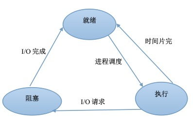

## 操作系统基础

#### 进程和线程的区别

1. 进程是资源分配和调度的一个独立单元，而线程是CPU调度的基本单元
2. 同一个进程中可以包括多个线程，并且线程共享整个进程的资源（寄存器、堆栈、上下文），一个进行至少包括一个线程。
3. 进程的创建调用fork或者vfork，而线程的创建调用pthread_create，进程结束后它拥有的所有线程都将销毁，而线程的结束不会影响同个进程中的其他线程的结束
4. 线程是轻量级的进程，它的创建和销毁所需要的时间比进程小很多，所有操作系统中的执行功能都是创建线程去完成的
5. 线程中执行时一般都要进行同步和互斥，因为他们共享同一进程的所有资源
6. 线程有自己的私有属性TCB，线程id，寄存器、硬件上下文，而进程也有自己的私有属性进程控制块PCB，这些私有属性是不被共享的，用来标示一个进程或一个线程的标志

#### [进程状态](https://www.nowcoder.com/questionTerminal/57536e601bbf4eaa8834e228c913e8d2)

就绪—>执行 执行—>阻塞 阻塞—>就绪  执行—>就绪



1. 进程的三种基本状态

   进程在运行中不断地改变其运行状态。通常，一个进程必须具有以下三种基本状态：

   - **就绪状态**： 当进程已分配到除CPU以外的所有必要的资源，只要获得处理机便可立即执行，这时的进程状态就称为就绪状态；
   - **执行状态**：当进程已获得处理机，其程序正在处理机上执行，此时的进程状态称为执行状态；
   - **阻塞状态**：正在执行的进程，由于等待某个事件发生而无法执行时，便放弃处理机而进入阻塞状态。引起进程阻塞的事件有很多种，例如，等待I/O完成、申请缓冲区不能满足、等待信号等。

2）进程三种状态间的转换

​	一个进程在运行期间，不断地从一种状态转换到另一种状态，它可以多次处于就绪状态和执行状态，也可以多次处于阻塞状态。 

​	A. 就绪—>执行：处于就绪状态的进程，当进程调度程序为之分配好了处理机后，该进程便由就绪状态转换为执行状态；

​	B. 执行—>就绪 ：处于执行状态的进程在其执行过程中，因分配给它的一个时间片已经用完而不得不让出处理机，于是进程从执行状态转换为就绪状态；

​	C. 执行—>阻塞正在执行的进程因等待某种事件发生而无法继续执行时，便从执行状态变成阻塞状态；

​	D. 阻塞—>就绪：处于阻塞状态的进程，若其等待的事件已经发生，于是进程便从阻塞状态转变为就绪状态。

#### IPC通信方式

1. 管道(pipe)：管道可用于具**有亲缘关系**的进程间的通信，是一种半双工的方式（可用socketpair创建全双工管道的系统调用），数据只能单向流动，允许一个进程和另一个与它有共同祖先的进程之间进行通信。
2. 命名管道(named pipe)：命名管道克服了管道没有名字的限制，同时除了具有管道的功能外（也是半双工），它还允许无亲缘关系进程间的通信。命名管道在文件系统中有对应的文件名。命名管道通过命令mkfifo或系统调用mkfifo来创建。
3. 信号（signal）：信号是比较复杂的通信方式，用于通知接收进程有某种事件发生了，除了进程间通信外，进程还可以发送信号给进程本身；linux除了支持Unix早期信号语义函数sigal外，还支持语义符合Posix.1标准的信号函数sigaction（实际上，该函数是基于BSD的，BSD为了实现可靠信号机制，又能够统一对外接口，用sigaction函数重新实现了signal函数）。
4. 消息队列：消息队列是消息的链接表，包括Posix消息队列system V消息队列。有足够权限的进程可以向队列中添加消息，被赋予读权限的进程则可以读走队列中的消息。消息队列克服了信号承载信息量少，管道只能承载无格式字节流以及缓冲区大小受限等缺
5. 共享内存：使得多个进程可以访问同一块内存空间，是**最快的可用IPC形式**。是针对其他通信机制运行效率较低而设计的。往往与其它通信机制，如信号量结合使用，来达到进程间的同步及互斥。
6. 内存映射：内存映射允许任何多个进程间通信，每一个使用该机制的进程通过把一个共享的文件映射到自己的进程地址空间来实现它。
7. 信号量（semaphore）：主要作为进程间以及同一进程不同线程之间的同步手段。
8. 套接字（Socket）：更为一般的进程间通信机制，可用于不同机器之间的进程间通信。起初是由Unix系统的BSD分支开发出来的，但现在一般可以移植到其它类Unix系统上：Linux和System V的变种都支持套接字

#### 信号量

信号量(Semaphore)，有时被称为信号灯，是在多线程环境下使用的一种设施，是可以用来保证两个或多个关键代码段不被并发调用。在进入一个关键代码段之前，线程必须获取一个信号量；一旦该关键代码段完成了，那么该线程必须释放信号量。其它想进入该关键代码段的线程必须等待直到第一个线程释放信号量。 （from 百度百科）

信号量（Semaphore）是一个整型变量，可以对其执行 down 和 up 操作，也就是常见的 P 和 V 操作。

- **down**  : 如果信号量大于 0 ，执行 -1 操作；如果信号量等于 0，进程睡眠，等待信号量大于 0；
- **up** ：对信号量执行 +1 操作，唤醒睡眠的进程让其完成 down 操作。

down 和 up 操作需要被设计成原语，不可分割，通常的做法是在执行这些操作的时候屏蔽中断。

如果信号量的取值只能为 0 或者 1，那么就成为了  **互斥量（Mutex）** ，0 表示临界区已经加锁，1 表示临界区解锁。

```c
typedef int semaphore;
semaphore mutex = 1;
void P1() {
    down(&mutex);
    // 临界区
    up(&mutex);
}
void P2() {
    down(&mutex);
    // 临界区
    up(&mutex);
}
```

####线程同步方式

1、临界区：通过对多线程的串行化来访问公共资源或一段代码，速度快，适合控制数据访问。在任意时刻只允许一个线程对共享资源进行访问，如果有多个线程试图访问公共资源，那么在有一个线程进入后，其他试图访问公共资源的线程将被挂起，并一直等到进入临界区的线程离开，临界区在被释放后，其他线程才可以抢占。

2、互斥量：采用互斥对象机制。 只有拥有互斥对象的线程才有访问公共资源的权限，因为互斥对象只有一个，所以能保证公共资源不会同时被多个线程访问。互斥不仅能实现同一应用程序的公共资源安全共享，还能实现不同应用程序的公共资源安全共享

3、信号量：它允许多个线程在同一时刻访问同一资源，但是需要限制在同一时刻访问此资源的最大线程数目

4、事 件： 通过通知操作的方式来保持线程的同步，还可以方便实现对多个线程的优先级比较的操作

####[僵尸进程孤儿进程](https://www.cnblogs.com/Anker/p/3271773.html)

- 孤儿进程：一个父进程退出，而它的一个或多个子进程还在运行，那么那些子进程将成为孤儿进程。孤儿进程将被init进程(进程号为1)所收养，并由init进程对它们完成状态收集工作。

  - 孤儿进程是没有父进程的进程，孤儿进程这个重任就落到了init进程身上，init进程就好像是一个民政局，专门负责处理孤儿进程的善后工作。每当出现一个孤儿进程的时候，内核就把孤儿进程的父进程设置为init，而init进程会循环地wait()它的已经退出的子进程。这样，当一个孤儿进程凄凉地结束了其生命周期的时候，init进程就会代表党和政府出面处理它的一切善后工作。因此孤儿进程并不会有什么危害。

- 僵尸进程：一个进程使用fork创建子进程，如果子进程退出，而父进程并没有调用wait或waitpid获取子进程的状态信息，那么子进程的进程描述符仍然保存在系统中。这种进程称之为僵死进程。

  危害：

  - 如果进程不调用wait / waitpid的话， 那么保留的那段信息就不会释放，其进程号就会一直被占用，但是系统所能使用的进程号是有限的，如果大量的产生僵死进程，将因为没有可用的进程号而导致系统不能产生新的进程。此即为僵尸进程的危害，应当避免。

  **僵尸进程处理：**

  ```c++
  #include<sys/types.h>
  #include<sys/wait.h>
  pid_t wait(int* stat_loc);
  pid_t waitpid(pid_d pid,int* stat_loc,int options);
  ```

  ​	wait函数将**阻塞进程**，直到该进程的某个子进程结束运行为止。它返回结束进程子进程的PID，并将该子进程的退出状态存储与stat_loc参数指向的内存中。

  ​	wait函数的阻塞特性显然不符合服务器期望，而waitpid函数解决了这个问题。waitpid只等待由pid参数指定的子进程。若干pid取值为-1，那么它就和wait函数相同，即等待任一个子进程结束。stat_loc参数含义通wait。options参数可以控制waitpid函数的行为。该参数通常用的取值为WNOHANG，此时waitpid是非阻塞的：如果pid指定的目标子进程还没有结束或意外终止，则waipid立即返回0；如果目标子进程确实正常退出了，则waitpid返回该子进程PID。waitpid调用失败时返回-1并设置eerrno。

  ​	在事件已经发生的情况下执行非阻塞调用才能提供程序的效率。对waitpid而言，最好在某个子进程退出后再调用它。当一个进程结束时，它将给其父进程发送一个SIGCHLD信号。因此，可以在父进程中捕获SIGCHLD信号，并在信号处理函数中调用waitpid函数以“彻底结束”一个子进程。SIGCHLD信号的典型处理函数：

  ```c
  static void handle_child(int sig)
  {
      pid_t pid;
      int stat;
      while((pid=waitpid(-1,&stat,WNOHANG))>0)
      {
          /*对结束的子进程进行善后处理*/
      }
  }
  ```

####同步异步阻塞非阻塞

-  同步： 所谓同步，就是在发出一个功能调用时，在没有得到结果之前，该调用就不返回。也就是必须一件一件事做，等前一件做完了才能做下一件事。

  例如普通B/S模式（同步）：提交请求->等待服务器处理->处理完毕返回 这个期间客户端浏览器不能干任何事

- 异步：异步的概念和同步相对。当一个异步过程调用发出后，调用者不能立刻得到结果。实际处理这个调用的部件在完成后，通过状态、通知和回调来通知调用者。

​       例如 ajax请求（异步）: 请求通过事件触发->服务器处理（这是浏览器仍然可以作其他事情）->处理完毕

- 阻塞：阻塞调用是指调用结果返回之前，当前线程会被挂起（线程进入非可执行状态，在这个状态下，cpu不会给线程分配时间片，即线程暂停运行）。函数只有在得到结果之后才会返回。

  ​     有人也许会把阻塞调用和同步调用等同起来，实际上他是不同的。对于同步调用来说，很多时候当前线程还是激活的，只是从逻辑上当前函数没有返回而已。 例如，我们在socket中调用recv函数，如果缓冲区中没有数据，这个函数就会一直等待，直到有数据才返回。而此时，当前线程还会继续处理各种各样的消息。

- 非阻塞：非阻塞和阻塞的概念相对应，指在不能立刻得到结果之前，该函数不会阻塞当前线程，而会立刻返回。

####linux系统IO模型

1. 阻塞I/O（blocking I/O）

2. 非阻塞I/O （nonblocking I/O）

3.  I/O复用(select 和poll) （I/O multiplexing）

4. 信号驱动I/O （signal driven I/O (SIGIO)）

5. 异步I/O （asynchronous I/O (the POSIX aio_functions)）

   *前四种都是同步，只有最后一种才是异步IO

####[进程调度方法](http://blog.csdn.net/leex_brave/article/details/51638300)

先来先服务、最短作业优先、最高响应比优先、时间片轮转法、多级反馈队列、（高优先级）

**先来先服务 （FCFS，first come first served）** 
在所有调度算法中，最简单的是非抢占式的FCFS算法。 

- 算法原理：进程按照它们请求CPU的顺序使用CPU.就像你买东西去排队，谁第一个排，谁就先被执行，在它执行的过程中，不会中断它。当其他人也想进入内存被执行，就要排队等着，如果在执行过程中出现一些事，他现在不想排队了，下一个排队的就补上。此时如果他又想排队了，只能站到队尾去。 
- 算法优点：易于理解且实现简单，只需要一个队列(FIFO)，且相当公平 
- 算法缺点：比较有利于长进程，而不利于短进程，有利于CPU 繁忙的进程，而不利于I/O 繁忙的进程

**最短作业优先（SJF, Shortest Job First）** 
短作业优先（SJF, Shortest Job First）又称为“短进程优先”SPN(Shortest Process Next)；这是对FCFS算法的改进，其目标是减少平均周转时间。 

- 算法原理：对预计执行时间短的进程优先分派处理机。通常后来的短进程不抢先正在执行的进程。 
- 算法优点：相比FCFS 算法，该算法可改善平均周转时间和平均带权周转时间，缩短进程的等待时间，提高系统的吞吐量。 
- 算法缺点：对长进程非常不利，可能长时间得不到执行，且未能依据进程的紧迫程度来划分执行的优先级，以及难以准确估计进程的执行时间，从而影响调度性能。

**最高响应比优先法(HRRN，Highest Response Ratio Next)** 
最高响应比优先法(HRRN，Highest Response Ratio Next)是对FCFS方式和SJF方式的一种综合平衡。**FCFS方式只考虑每个作业的等待时间而未考虑执行时间的长短，而SJF方式只考虑执行时间而未考虑等待时间的长短**。因此，这两种调度算法在某些极端情况下会带来某些不便。HRN调度策略同时考虑每个作业的等待时间长短和估计需要的执行时间长短，从中选出响应比最高的作业投入执行。这样，即使是长作业，随着它等待时间的增加，W / T也就随着增加，也就有机会获得调度执行。这种算法是介于FCFS和SJF之间的一种折中算法。 

- 算法原理：响应比R定义如下： R =(W+T)/T = 1+W/T 

  其中T为该作业估计需要的执行时间，W为作业在后备状态队列中的等待时间。每当要进行作业调度时，系统计算每个作业的响应比，选择其中R最大者投入执行。 

- 算法优点：由于长作业也有机会投入运行，在同一时间内处理的作业数显然要少于SJF法，从而采用HRRN方式时其吞吐量将小于采用SJF 法时的吞吐量。 

- 算法缺点：由于每次调度前要计算响应比，系统开销也要相应增加。

**时间片轮转算法（RR，Round-Robin）** 
该算法采用剥夺策略。时间片轮转调度是一种最古老，最简单，最公平且使用最广的算法，**又称RR调度**。每个进程被分配一个时间段，称作它的时间片，即该进程允许运行的时间。 

- 算法原理：让就绪进程以FCFS 的方式按时间片轮流使用CPU 的调度方式，即将系统中所有的就绪进程按照FCFS 原则，排成一个队列，每次调度时将CPU 分派给队首进程，让其执行一个时间片，时间片的长度从几个ms 到几百ms。在一个时间片结束时，发生时钟中断，调度程序据此暂停当前进程的执行，将其送到就绪队列的末尾，并通过上下文切换执行当前的队首进程，进程可以未使用完一个时间片，就出让CPU（如阻塞）。 

- 算法优点：时间片轮转调度算法的特点是简单易行、平均响应时间短。 

- 算法缺点：不利于处理紧急作业。在时间片轮转算法中，时间片的大小对系统性能的影响很大，因此时间片的大小应选择恰当 

- 时间片大小的确定 

  1.系统对响应时间的要求 
  2.就绪队列中进程的数目 
  3.系统的处理能力

**多级反馈队列(Multilevel Feedback Queue)** 
多级反馈队列调度算法是一种CPU处理机调度算法，UNIX操作系统采取的便是这种调度算法。 
多级反馈队列调度算法描述： 
　　1、进程在进入待调度的队列等待时，首先进入优先级最高的Q1等待。 
　　2、首先调度优先级高的队列中的进程。若高优先级中队列中已没有调度的进程，则调度次优先级队列中的进程。例如：Q1,Q2,Q3三个队列，只有在Q1中没有进程等待时才去调度Q2，同理，只有Q1,Q2都为空时才会去调度Q3。 
　　3、对于同一个队列中的各个进程，按照时间片轮转法调度。比如Q1队列的时间片为N，那么Q1中的作业在经历了N个时间片后若还没有完成，则进入Q2队列等待，若Q2的时间片用完后作业还不能完成，一直进入下一级队列，直至完成。 
　　4、在低优先级的队列中的进程在运行时，又有新到达的作业，那么在运行完这个时间片后，CPU马上分配给新到达的作业（抢占式）。 
　　在多级反馈队列调度算法中，如果规定第一个队列的时间片略大于多数人机交互所需之处理时间时，便能够较好的满足各种类型用户的需要。

**优先级调度算法（HPF）**：在进程等待队列中选择优先级最高的来执行。

引起进程调度的因素：（1）一个进程运行完毕。（2）一个正在运行的进程被阻塞。（3）在抢占式调度中，一个高优先级的进程被创建。（4）在抢占式调度中，一个高优先级进程由阻塞唤醒。（5）在轮转式调度中，正垢进程运行完一个时间片。	

####进程内存布局

#### 进/线程池

1. 动态创建子进/线程实现并发服务器缺点
   - 动态创建进程/线程比较耗费时间，导致较慢的客户反应。
   - 动态创建的子进/线程通常只用来为一个客户服务，导致系统上产生大量的细微进/线程。进/线程之间的切换将耗费大量的CPU时间。
   - 动态创建的子进/线程是当前进程的完全映像。当前进程必须谨慎地管理其分配的文件描述符和堆内存等系统资源，否则进程可能复制这些资源，从而使系统的可用资源急剧下降，从而影响服务器的性能。
2. 进/线程池概述
   - 进/线程池由服务器预先创建一组进/线程，这些子进/线程的数目在3~10个之间，通常线程池中的线程数量应该和CPU数量差不多。
   - 进/线程中的所有子进/线程都运行着相同的代码，并具有相同的属性，比如优先级、PGID等。因为进/线程在服务器启动之初就创建好，所以每个进/线程相对“干净”，即她们没有代开不必要的文件描述符（从父进程继承得到），也不会错误使用大块堆内存（从父进程复制得到）。
   - 当有新的任务到来时，主进程通过某种方式选择进/线程池中的某一个进/线程来为之服务。相比于动态创建子进/线程，选择一个已经存在的进/线程的代价显然小得多。

### 海量数据

#### 海量数据top k

#### 布隆（bloom）过滤器

### 死锁

#### 死锁概念

1. 概念：相互等待资源而产生的一种僵持状态，如果没有外力的干预将一直持续这个状态
2. 产生原因：
   - 系统资源不足
   - 相互竞争资源
   - 请求资源顺序不当
3. 必要条件：
   - 互斥条件：一个资源每次只能被一个进程使用。
   - 请求和保持条件：一个进程因请求资源而阻塞时，对已获得的资源保持不放。
   - 不可抢占条件: 进程已获得的资源，在末使用完之前，不能强行剥夺，只能在进程使用完时由自己释放。
   - 循环等待条件: 若干进程之间形成一种头尾相接的循环等待资源关系。
4. 如何避免：加锁顺序；加锁时限；死锁检测；银行家算法；
5. 怎么处理：因为互斥是不可改变的，所以只能破坏其他三个条件中的一个来解除死锁，方法：剥夺资源、杀死其中一个线程

#### 银行家算法

​	这是一个著名的避免死锁的算法，是由Dijstra首先提出来并加以解决的。

1. 背景知识

   ​	一个银行家如何将一定数目的资金安全地借给若干个客户，使这些客户既能借到钱完成要干的事，同时银行家又能收回全部资金而不至于破产，这就是银行家问题。这个问题同操作系统中资源分配问题十分相似：银行家就像一个操作系统，客户就像运行的进程，银行家的资金就是系统的资源。

2. 问题的描述

   ​	一个银行家拥有一定数量的资金，有若干个客户要贷款。每个客户须在一开始就声明他所需贷款的总额。若该客户贷款总额不超过银行家的资金总数，银行家可以接收客户的要求。客户贷款是以每次一个资金单位（如1万RMB等）的方式进行的，客户在借满所需的全部单位款额之前可能会等待，但银行家须保证这种等待是有限的，可完成的。

   ​	银行家算法允许死锁必要条件中的互斥条件，占有且申请条件，不可抢占条件的存在，这样，它与预防死锁的几种方法相比较，限制条件少了，资源利用程度提高了。

3. 算法原理

   ​	我们可以把操作系统看作是银行家，操作系统管理的资源相当于银行家管理的资金，进程向操作系统请求分配资源相当于用户向银行家贷款。

   为保证资金的安全，银行家规定：

   (1) 当一个顾客对资金的最大需求量不超过银行家现有的资金时就可接纳该顾客；

   (2) 顾客可以分期贷款，但贷款的总数不能超过最大需求量；

   (3) 当银行家现有的资金不能满足顾客尚需的贷款数额时，对顾客的贷款可推迟支付，但总能使顾客在有限的时间里得到贷款；

   (4) 当顾客得到所需的全部资金后，一定能在有限的时间里归还所有的资金.

   ​	操作系统按照银行家制定的规则为进程分配资源，当进程首次申请资源时，要测试该进程对资源的最大需求量，如果系统现存的资源可以满足它的最大需求量则按当前的申请量分配资源，否则就推迟分配。当进程在执行中继续申请资源时，先测试该进程本次申请的资源数是否超过了该资源所剩余的总量。若超过则拒绝分配资源，若能满足则按当前的申请量分配资源，否则也要推迟分配。

4. 算法缺点

   - 这个算法要求客户数保持固定不变，这在多道程序系统中是难以做到的。
   - 这个算法保证所有客户在有限的时间内得到满足，但实时客户要求快速响应，所以要考虑这个因素。  
   - 由于要寻找一个安全序列，实际上增加了系统的开销。

### 经典同步问题

#### 哲学家进餐问题

#### 读者写者问题

#### 生产者消费者问题

### 内存管理

#### [页面置换算法](http://blog.csdn.net/a724888/article/details/70038420)

1. 最佳置换算法(OPT)

   ​	最佳(Optimal, OPT)置换算法所选择的被淘汰页面将是以后永不使用的，或者是在最长时间内不再被访问的页面,这样可以保证获得最低的缺页率。但由于人们目前无法预知进程在内存下的若千页面中哪个是未来最长时间内不再被访问的，因而该算法无法实现。

2. 先进先出(FIFO)页面置换算法

     	优先淘汰最早进入内存的页面，亦即在内存中驻留时间最久的页面。该算法实现简单，只需把调入内存的页面根据先后次序链接成队列，设置一个指针总指向最早的页面。但该算法与进程实际运行时的规律不适应，因为在进程中，有的页面经常被访问。

3. 最近最久未使用(LRU)置换算法

		​	选择最近最长时间未访问过的页面予以淘汰，它认为过去一段时间内未访问过的页面，在最近的将来可能也不会被访问。该算法为每个页面设置一个访问字段，来记录页面自上次被访问以来所经历的时间，淘汰页面时选择现有页面中值最大的予以淘汰。

**实现一个LRU算法**

```

```

4. 时钟(CLOCK)置换算法

   ​	当采用简单Clock算法时，只需为每页设置一位**访问位**，再将内存中的所有页面都通过链接指针链接成一个**循环队列**。

   ​	当某页被访问时，其访问位被置为1。置换算法在选择一页淘汰时，只需检查页的访问位，如果是0，就选择将该页换出；若为1，则重新将它置0，暂不换出，而给该页第二次驻留内存的机会，再按照FIFO算法检查下一个页面。当检查到队列中的最后一个页面时，若其访问位仍为1，则再返回到队首去检查第一个页面。由于该算法是**循环地检查各页面的使用情况**，故称为Clock算法。因该算法只有一位访问位，只能用它表示该页是否已经使用过，而置换时是将未使用过的页面换出去，又称为**最近未用算法NRU**(Not recently used)。

#### 内存管理方式

​	常见的内存管理方式有块式管理、页式管理、段式管理和段页式管理。最常见的是段页式管理。

- 块式管理：把主存分为一大块一大块的，当所需的程序片段不在主存时就分配一块主存空间，把程序片断load入主存，就算所需的程序片段只有几个字节也只能把这一块分配给它。这样会造成很大的浪费，平均浪费了50%的内存空间，但是易于管理。
- 页式管理：把主存分为一页一页的，每一页的空间要比一块一块的空间小很多，这种方法的空间利用率要比块式管理高很多
- 段式管理：把主存分为一段一段的，每一段的空间又要比一页一页的空间小很多，这种方法在空间利用率上又比页式管理高得多，但是也有另外一个缺点。一个程序片段可能会被分为几十段，这样很多时间就会被浪费在计算每一段的物理地址上。
- 段页式管理：结合了段式管理和页式管理的优点。把主存先分成若干段，每个段又分成若干页。段页式管理每取一数据，要访问3次内存

#### 虚拟内存

​	虚拟内存简称虚存，是计算机系统内存管理的一种技术。它是相对于物理内存而言的，可以理解为“假的”内存。它**使得应用程序认为它拥有连续可用的内存（一个连续完整的地址空间）**，允许程序员编写并允许比实际系统拥有的内存大得多的程序，这使得许多大型软件项目能够在具有有限内存资源的系统上实现。而**实际上，它通常被分割成多个物理内存碎片，还有部分暂时存储在外部磁盘存储器上**，在需要时进行数据交换。虚存比实存有以下好处：

1. 扩大地址空间。无论段式虚存，还是页式虚存，或是段页式虚存，寻址空间都比实存大。
2. 内存保护。每个进程运行在各自的虚拟内存地址空间，互相不能干扰对方。另外，虚存还对特定的内存地址提供写保护，可以防止代码或数据被恶意篡改
3. 公平分配内存。采用了虚存之后，每个进程都相当于有太阳大小的虚存空间。
4. 当进程需要通信时，可采用虚存共享的方式实现。

不过，使用虚存也是有代价的，主要表现在以下几个方面： 

1. 虚存的管理需要建立很多数据结构，这些数据结构要占用额外的内存 
2. 虚拟地址到物理地址的转换，增加了指令的执行时间 
3. 页面的换入换出需要磁盘I/O，这是很耗时间的。 
4. 如果一页中只有一部分数据，会很浪费内存。

#### 虚拟地址、逻辑地址、线性地址、物理地址的区别

 分段机制把一个逻辑地址转换为线性地址；接着，分页机制把一个线性地址转换为物理地址。

1. 虚拟地址：虚拟内存映射出来的地址
2. 逻辑地址：程序的段加偏移量形成的，C/C++程序中取地址求出来的地址就是逻辑地址
3. 线性地址：是逻辑地址到物理地址的中间层，只有启动分页机制的时候才有线性地址，如果没有分页机制，那么线性地址就是物理地址
4. 物理地址：是内存中实实在在存在的硬件地址，

逻辑地址（启动分段）--》线性地址（启动分页）--》物理地址