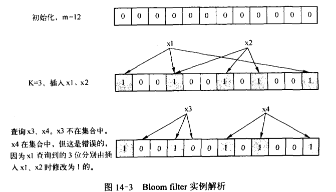

# 海量数据处理

## 基本方法

针对海量数据的处理，可以使用的方法非常多，常见的方法有Hash法、Bit-map法、Bloom filter法、数据库优化法、倒排索引法、外排序法、Trie树、堆、双层桶法以及MapReduce法。

### Hash法

Hash也被称作散列，它是一种映射关系，即给定一个数据元素，其关键字为key，按一个确定的哈希函数Hash计算出hash（key)，把hash（key)作为关键字key对呀元素的存储地址，再进行元素的插入和检索操作。简而言之，哈希函数就是一种将任意长度的消息压缩到某一固定长度的消息摘要的函数。

**解决冲突办法：**

1. 开放地址法：开放地址法的基本思想是当发生地址冲突时，则在哈希表中再按照某种方法继续试探其他的存储地址，直到找到空闲的地址为止。
2. 链地址法：主要思想是：如果哈希表空为[0,m-1]，则设置一个由m个指针组成的以为数组CH[m]，然后再寻找关键字哈希地址的过程，所有哈希地址为i的数据元素都插入到指针为CH[i]的链表中。这种方法比较适合于冲突比较严重的情况下使用。
3. 再散列法：当发生冲突时，使用第二个第三个哈希函数计算地址，直到无冲突。但这种方法的缺点是计算时间会大幅增加。
4. 建立一个公共溢出区：假设哈希函数的值域为[0,m-1],则设向量HashTable[0,...,m-1]为基本表，另外设立存储空间向量OverTable[0,...,v]用以存储发生冲突的记录。

### Bit-map法

位图法的基本原理是使用位数组来标识某些元素是否存在，如8为电话号码中查重复号码，它适用于海量数据的快速查找、判断、删除等。

具体而言，位图排序以一个N位长的串，每位上以“1”或“0”标识需要排序的集合中的数。例如，集合为{2，7，4，9，1，10}，则生成一个10位的串，级那个第2、7、4、9、1、10位置为“1”，其余位置为“0”，这样当把串中所有位置都置完后，排序也自动完成了：1101001011。

位图排序的时间复杂度是O(n)，比一般的排序都快，但是它是以空间换时间的，而且有一些限制，即数据状态不是很多。例如，排序前集合大小最好已知，而且集合中元素的最大重复次数必须一种，最好是惆集数据（不然浪费空间很大）。

### Bloom filter法

Bloom filter是一种空间效率和时间效率很高的随机数据结构，它用来检测一个元素是否属于一个集合。但它同样带来一个问题：牺牲了正确率，Bloom filter以牺牲正确率为前提，来换取空间效率与时间效率的提高。当它判断某元素不属于这个集合时，该元素一定不属于这个集合；当它判断某元素属于这个集合时，该元素不一定属于这个机会。所以，Bloom filter适合应用再对于低错误率可以容忍的场合。

它的基本原理是位数组与Hash函数的联合使用。具体而言，首先Bloom filter是一个包含了m为的位数组，数组的每一位都初始化为0，然后定义k个不同的Hash函数，每个函数都可以将集合中的元素映射到位数组中的某一位。当向集合中插入一个元素时，根据k个Hash函数可以得到k位数组中的k个位，查看k个位中的值，如果有的位部位1，那么该元素肯定不在此集合中；如果这k个位全部为1，那么该元素可能再此集合中（在插入其他元素时，可能会将这些位置为1，这样就产生了错误），如下例：

### 数据库优化法

互联网上的数据一一般都存在数据库中，很多情况下，人们并非对这些海量数据本身感兴趣，而是需要从这些海量数据中提取出自己有用的信息。例如，从数据中获取访问最多的页面信息等，这就涉及数据的查询技术等相关内容。

数据库管理软件选择是否合理、表结构设计是否规范、索引创建是否恰当都是影响数据库性能的重要因素。所以，对数据库进行优化，是实现海量数据高效处理的有效方法之一。常见的数据库优化有以下几种方法。

1. 优秀的数据库管理共就；2. 数据分区；3. 索引；4. 缓存机制；5. 加大虚存；6. 分批处理；7.使用临时表和中间表；8.优化查询语句；9.使用试图；10.使用存储过程；11.用排序来取代非排序存取；12.使用采用数据进行数据挖掘。

### 到排序索引法

排序索引是目前搜索引擎公司对搜索引擎最常用的存储方式，也是搜索引擎的核心内容。再搜索引擎实际引用之中，有时需要按关键字的某些值查找记录，所以是按照关键字建立索引，这个索引就被称为排序索引。

### 外排序法

当待排序的对象数目特别多时，再内存中不能一次处理，必须把它们以文件形式存放于外存，排序时再把它们一部分一部分调入内存进行处理，这种反思就是外排序。

外排序相对于内排序而言的，它是大文件的排序，待排序的记录存储再外存储器上，待排序的文件无法一次装入内存，需要再内存和外部存储直接进行多次数据交换，以达到排序整个文件的目的。一般采用归并排序等方式实现外排序，主要分为两个步骤：第一步，生成若干初始归并段，也称为文件预处理，把含有n个记录的文件，按内存大小划分为若干长度为L的子文件，然后分别将子文件调入内存，采用有效的内部排序方法排序后送回外存；第二步进行多路归并，即对这些初始归并段进行多遍归并，使得有序的归并段逐渐扩大，最后再外存上形成整个文件的单一归并段，此时就完成了文件的外排序。

外排序的适用范围是大数据的排序以及去重复。但外排序也存在着很大的缺陷，就是它会消耗大量的IO，效率不会很高。

### Tire树

Tire树又称为字典树或者键树。它是一种用于快速字符串检索的多叉树结构，其原理是利用字符串的公共前缀来降低时间开销，即以空间换时间，从而达到提高程序效率的目的。Tire树的典型应用是用于统计和排序大量的字符串，所以经常被搜索引擎用于文本词频统计。他的优点是：最大限度地接受无所谓的字符串比较，查询效率比哈希表高。

### 堆

堆是一种树形数据结构，每个节点都有一个值，通常所说的堆，一般是指二叉堆。在堆中，以大顶堆为例，堆的根节点的值最大，而根节点的两个子树也是一个大顶堆，基于以上特点，堆适用于海量数据求前N大（用小顶堆）或者前N小（用大顶堆）数问题，其中N一般比较小。

### MapReduce法

MapReduce是云计算的核心技术之一，是一种简化并行计算的分布式编程模型，它为并行系统的数据提供了一个简单、高效的解决方案，主要目的是为了大型集群系统能在大数据集上进行并行工作，并用于大规模数据的并行运算。

## 实例分析

### top k问题

针对top K类问题，通常比较好的方案是分治+Tire树/hash+小顶堆，即先将数据集安装Hash方法分解成多个小数据集，然后使用Tire树或者Hash统计每个小数据集中的query词频，之后用小顶堆求出每个数据集中出现频率最高的前K个数，最后在所有top K中求出最终的top K。

问题：有1亿个浮点数，如何找出其中最大的10000个？

方法一：

全部排序，然后集中查找，快排时间复杂度O(nlogn)。在32位机器上，每个float占4字节，1亿个浮点数占400MB空间，内存很难满足需求，而且做了很多无用功。

方法二：

局部淘汰法，与排序类似。用一个容器保存10000个数，然后将剩余的数字一一与该容器内的最小数字比较，如果所有的后续元素都比容器内的10000个数海啸，那么容器内的这10000个数就是最小10000个数。如果某一后续元素比容器内的最小数字大，则删除容器内最小元素，并将该元素插入容器，最后遍历完这1亿个数，得到的容器中保存的树即为最终结果。此时的时间复杂度为O(n+m^2)，其中m为容器大小，即10000.

方法三：

分治法，将1亿个数据分成100份，每份100万个数据，找出每份数据中最大的10000个，最后在剩下的100*10000个数据里面找出最大的10000个。如果100万数据选择足够理想，那么可以过滤掉99%的数据。100万个数据里面查找最大10000个数据的方法如下：用快排的方法，将数据分为2堆，如果大的那堆个数N大于10000个，继续对大堆快排一次分为两堆，如果大堆个数N小于10000，就再小堆里面快速排序一次，找到第10000-N大的数字；递归以上过程，就可以找到1w大的数。参考上面找出第1w大的数字，就可以类似找出前10000大数字。此种方法每次需要的内存空间为10^6 *4=4MB,一共需要101次这样的比较。

方法四：

哈希法，如果1亿个数里面有很多重复的数，先通过hash法，把这1亿个数字去重复，如果重复率很高的话，会减少很大的内存用量，从而缩小运算空间，然后通过分治法或最小堆法查找最大的10000个数。

方法五：

采用最小堆。首先读入前10000个数来创建大小为10000的小顶堆，建堆的时间复杂度为O（mlogm）（m为数组的大小即10000），然后遍历后续的数字，并与堆顶（最小）数字进行比较。如果比最小的数字小，则继续读后续数字；如果比堆顶数字大，则替换堆顶元素并重新调整堆为最小顶堆。整个过程直至1亿个数全都遍历完为止。然后按照中序遍历方式输出当前堆中所有的10000个数字。该算法的时间复杂度为O(nmlogm)，空间复杂度为10000.

> 1. 如何在海量数据中找出重复最多一个。
>
> - 通过hash映射为小文件
> - 通过hash_map统计各个小文件重读最多的并记录次数
> - 对每个小文件重复最多的进行建立大根堆
>
> 2. 上亿有重数据，统计最多前N个。
>
> - 内存存不下
>   - 通过hash映射为小文件
>   - 通过hash_map统计各个小文件重读最多的并记录次数
>   - 对每个小文件重复最多的进行建立大根堆并重复N次取走堆顶并重建堆操作
> - 内存存得下
>   - 直接内存通过hash_map统计并建大根堆
>   - 重复N次取走堆顶并重建堆操作
>
> 3. 海量日志数据，提取出某日访问百度次数最多的那个IP（同1）。
>
> - 将IP % 1000映射到1000个小文件中
>   - 相同IP会被映射到同一个文件
>   - 不会出现累加和更大情况
> - 分1000次在内存处理小文件，得到频率最大IP（使用map统计）
> - 对这1000个IP建立大根堆
>
> 4. 1000w查询串统计最热门10个（同2）。
>
> - 同上
>
> 5. 1G的文件，里面1行1个不超过16字节的词。内存限制1M，返回频数最高前100（同2）。
>
> - 将单词 % 5000存入5000小文件
>   - 平均各文件约200K
>   - 对超过1M的文件继续分割直到小于200K
> - 使用map统计各个词出现的频率
> - 对5000词使用堆排序或归并排序
>
> 6. 分布在100台电脑的海量数据，统计前十。
>
> - 各数据只出现在一台机器中
>   - 先在独立机器得到前十
>     - 若可以放入内存直接堆排序
>     - 若不可全放入内存：哈希分块 -> map统计 -> 归总堆排
>   - 再将100台计算机的TOP10组合起来堆排序
> - 同一元素可同时出现在不同机器中
>   - 遍历所有数据，重新hash取模，使同一个元素只出现在单独的一台电脑中，然后采用上面方法先统计每台电脑TOP10再汇总起来

### 重复问题

### 排序问题